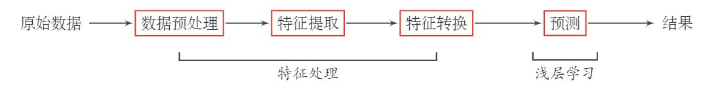

# 机器学习  
**机器学习**（Machine Learning，ML）是指从有限的观测数据中学习（或“猜测”）出具有一般性的规律，并利用这些规律对未知数据进行预测的方法。  
机器学习方法可以粗略地分为三个基本要素：模型、学习准则、优化算法．
- **模型**：根据经验来假设一个函数集合 ℱ ，称为假设空间（Hypothesis Space），然后通过观测其在训练集 𝒟 上的特性，从中选择一个理想的假设（Hypothesis）𝑓∗∈ ℱ．通常分为线性&非线性.  
- **学习准则**：
    - 损失函数：
    - 风险最小化准则：经验风险最小化（Empirical Risk Minimization，ERM）准则与结构风险最小化（Structure Risk Minimization，SRM）准则. 前者是要求你对训练集的拟合，后者是保证泛化能力.
- **优化算法**：在确定了训练集 𝒟 、假设空间 ℱ 以及学习准则后，如何找到最优的模型 𝑓(𝒙,𝜃∗) 就成了一个最优化（Optimization）问题．机器学习的训练过程其实就是最优化问题的求解过程．

**传统的机器学习**主要关注如何学习一个预测模型．一般需要首先将数据表示为一组**特征**（Feature），特征的表示形式可以是连续的数值、离散的符号或其他形式．然后将这些特征输入到预测模型，并输出预测结果．这类机器学习可以看作**浅层学习**（Shallow Learning）．浅层学习的一个重要特点是不涉及特征学习，其特征主要靠人工经验或特征转换方法来抽取．  
在实际任务中使用机器学习模型一般会包含以下几个步骤（如图1.2所示）：
1. 数据预处理：经过数据的预处理，如去除噪声等．比如在文本分类中，去除停用词等．
2. 特征提取：从原始数据中提取一些有效的特征．比如在图像分类中，提取边缘、尺度不变特征变换（Scale Invariant Feature Transform，SIFT）特征等．
3. 特征转换：对特征进行一定的加工，比如降维和升维．降维包括特征抽取（Feature Extraction）和特征选择（Feature Selection）两种途径．常用的特征转换方法有主成分分析（Principal Components Analysis，PCA）、线性判别分析（Linear Discriminant Analysis，LDA）等.
4. 预测：机器学习的核心部分，学习一个函数并进行预测．
  
>**表示学习**：为了提高机器学习系统的准确率，我们就需要将输入信息转换为有效的特征，或者更一般性地称为**表示**（Representation）．如果有一种算法可以自动地学习出有效的特征，并提高最终机器学习模型的性能，那么这种学习就可以叫作表示学习（Representation Learning）．  
>**语义鸿沟**：表示学习的关键是解决语义鸿沟（Semantic Gap）问题．即车这一概念是高层语义特征，轿车、自行车、卡车是底层特征，如何同不同车种提取出那个高层特征“车”呢？如果一个预测模型直接建立在底层特征之上，会导致对预测模型的能力要求过高．如果可以有一个好的表示在某种程度上能够反映出数据的高层语义特征，那么我们就能相对容易地构建后续的机器学习模型。
### 支持向量机  
支持向量机，Support Vector Machine(SVM)，属于监督学习中的二分类。
#### 核方法  
有些问题是线性不可分的，即特征空间存在超平面（hypersurface）将正类和负类分开。考虑使用非线性函数将非线性可分问题从原始的特征空间映射至更高维的希尔伯特空间，从而转化为线性可分问题。  
核方法(kernal method)定义映射函数的内积为核函数(kernal function)，$\kappa (X_1,X_2)=\phi(X_1)^T \phi(X_2)$以回避内积的显示计算。 
##### 常用核函数  
- 径向基核函数(RBF kernal)：$\kappa (X_1,X_2)=exp\left({-\frac{||X_1-X_2||^2}{2\sigma^2}}\right)$
- 多项式核函数：$\kappa (X_1,X_2)=(X_1^TX_2)^2$
- 拉普拉斯核(Laplacian kernal)：$\kappa (X_1,X_2)=exp\left({-\frac{||X_1-X_2||}{\sigma}}\right)$ 
- Sigmoid核：$\kappa (X_1,X_2)=tanh[a(X_1^2X_2)-b]，a,b>0$
#### Mercer定理  

### 感知机  

### 补充  
#### 交叉熵损失函数  
交叉熵损失函数（Cross-Entropy Loss Function）一般用于分类问题．假设样本的标签 𝑦 ∈ {1,⋯,𝐶} 为离散的类别，模型 $f(x;\theta) \in[0,1]^𝐶$的输出为类别标签的条件概率分布，即 
$$p(y = c|x;\theta) = f_c(x;\theta)$$  
并满足
$$f_c(x;\theta) \in [0,1], \sum_{c=1}^C f_c(x;\theta) = 1$$  
我们可以用一个 $C$ 维的one-hot向量 $y$ 来表示样本标签．假设样本的标签为 $k$ ，那么标签向量只有第 $k$ 维的值为 1 ，其余元素的值都为 0 ．标签向量 $y$ 可以看作样本标签的真实条件概率分布 $p_r(𝒚|𝒙)$ ，即第 $c$ 维（记为 $y_c, 1\leq c\leq C$） 是类别为 $c$ 的真实条件概率．假设样本的类别为 $k$ ，那么它属于第 $k$ 类的概率为 1 ，属于其他类的概率为 0 .  
对于两个概率分布，一般可以用交叉熵来衡量它们的差异．标签的真实分布 $y$ 和模型预测分布 $f(x;\theta)$ 之间的交叉熵为  
$$
\begin{aligned}
L(y,f(x;\theta)) &= -y^T \log f(x;\theta)\\
&=-\sum_{c=1}^C y_c \log f_c(x;\theta)
\end{aligned}
$$
比如对于三分类问题，一个样本的标签向量为$y = [0,0,1]^T$，模型预测的标签分布为$f(x;\theta) = [0.3,0.3,0.4]^T$，则它们的交叉熵为$-(0 \times \log (0.3)+0\times \log(0.3) + 1\times \log(0.4)) = -\log(0.4)$.  
因为 $y$ 为one-hot向量，上式也可以写为  
$$
L(y,f(x;\theta)) = -\log f_y(x;\theta),
$$
其中 $f_y(x;\theta)$ 可以看作真实类别 $y$ 的似然函数．因此，交叉熵损失函数也就是负对数似然函数（Negative Log-Likelihood）．