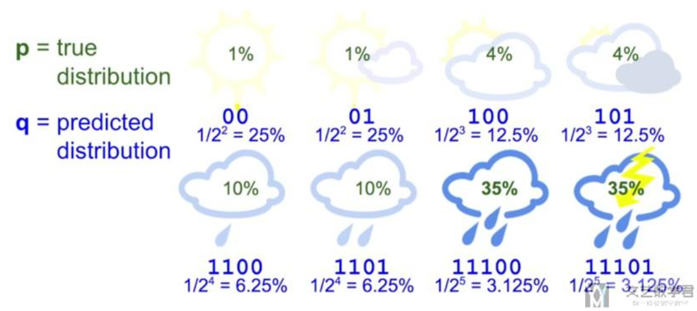

# 机器学习  

**机器学习**（Machine Learning，ML）是指从有限的观测数据中学习（或“猜测”）出具有一般性的规律，并利用这些规律对未知数据进行预测的方法。  
机器学习方法可以粗略地分为三个基本要素：模型、学习准则、优化算法．

- **模型**：根据经验来假设一个函数集合 ℱ ，称为假设空间（Hypothesis Space），然后通过观测其在训练集 𝒟 上的特性，从中选择一个理想的假设（Hypothesis）𝑓∗∈ ℱ．通常分为线性&非线性.  
- **学习准则**：
  - 损失函数：
    - 风险最小化准则：经验风险最小化（Empirical Risk Minimization，ERM）准则与结构风险最小化（Structure Risk Minimization，SRM）准则. 前者是要求你对训练集的拟合，后者是保证泛化能力.
- **优化算法**：在确定了训练集 𝒟 、假设空间 ℱ 以及学习准则后，如何找到最优的模型 𝑓(𝒙,𝜃∗) 就成了一个最优化（Optimization）问题．机器学习的训练过程其实就是最优化问题的求解过程．

**传统的机器学习**主要关注如何学习一个预测模型．一般需要首先将数据表示为一组**特征**（Feature），特征的表示形式可以是连续的数值、离散的符号或其他形式．然后将这些特征输入到预测模型，并输出预测结果．这类机器学习可以看作**浅层学习**（Shallow Learning）．浅层学习的一个重要特点是不涉及特征学习，其特征主要靠人工经验或特征转换方法来抽取．  
在实际任务中使用机器学习模型一般会包含以下几个步骤（如图1.2所示）：

1. 数据预处理：经过数据的预处理，如去除噪声等．比如在文本分类中，去除停用词等．
2. 特征提取：从原始数据中提取一些有效的特征．比如在图像分类中，提取边缘、尺度不变特征变换（Scale Invariant Feature Transform，SIFT）特征等．
3. 特征转换：对特征进行一定的加工，比如降维和升维．降维包括特征抽取（Feature Extraction）和特征选择（Feature Selection）两种途径．常用的特征转换方法有主成分分析（Principal Components Analysis，PCA）、线性判别分析（Linear Discriminant Analysis，LDA）等.
4. 预测：机器学习的核心部分，学习一个函数并进行预测．
  

>**表示学习**：为了提高机器学习系统的准确率，我们就需要将输入信息转换为有效的特征，或者更一般性地称为**表示**（Representation）．如果有一种算法可以自动地学习出有效的特征，并提高最终机器学习模型的性能，那么这种学习就可以叫作表示学习（Representation Learning）．  
>**语义鸿沟**：表示学习的关键是解决语义鸿沟（Semantic Gap）问题．即车这一概念是高层语义特征，轿车、自行车、卡车是底层特征，如何同不同车种提取出那个高层特征“车”呢？如果一个预测模型直接建立在底层特征之上，会导致对预测模型的能力要求过高．如果可以有一个好的表示在某种程度上能够反映出数据的高层语义特征，那么我们就能相对容易地构建后续的机器学习模型。  

### 支持向量机

支持向量机，Support Vector Machine(SVM)，属于监督学习中的二分类。

#### 核方法  

有些问题是线性不可分的，即特征空间存在超平面（hypersurface）将正类和负类分开。考虑使用非线性函数将非线性可分问题从原始的特征空间映射至更高维的希尔伯特空间，从而转化为线性可分问题。  
核方法(kernal method)定义映射函数的内积为核函数(kernal function)，$\kappa (X_1,X_2)=\phi(X_1)^T \phi(X_2)$以回避内积的显示计算。

##### 常用核函数  

- 径向基核函数(RBF kernal)：$\kappa (X_1,X_2)=exp\left({-\frac{||X_1-X_2||^2}{2\sigma^2}}\right)$
- 多项式核函数：$\kappa (X_1,X_2)=(X_1^TX_2)^2$
- 拉普拉斯核(Laplacian kernal)：$\kappa (X_1,X_2)=exp\left({-\frac{||X_1-X_2||}{\sigma}}\right)$
- Sigmoid核：$\kappa (X_1,X_2)=tanh[a(X_1^2X_2)-b]，a,b>0$

#### Mercer定理  

### 感知机  

### 补充

#### 熵、交叉熵和KL散度

**熵**(Entropy)的介绍  
我们以天气预报为例子，进行熵的介绍．

- 假如只有 **2 种**天气，sunny 和 rainy ，那么明天对于每一种天气来说，各有 50% 的可能性．
- 此时气象部门告诉你明天是rainy，他其实减少了你的**不确定信息**．
- 所以，天气部门给了你 **1 bit**的**有效信息**(因为此时只有两种可能性)．
- 假如只有8种天气，每一种天气出现是**等可能的**．
- 此时气象部门告诉你明天是 Rainy ，他其实减少了你的不确定信息，也就是告诉了你有效信息．
- 所以，天气部门给了你 **3 bit**的有效信息(因为8种状态需要 2^3=8 ，需要 3 bit来表示．
- 所以，有效信息的计算可以使用 log 来进行计算，计算过程如下
$$
\begin{array}{l}
2^{3}=8 \\
\log _{2}(8)=3
\end{array}
$$

- 上面所有的情况都是等概率出现的，假设各种情况出现的**概率不是相等**的．
- 例如有75%的可能性是Sunny，25%的可能性是Rainy．
- 如果气象部门告诉你明天是Rainy
  - 我们会使用**概率的倒数**， $1 / 0.25=4$ (概率越小，有效信息越多)
  - 接着计算有效信息， $\log 2(1 / 0.25)=2=(-\log 2(0.25)$ ，log的等价计算)
  - 因为和本来的概率相差比较大，所以获得的有效信息比较多(本来是 Rainy 的可能性小)
- 如果气象部门告诉你明天是 Sunny
  - 同样计算此时的有效信息， $\log 2(1 / 0.75)=-\log 2(0.75)=0.41$
  - 因为和本来的概率相差比较小，所以获得的信息比较少(本来是 Sunny 的可能性大)
- 从气象部门获得的信息的平均值(这个就是**熵**
  - 简单解释: 有 75% 的可能性是Sunny ，得到晴天的有效信息是 0.41 ，所以是
$$
0.75^{*} 0.41
$$
- 于是我们得到了**熵的计算公式**.
  - 熵是用来衡量获取的信息的平均值，没有获取什么信息量，则 Entropy 接近 0 ．
  - 下面是熵的计算公式
$$
\mathrm{H}(\mathbf{p})=-\Sigma_{i} p_{i} \log _{2}\left(p_{i}\right)
$$

**交叉熵**(Cross-Entropy)的介绍  
对于交叉熵的介绍，我们还是以天气预报作为例子来进行讲解．

- 交叉熵(Cross-Entropy)可以理解为平均的 message length ，即**平均信息长度**．
- 现在有 8 种天气，于是每一种天气我们可以使用 3 bit 来进行表示（000，001，010，011...）
- 此时 average message length = 3 ，所以此时Cross-Entropy $=3$

现在假设你住在一个 sunny region ，出现晴天的可能性比较大(**即每一种天气不是等可能出现的**)，下图是每一种天气的概率．

我们来计算一下此时的熵(ntropy) ，计算的式子如下所示：
$$
\begin{array}{l}
Entropy\\
=-0.35 \log _{2}(0.35)-\ldots-0.01 \log_{2}(0.01) \\
=2.23 \mathrm{bits}
\end{array}
$$

- 此时有效的信息是 2.23 bit．
- 所以再使用上面的编码方式(都使用 3 $\mathrm{bit})$ 会有咒余．
- 也就是说我们每次发出 3 bit ，接收者有效信息为2.23 bit．
- 这时我们可以修改天气的 **encode 的方式**，可以给经常出现的天气比较小的 code 来进行表示，于是我们可以按照下图对每一种天气进行 encode ．

此时的平均长度的计算如下所示(每一种天气的概率该天气code的长度)：
$$
\begin{array}{l}
35 \% \times 2+35 \% \times 2+10 \% \times 3 \\
+10 \% \times 3+4 \% \times 4+4 \% \times 4 \\
+1 \% \times 5+1 \% \times 5\\
=2.42 \text { bits }
\end{array}
$$
此时的平均长度为 2.42 bit，可以看到比一开始的 3 bit有所减少．  

如果我们使用相同的 code ，但是此时对应的天气的概率是不相同的，此时计算出的平均长度就会发生改变．此时每一种天气的概率如下图所示：

于是此时的信息的平均长度就是 4.58 bit ，比 Entropy 大很多 (如上图所示，我们给了概率很小的天 气的 code 也很小，概率很大的天气的 code 也很大，此时就会导致计算出的平均长度很大)，下面是平均长度的计算的式子．
$$
\begin{array}{l}
1 \% \times 2+1 \% \times 2+4 \% \times 3+ \\
4 \% \times 3+10 \% \times 4+10 \% \times 4 \\
+35 \% \times 5+35 \% \times 5\\
=4.58 \mathrm{bits}
\end{array}
$$
我们如何来理解我们给每一种天气的 code 呢，其实我们可以理解为这就是我们对每一种天气发生的可能性的预测，我们会给出现概率比较大的天气比较短的 code ，这里的概率是我们假设的，即**我们有一个估计的概率**，我们估计这个天气的概率比较大，所以给这个天气比较短的 code．

下图中可以表示出我们**预测的q**(predicted distribution)和**真实分布p**(true distribution)．可以看到此时我们的预测概率 $q$ 与真实分布 $p$ 之间相差很大(此时计算出的交叉熵就会比较大)

关于上面 code 长度与概率的转换，我们可以这么来进行理解，对于概率为 $p$ 的信息，他的有效信息为 $-log2(p)$ ．若此时 code 长度为 $n$ ，我们问概率为多少的信息的有效信息为 n ，即求解 $-log2(p)=n$ ，则 $\mathrm{p}=1 / 2^{\wedge} \mathrm{n}$ ，所以我们就可以求出 $\mathrm{code}$ 长度与概率的转换．此时，我们就可以定义**交叉熵**(Cross-Entropy)，这里会有两个变量，分别是p(真实的分布)和
q(预测的概率):
$$
\mathrm{H}(\mathrm{p}, \mathrm{q})=-\Sigma_{\mathrm{i}} p_{i} \log _{2}\left(q_{i}\right)
$$
这个交叉熵公式的意思就是在计算消息的平均长度，我们可以这样来进行理解．

- $-\log 2(\mathrm{q})$ 是将预测概率转换为 code 的长度(这里看上面 code 长度与概率的转换)
- 接着我们再将 code 的长度 $(-log2(q))$ 乘上出现的概率 $\mathrm{p}($ 真实的概率 $)$

我们简单说明一下熵(Entropy),和交叉熵(Cross-Entropy)的性质：  

- 如果预测结果是好的,，那么 p 和 q 的分布是相似的，此时 Cross-Entropy 与 Entropy 是相似
的．
- 如果 p 和 q 有很大的不同，那么 Cross-Entropy 会比 Entropy 大．
- 其中 Cross-Entropy 比 Entropy 大的部分，我们称为 relative entropy ，或是Kullback-
Leibler Divergence(KL Divergence)，这个就是**KL-散度**，我们会在后面进行详细的介
绍．
- 也就是说，三者的关系为：**Cross-Entropy=Entropy+ KL Divergence**

在进行**分类**问题的时候，我们通常会将 loss 函数设置为交叉熵(Cross-Entropy)，其实现在来看这个也是很好理解，我们会有我们预测的概率 q 和实际的概率 p ，若 p 和 q 相似，则交叉熵小，若 p 和 q 不相似，则交叉熵大．

有一个要注意的是，我们通常在使用的时候会使用 10 为底的 log ，但是这个不影响 ，因为 $log2(x)=log10(x)/log(2)$ ，我们可以通过公式进行转换．

在 PyTorch 中，CrossEntropyLoss 不是直接按照上面进行计算的，他是包含了 Softmax 的步骤的．关于在 PyTorch 中 CrossEntropyLoss 的实际计算：  
[详细介绍:PyTorch中交叉熵的计算CrossEntropyLoss](https://mathpretty.com/12068.html)

#### 交叉熵损失函数  

交叉熵损失函数（Cross-Entropy Loss Function）一般用于分类问题．假设样本的标签 𝑦 ∈ {1,⋯,𝐶} 为离散的类别，模型 $f(x;\theta) \in[0,1]^𝐶$的输出为类别标签的条件概率分布，即
$$p(y = c|x;\theta) = f_c(x;\theta),$$  
并满足
$$f_c(x;\theta) \in [0,1],\qquad \sum_{c=1}^C f_c(x;\theta) = 1.$$  
我们可以用一个 $C$ 维的one-hot向量 $y$ 来表示样本标签．假设样本的标签为 $k$ ，那么标签向量只有第 $k$ 维的值为 1 ，其余元素的值都为 0 ．标签向量 $y$ 可以看作样本标签的真实条件概率分布 $p_r(𝒚|𝒙)$ ，即第 $c$ 维（记为 $y_c, 1\leq c\leq C$） 是类别为 $c$ 的真实条件概率．假设样本的类别为 $k$ ，那么它属于第 $k$ 类的概率为 1 ，属于其他类的概率为 0 .  
对于两个概率分布，一般可以用交叉熵来衡量它们的差异．标签的真实分布 $y$ 和模型预测分布 $f(x;\theta)$ 之间的交叉熵为  
$$
\begin{aligned}
L(y,f(x;\theta)) &= -y^T \log f(x;\theta)\\
&=-\sum_{c=1}^C y_c \log f_c(x;\theta)
\end{aligned}
$$
比如对于三分类问题，一个样本的标签向量为$y = [0,0,1]^T$，模型预测的标签分布为$f(x;\theta) = [0.3,0.3,0.4]^T$，则它们的交叉熵为$-(0 \times \log (0.3)+0\times \log(0.3) + 1\times \log(0.4)) = -\log(0.4)$.  
因为 $y$ 为one-hot向量，上式也可以写为  
$$
L(y,f(x;\theta)) = -\log f_y(x;\theta),
$$
其中 $f_y(x;\theta)$ 可以看作真实类别 $y$ 的似然函数．因此，交叉熵损失函数也就是**负对数似然函数**（Negative Log-Likelihood）．
