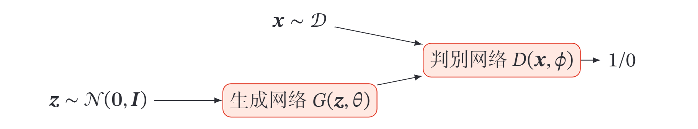
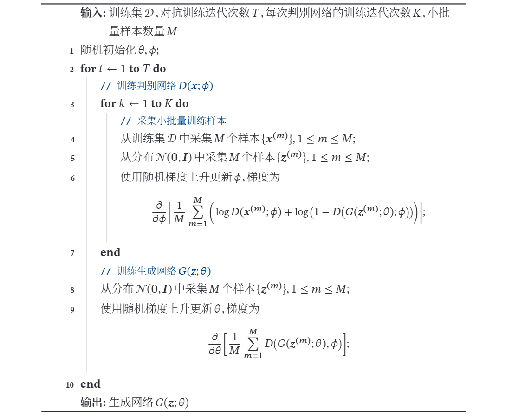

# 生成对抗网络
产生于2014年，[论文地址 Ian J. Goodfellow](https://arxiv.org/abs/1406.2661v1)  

生动的白话例子：[莫烦教程](https://mofanpy.com/tutorials/machine-learning/torch/intro-GAN/)  

又李宏毅课上举的例子：类似生物的拟态，枯叶蝶进化中不断地去模仿叶子的形态以逃避天敌的捕食．  

简而言之，有两个网络，**生成网络**（generative network，即枯叶蝶自身形态的进化）和**对抗网络**（adversarial network，即天敌对它的分辨），生成网络负责生成样本（可能依据一个分布得到的随机数来生成），而对抗网络负责判断这个样本是真实样本还是生成样本，两个网络共同训练．  

# 一． 概率生成模型

**概率生成模型**（Probabilistic Generative Model），简称生成模型，指一系列用于随机生成可观测数据的模型．假设在一个连续或离散的高维空间 $\mathbb{X}$ 中，存在一个随机向量 $X$ 服从一个未知的数据分布 $p_r(x) , x\in \mathbb{X}$ ．生成模型是根据一些可观测的样本 $x^{(1)},x^{(2)},...,x^{N}$ 来学习一个参数化的模型 $p_{\theta}(x)$ 来近似未知分布 $p_r(x)$ ，并可以用这个模型来生成一些样本，使得“生成”的样本和“真实”的样本尽可能地相似．生成模型通常包含两个基本功能：**概率密度估计**和**生成样本**（即采样）．  

## 1.1 密度估计

给定一组数据 $\mathcal{D}=\left\{\boldsymbol{x}^{(n)}\right\}_{n=1}^{N}$ ，假设它们都是独立地从相同的概率密度函数为 $p_r(x)$ 的未知分布中产生的．密度估计（Density Estimation）是根据数据集 $\mathcal{D}$ 来估计其概率密度函数 $p_{\theta}(x)$．  

直接建模 $p_r(x)$ 比较困难．因此，我们通常通过引入隐变量 $z$ 来简化模型，这样密度估计问题可以转换为估计变量 $(x,z)$ 的两个局部条件概率 $p_{\theta}(x)$ 和 $p_{\theta}(x|z)$ ．一般为了简化模型，假设隐变量 $z$ 的先验分布为标准高斯分布 $\mathcal{N}(\mathbf{0}, \boldsymbol{I})$ ．隐变量 $z$ 的每一维之间都是独立的．在这个假设下，先验分布 $p(\theta ;z)$ 中没有参数．因此，密度估计的重点是估计条件分布 $p(x|\theta ;z)$ ．

## 1.2 生成样本  

**生成样本**就是给定一个概率密度函数为 $p_{\theta}(x)$ 的分布，生成一些服从这个分布的样本，也称为**采样**．  

在得到两个变量的局部条件概率 $p_{\theta}(z)$ 和 $p_{\theta}(x \mid z)$ 之后，我们就可以生成数据 $x$ ，具体过程可以分为两步进行:  
1. 根据隐变量的先验分布 $p_{\theta}(z)$ 进行采样,得到样本 $z$．
2. 根据条件分布 $p_{\theta}(x \mid z)$ 进行采样,得到样本 $x$．  

为了便于采样,通常 $p_{\theta}(x \mid z)$ 不能太过复杂．因此，另一种生成样本的思想是从一个简单分布 $p(z), z \in \mathcal{Z}$ ( 比如标准正态分布 ) 中采集一个样本 $z$ , 并利用一个深度神经网络 $g: \mathcal{Z} \rightarrow \mathcal{X}$ 使得 $g(z)$ 服从 $p_{r}(\boldsymbol{x}) .$ 这样，我们就可以避免密度估计问题，并有效降低生成样本的难度，这正是**生成对抗网络**的思想．  

## 1.3 生成对抗网络 

一种无监督学习．注意到生成网络与真实样本是未接触的，判别网络根据真实样本来更新参数，而生成网络根据判别网络来更新参数．

### 1.3.1 显式密度模型和隐式密度模型  

一些深度生成模型，比如变分自编码器、深度信念网络等，都是显示地构建出样本的密度函数 $p(x;\theta)$ ，并通过最大似然估计来求解参数，称为**显式密度模型**（Explicit Density Model）．  

如果只是希望有一个模型能生成符合数据分布 $p_{r}(x)$ 的样本，那么可以不显式地估计出数据分布的密度函数．假设在低维空间 $\mathcal{Z}$ 中有一个简单容易采样的 分布 $p(z)，p(z)$ 通常为标准多元正态分布 $\mathcal{N}(\mathbf{0}, \boldsymbol{I})$ ．我们用神经网络构建一个映射函数 $G: \mathcal{Z} \rightarrow \mathcal{X}$ ，称为生成网络．利用神经网络强大的拟合能力，使得 $G(z)$ 服从分布 $p_{r}(x)$ ．这种模型就称为**隐式密度模型** ( Implicit Density Model )．所谓隐式模型就是指并不显式地建模 $p_{r}(x)$，而是建模生成过程．  

### 1.3.2 网络分解  

**生成对抗网络**（Generative Adversarial Networks，GAN）[Goodfellowet al.,2014]是通过对抗训练的方式来使得生成网络产生的样本服从真实数据分布．在生成对抗网络中，有两个网络进行对抗训练．一个是**判别网络**，目标是尽量准确地判断一个样本是来自于真实数据还是由生成网络产生；另一个是**生成网络**，目标是尽量生成判别网络无法区分来源的样本．  

#### 1.3.2.1 判别网络  

**判别网络** ( Discriminator Network ) $D(\boldsymbol{x} ; \phi)$ 的目标是区分出一个样本 $\boldsymbol{x}$ 是来自于真实分布 $p_{r}(\boldsymbol{x})$ 还是来自于生成模型 $p_{\theta}(\boldsymbol{x})$，因此判别网络实际上是一个二分类的分类器．用标签 $y=1$ 来表示样本来自真实分布，$y=0$ 表示样本来自生成模型，判别网络 $D(\boldsymbol{x} ; \phi)$ 的输出为 $\boldsymbol{x}$ 属于真实数据分布的概率，即
$$
p(y=1 \mid \boldsymbol{x})=D(\boldsymbol{x} ; \phi)，
$$
则样本来自生成模型的概率为 $p(y=0 \mid \boldsymbol{x})=1-D(\boldsymbol{x} ; \phi)$
．给定一个样本 $(\boldsymbol{x}, y), y\in\{1,0\}$ 表示其来自于 $p_{r}(\boldsymbol{x})$ 还是 $p_{\theta}(\boldsymbol{x})$．判别网络的
目标函数为最小化交叉嫡，即
$$
\min _{\phi}-\left(\mathbb{E}_{\boldsymbol{x}}[y \log p(y=1 \mid \boldsymbol{x})+(1-y) \log p(y=0 \mid \boldsymbol{x})]\right)．
$$
假设分布 $p(\boldsymbol{x})$ 是由分布 $p_{r}(\boldsymbol{x})$ 和分布 $p_{\theta}(\boldsymbol{x})$ 等比例混合而成，即 $p(\boldsymbol{x})=$
$\frac{1}{2}\left(p_{r}(\boldsymbol{x})+p_{\theta}(\boldsymbol{x})\right)$ ，则上式等价于
$$
\begin{aligned}
& \max _{\phi} \mathbb{E}_{\boldsymbol{x} \sim p_{r}(\boldsymbol{x})}[\log D(\boldsymbol{x} ; \phi)]+\mathbb{E}_{\boldsymbol{x}^{\prime} \sim p_{\theta}\left(x^{\prime}\right)}\left[\log \left(1-D\left(\boldsymbol{x}^{\prime} ; \phi\right)\right)\right] \\
=& \max _{\phi} \mathbb{E}_{\boldsymbol{x} \sim p_{r}(\boldsymbol{x})}[\log D(\boldsymbol{x} ; \phi)]+\mathbb{E}_{z \sim p(z)}[\log (1-D(G(\boldsymbol{z} ; \theta) ; \phi))]
\end{aligned}
$$
其中 $\theta$ 和 $\phi$ 分别是生成网络和判别网络的参数．  
>回忆交叉熵定义：$L(y,f(x;\theta)) = -y^T \log f(x;\theta)=-\sum_{c=1}^C y_c \log f_c(x;\theta)$ ，其中 $y$ 为真实值， $f(x;\theta)$ 为以 $\theta$为参数， $x$ 为输入的模型输出的估计值．

#### 1.3.2.2 生成网络

**生成网络**（Generator Network）的目标刚好和判别网络相反，即让判别网络将自己生成的样本判别为真实样本．  
$$
\begin{aligned}
& \max _{\theta}\left(\mathbb{E}_{\boldsymbol{z} \sim p(z)}[\log D(G(\boldsymbol{z} ; \theta) ; \phi)]\right) \\
=& \min _{\theta}\left(\mathbb{E}_{\boldsymbol{z} \sim p(z)}[\log (1-D(G(\boldsymbol{z} ; \theta) ; \phi))]\right)
\end{aligned}
$$
上面的这两个目标函数是等价的．但是在实际训练时，一般使用前者，因为其梯度性质更好．我们知道，函数 $\log (x), x \in(0,1)$ 在 $x$ 接近 $1$ 时的梯度要比接近 $0$ 时的梯度小很多，接近“饱和”区间．这样，当判别网络 $D$ 以很高的概率认为生成网络 $G$ 产生的样本是“假”样本时, 即 $(1-D(G(z ; \theta) ; \phi)) \rightarrow 1$, 目标函数关于 $\theta$ 的 梯度反而很小，从而不利于优化．  

#### 1.3.2.3 训练

和单目标的优化任务相比，生成对抗网络的两个网络的优化目标刚好相反．因此生成对抗网络的训练比较难，往往不太稳定．一般情况下，需要**平衡**两个网络的能力．对于判别网络来说，一开始的判别能力不能太强，否则难以提升生成网络的能力．但是，判别网络的判别能力也不能太弱，否则针对它训练的生成网络也不会太好．在训练时需要使用一些技巧，使得在每次迭代中，判别网络比生成网络的能力强一些，但又不能强太多．

生成对抗网络的训练流程如下图所示．每次迭代时，判别网络更新 𝐾 次而生成网络更新一次，即首先要保证判别网络足够强才能开始训练生成网络．在实践中 𝐾 是一个超参数，其取值一般取决于具体任务．  
  

#### 1.3.2.4 难点  

生成对抗网络训练的难点在于，不像一般的loss function，我们只要看loss收不收敛就知道训练效果．GAN中最后判断网络无法辨别样本来自真实网络还是生成网络，可能是由于生成网络训练得很好，但也可能是由于判别网络训练得太差，反之亦然．