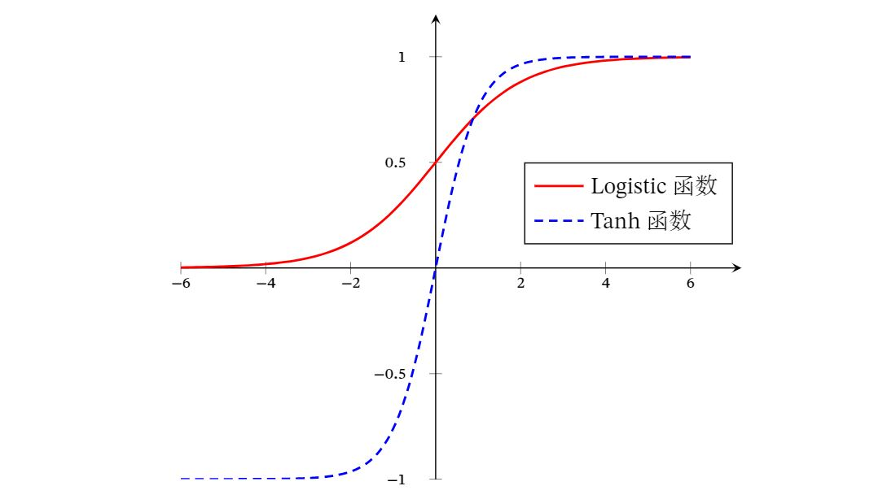
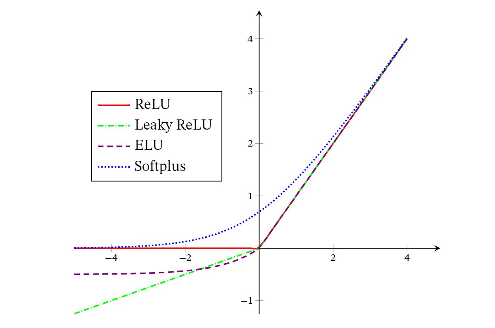
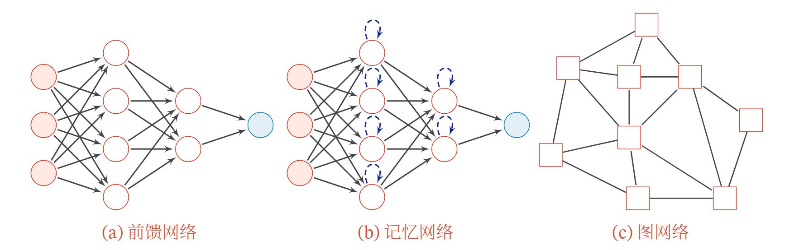

# 神经网络

书可参考[邱锡鹏：神经网络与深度学习](https://nndl.github.io/nndl-book.pdf)

# 一. 神经元

>时刻思考各个激活函数的特点，如合理性？梯度爆炸？梯度消失？  

### 1. Sigmoid型函数  

Sigmoid型函数是指一类S型曲线函数，为两端饱和函数．常用的Sigmoid型函数有Logistic函数和Tanh函数．  
>对于函数 $f(x)$ ，若 $x\rightarrow -\infin$ 时，其导数 $f'(x)\rightarrow 0$ ，则称其为左饱和．若 $x\rightarrow +\infin$ 时，其导数 $f'(x)\rightarrow 0$ ，则称其为右饱和．当同时满足左、右饱和时，就称为两端饱和． 

#### 1.1 Logistic型函数  

$$
\sigma (x) = \frac{1}{1+exp(-x)}
$$

#### 1.2 Tanh函数  

$$
tanh(x) = \frac{exp(x)-exp(-x)}{exp(x)+exp(-x)}
$$
Tanh函数可以看作放大并平移的Logistic函数，其值域是(−1,1)  
$$
tanh(x) = 2\sigma(2x) -1
$$
下图给出了Logistic函数和Tanh函数的形状．Tanh函数的输出是零中心化的（Zero-Centered），而Logistic函数的输出恒大于0．非零中心化的输出会使得其后一层的神经元的输入发生偏置偏移（Bias Shift），并进一步使得梯度下降的收敛速度变慢．  

  

### 2. ReLU函数  

ReLU（Rectified Linear Unit，修正线性单元），也叫Rectifier函数，是目前深度神经网络中经常使用的激活函数．ReLU实际上是一个斜坡（ramp）函数，定义为
$$
ReLU(x) = 
    \begin{cases}
        x&, x\geq0 \\
        0&, x<0
    \end{cases}
$$
ReLU神经元训练时比较容易“**死亡**”，在训练时，如果参数在一次不恰当的更新后，第一个隐藏层中的某个ReLU神经元在所有的训练数据上都不能被激活，那么这个神经元自身参数的梯度永远都会是0，在以后的训练过程中永远不能被激活．这种现象称为死亡ReLU问题（DyingReLU Problem）．故有以下变种  

#### 2.1 带泄露的ReLU  

带泄露的ReLU（Leaky ReLU）在输入 $x<0$ 时，保持一个很小的梯度 $\gamma$ ．这样当神经元非激活时也能有一个非零的梯度可以更新参数，避免永远不能被激活．
$$
\begin{aligned}
LeakyReLU(x) &= 
    \begin{cases}
        x&if x>0\\
        \gamma x&if x\leq 0
    \end{cases}\\
&=max(0,x)+\gamma min(0,x).
\end{aligned}
$$

#### 2.2 带参数的ReLU  

带参数的ReLU（Parametric ReLU，PReLU）引入一个可学习的参数，不同神经元可以有不同的参数[He et al.,2015]．对于第𝑖个神经元，其PReLU的定义为
$$
\begin{aligned}
PReLU_i(x) &= 
    \begin{cases}
        x&if x>0\\
        \gamma_i x&if x\leq 0
    \end{cases}\\
&=max(0,x)+\gamma_i min(0,x).
\end{aligned}
$$

#### 2.3 ELU函数  

ELU（Exponential Linear Unit，指数线性单元）是一个近似的零中心化的非线性函数，其定义为
$$
\begin{aligned}
ELU(x) &= 
    \begin{cases}
        x&if x>0\\
        \gamma(exp(x)-1) &if x\leq 0
    \end{cases}\\
&=max(0,x)+ min(0,\gamma (exp(x)-1)).
\end{aligned}
$$
其中𝛾 ≥ 0是一个超参数，决定𝑥 ≤ 0时的饱和曲线，并调整输出均值在0附近．  

#### 2.4 Softplus函数  

Softplus函数可以看作Rectifier函数的平滑版本，其定义为
$$
Softplus(x) = log(1+exp(x))
$$
Softplus函数其导数刚好是Logistic函数．Softplus函数虽然也具有单侧抑制、宽兴奋边界的特性，却没有稀疏激活性．
  

### 3. Swish函数  

Swish函数是一种自门控（Self-Gated）激活函数，定义为
$$
swish(x) = x\sigma(\beta x).
$$
其中$\sigma(\cdot)$为Logistic函数，$\beta$ 为可学习的参数或一个固定超参数．$\sigma(\cdot)\in(0,1)$ 可以看作一种软性的门控机制．当 $\sigma(\beta x)$ 接近于1时，门处于“开”状态，激活函数的输出近似于𝑥本身；当 $\sigma(\beta x)$ 接近于0时，门的状态为“关”，激活函数的输出近似于0
  
当 $\beta=0$ 时，Swish函数变成线性函数 $\frac{x}{2}$ ．当 $\beta=1$ 时，Swish函数在 $x>0$ 时近似线性，在 $x<0$ 时近似饱和，同时具有一定的非单调性．当 $\beta\rightarrow+\infin$ 时， $\sigma(\beta x)$ 趋向于离散的0-1函数，Swish函数近似为ReLU函数．因此，Swish函数可以看作线性函数和ReLU函数之间的非线性插值函数，其程度由参数 $\beta$ 控制．  

### 4. GELU函数  

TODO:GELU函数

### 5. Maxout单元  

TODO:Maxout单元

# 二. 网络结构

### 1. 网络结构总述

目前为止，常用的神经网络有如下三种：
1. **前馈网络**：整个网络中的信息是朝一个方向传播，没有反向的信息传播，可以用一个有向无环路图表示．前馈网络包括全连接前馈网络和卷积神经网络等．前馈网络可以看作一个**函数**，通过简单非线性函数的多次复合，实现输入空间到输出空间的复杂映射．
2. **记忆网络**：也称为**反馈网络**，网络中的神经元不但可以接收其他神经元的信息，也可以接收自己的历史信息．和前馈网络相比，记忆网络中的神经元具有**记忆**功能，在不同的时刻具有不同的状态．记忆神经网络中的信息传播可以是单向或双向传递，因此可用一个有向循环图或无向图来表示．记忆网络包括循环神经网络、Hopfield网络、玻尔兹曼机、受限玻尔兹曼机等．记忆网络可以看作一个**程序**，具有更强的计算和记忆能力．为了增强记忆网络的记忆容量，可以引入外部记忆单元和读写机制，用来保存一些网络的中间状态，称为记忆增强神经网络（Memory Augmented NeuralNetwork，MANN），比如神经图灵机和记忆网络等．  
3. **图网络**：实际应用中很多数据是图结构的数据，比如知识图谱、社交网络、分子（Molecular）网络等．图网络是定义在图结构数据上的神经网络．图中每个节点都由一个或一组神经元构成．节点之间的连接可以是有向的，也可以是无向的．每个节点可以收到来自相邻节点或自身的信息．图网络是前馈网络和记忆网络的泛化，包含很多不同的实现方式，比如图卷积网络（Graph Convolutional Network，GCN）、图注意力网络（Graph Attention Network，GAT）、消息传递神经网络（Message Passing Neural Network，MPNN）等．  
  
