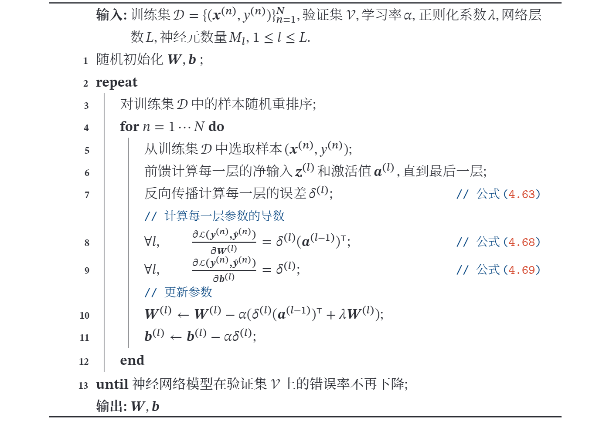

# 前馈神经网络  

# 一． 前馈神经网络
**前馈神经网络**（Feedforward Neural Network，FNN）是最早发明的简单人工神经网络．前馈神经网络也经常称为**多层感知器**（Multi-Layer Perceptron，MLP）．  

在前馈神经网络中，各神经元分别属于不同的层．每一层的神经元可以接收前一层神经元的信号，并产生信号输出到下一层．第 0 层称为**输入层**，最后一层称为**输出层**，其他中间层称为**隐藏层**．整个网络中无反馈，信号从输入层向输出层单向传播，可用一个有向无环图表示．  

  

下面用到的记号：  
- $L$ ：神经网络的层数
- $M_{l}$：第 $l$ 层神经元的个数
- $f_{l}(\cdot)$：第 $l$ 层神经元的激活函数
- $\boldsymbol{W}^{(l)} \in \mathbb{R}^{M_{l} \times M_{l-1}} \quad$ ：第 $l-1$ 层到第 $l$ 层的权重矩阵
- $\boldsymbol{b}^{(l)} \in \mathbb{R}^{M_{l}}:\text{第 } l-1 \text {层到第 } l \text { 层的偏置 }$
- $z^{(l)} \in \mathbb{R}^{M_{l}}$：第 $l$ 层神经元的净输入 $($ 净活性值 $)$
- $\boldsymbol{a}^{(l)} \in \mathbb{R}^{M_{l}}$：第 $l$ 层神经元的输出 $($ 活性值 $)$  

令 $\boldsymbol{a}^{(0)}=\boldsymbol{x}$ ，前馈神经网络通过不断迭代下面公式进行信息传播:
$$
\begin{array}{l}
\boldsymbol{z}^{(l)}=\boldsymbol{W}^{(l)} \boldsymbol{a}^{(l-1)}+\boldsymbol{b}^{(l)} \\
\boldsymbol{a}^{(l)}=f_{l}\left(\boldsymbol{z}^{(l)}\right)
\end{array}
$$

首先根据第 $l-1$ 层神经元的**活性值** ( Activation ) $\boldsymbol{a}^{(l-1)}$ 计算出第 $l$ 层神经元的**净活性值** ( Net Activation ) $\boldsymbol{z}^{(l)}$ ，然后经过一个激活函数得到第 $l$ 层神经元的活性
值因此，我们也可以把每个神经层看作一个仿射变换 ( Affine Transformation )
和一个非线性变换．
上述两式也可以合并写为:
$$
z^{(l)}=\boldsymbol{W}^{(l)} f_{l-1}\left(z^{(l-1)}\right)+\boldsymbol{b}^{(l)}
$$
或者
$$
\boldsymbol{a}^{(l)}=f_{l}\left(\boldsymbol{W}^{(l)} \boldsymbol{a}^{(l-1)}+\boldsymbol{b}^{(l)}\right)
$$

>**仿射变换**：又称仿射映射，是指在几何中，一个向量空间进行一次线性变换并接上一个平移，变换为另一个向量空间．  

这样, 前馈神经网络可以通过逐层的信息传递，得到网络最后的输出 $\boldsymbol{a}^{(L)}$ ．整个网络可以看作一个复合函数 $\phi(\boldsymbol{x} ; \boldsymbol{W}, \boldsymbol{b})$ ，将向量 $\boldsymbol{x}$ 作为第 1 层的输入 $\boldsymbol{a}^{(0)}$ ．将第 $L$ 层的输出 $\boldsymbol{a}^{(L)}$ 作为整个函数的输出．
$$
x=\boldsymbol{a}^{(0)} \rightarrow z^{(1)} \rightarrow \boldsymbol{a}^{(1)} \rightarrow \boldsymbol{z}^{(2)} \rightarrow \cdots \rightarrow \boldsymbol{a}^{(L-1)} \rightarrow \boldsymbol{z}^{(L)} \rightarrow \boldsymbol{a}^{(L)}=\phi(\boldsymbol{x} ; \boldsymbol{W}, \boldsymbol{b})，
$$

其中 $\boldsymbol{W}, \boldsymbol{b}$ 表示网络中所有层的连接权重和偏置．  

**通用近似定理**（Universal Approximation Theorem ) [Cy-
benko, 1989; Hornik et al., 1989]: 令 $\phi(\cdot)$ 是一个非常数、有界、单调递增的连续函数，$\mathcal{J}_{D}$ 是一个 $D$ 维的单位超立方体 $[0,1]^{D}，C\left(\mathcal{J}_{D}\right)$ 是定义在 $\mathcal{J}_{D}$ 上的连续函数集合．对于任意给定的一个函数 $f \in C\left(\mathcal{T}_{D}\right)$ ，存在一个整数 $M$ ，和一组实数 $v_{m}, b_{m} \in \mathbb{R}$ 以及实数向量 $\boldsymbol{w}_{m} \in \mathbb{R}^{D}, m=1, \cdots, M$ ，以至于我
们可以定义函数
$$
F(\boldsymbol{x})=\sum_{m=1}^{M} v_{m} \phi\left(\boldsymbol{w}_{m}^{\top} \boldsymbol{x}+b_{m}\right)
$$
作为函数 $f$ 的近似实现，即
$$
|F(\boldsymbol{x})-f(\boldsymbol{x})|<\epsilon, \quad \forall \boldsymbol{x} \in \mathcal{J}_{D}
$$
其中 $\epsilon>0$ 是一个很小的正数．  

# 二． 反向传播  

假设采用随机梯度下降进行神经网络参数学习，给定一个样本 $(\boldsymbol{x}, \boldsymbol{y})$ ，将其输入到神经网络模型中，得到网络输出为 $\hat{y}$ ．假设损失函数为 $\mathcal{L}(\boldsymbol{y}, \hat{\boldsymbol{y}})$ ，要进行参
数学习就需要计算损失函数关于每个参数的导数．  

不失一般性，对第 $l$ 层中的参数 $\boldsymbol{W}^{(l)}$ 和 $\boldsymbol{b}^{(l)}$ 计算偏导数．因为 $\frac{\partial \mathcal{L}(\boldsymbol{y}, \hat{\boldsymbol{y}})}{\partial \boldsymbol{W}^{(l)}}$ 的计算
涉及向量对矩阵的微分，十分繁銷，因此我们先计算 $\mathcal{L}(\boldsymbol{y}, \hat{\boldsymbol{y}})$ 关于参数矩阵中每个元素的偏导数 $\frac{\partial \mathcal{L}(\boldsymbol{y}, \boldsymbol{y})}{\partial w_{i j}^{(l)}}$ ．根据链式法则，
$$
\begin{aligned}
\frac{\partial \mathcal{L}(\boldsymbol{y}, \hat{\boldsymbol{y}})}{\partial w_{i j}^{(l)}}=\frac{\partial \boldsymbol{z}^{(l)}}{\partial w_{i j}^{(l)}} \frac{\partial \mathcal{L}(\boldsymbol{y}, \hat{\boldsymbol{y}})}{\partial \boldsymbol{z}^{(l)}} \\
\frac{\partial \mathcal{L}(\boldsymbol{y}, \hat{\boldsymbol{y}})}{\partial \boldsymbol{b}^{(l)}}=\frac{\partial \boldsymbol{z}^{(l)}}{\partial \boldsymbol{b}^{(l)}} \frac{\partial \mathcal{L}(\boldsymbol{y}, \hat{\boldsymbol{y}})}{\partial \boldsymbol{z}^{(l)}}
\end{aligned}
$$
上式中的第二项都是目标函数关于第 $l$ 层的神经元 $z^{(l)}$
的偏导数，称为**误差项**，可以一次计算得到，这样我们只需要计算三个偏导数, 分 别为 $\frac{\partial z^{(l)}}{\partial w_{i j}^{(l)}}, \frac{\partial z^{(l)}}{\partial \boldsymbol{b}^{(l)}}$ 和 $\frac{\partial \mathcal{L}(\boldsymbol{y}, \hat{\boldsymbol{y}})}{\partial \boldsymbol{z}^{(l)}} .$
下面分别来计算这三个偏导数．  

1. 计算偏导数 $\frac{\partial z^{(l)}}{\partial w_{i j}^{(l)}} \quad$ 因 $z^{(l)}=\boldsymbol{W}^{(l)} \boldsymbol{a}^{(l-1)}+\boldsymbol{b}^{(l)}$ ，偏导数
$$
\begin{aligned}
\frac{\partial \boldsymbol{z}^{(l)}}{\partial w_{i j}^{(l)}} &=[\frac{\partial z_{1}^{(l)}}{\partial w_{i j}^{(l)}}, \cdots, {\frac{\partial z_{i}^{(l)}}{\partial w_{i j}^{(l)}}}, \cdots, \frac{\partial z_{M_{l}}^{(l)}}{\partial w_{i j}^{(l)}}] \\
&=[0, \cdots, \frac{\partial\left(\boldsymbol{w}_{i:}^{(l)} \boldsymbol{a}^{(l-1)}+b_{i}^{(l)}\right)}{\partial w_{i j}^{(l)}}, \cdots, 0] \\
&=\left[0, \cdots, a_{j}^{(l-1)}, \cdots, 0\right] \\
& \triangleq \mathbb{l}_{i}\left(a_{j}^{(l-1)}\right) \in \mathbb{R}^{1 \times M_{l}},
\end{aligned}
$$
其中 $\boldsymbol{w}_{i:}^{(l)}$ 为权重矩阵 $\boldsymbol{W}^{(l)}$ 的第 $i$ 行， $0_{i}\left(a_{j}^{(l-1)}\right)$ 表示第 $i$ 个元素为 $a_{j}^{(l-1)}$ ，其余为 0 的行向量．  

2. 计算偏导数 $\frac{\partial z^{(l)}}{\partial b^{(l)}} \quad$ 因为 $z^{(l)}$ 和 $\boldsymbol{b}^{(l)}$ 的函数关系为 $z^{(l)}=\boldsymbol{W}^{(l)} \boldsymbol{a}^{(l-1)}+$
$\boldsymbol{b}^{(l)}$ ，因此偏导数
$$
\frac{\partial \boldsymbol{z}^{(l)}}{\partial \boldsymbol{b}^{(l)}}=\boldsymbol{I}_{M_{l}} \in \mathbb{R}^{M_{l} \times M_{l}}
$$
为 $M_{l} \times M_{l}$ 的单位矩阵．  

3. 计算偏导数 $\frac{\partial \mathcal{L}(\boldsymbol{y}, \hat{y})}{\partial z^{(l)}} \quad$ 偏导数 $\frac{\partial \mathcal{L}(\boldsymbol{y}, \hat{\boldsymbol{y}})}{\partial \boldsymbol{z}^{(l)}}$ 表示第 $l$ 层神经元对最终损失
的影响，也反映了最终损失对第 $l$ 层神经元的敏感程度，因此一般称为第 $l$ 层神经元的**误差项**，用 $\delta^{(l)}$ 来表示．
$$
\delta^{(l)} \triangleq \frac{\partial \mathcal{L}(\boldsymbol{y}, \hat{\boldsymbol{y}})}{\partial \boldsymbol{z}^{(l)}} \in \mathbb{R}^{M_{l}}
$$  

误差项 $\delta^{(l)}$ 也间接反映了不同神经元对网络能力的贡献程度，从而比较好地解决
了贡献度分配问题 ( Credit Assignment Problem, CAP )．  

根据 $\boldsymbol{z}^{(l+1)}=\boldsymbol{W}^{(l+1)} \boldsymbol{a}^{(l)}+\boldsymbol{b}^{(l+1)}$ ，有
$$
\frac{\partial z^{(l+1)}}{\partial \boldsymbol{a}^{(l)}}=\left(\boldsymbol{W}^{(l+1)}\right)^{\top} \in \mathbb{R}^{M_{l} \times M_{l+1}}
$$
根据 $\boldsymbol{a}^{(l)}=f_{l}\left(\boldsymbol{z}^{(l)}\right)$ ，其中 $f_{l}(\cdot)$ 为按位计算的函数，因此有
$$
\begin{aligned}
\frac{\partial \boldsymbol{a}^{(l)}}{\partial \boldsymbol{z}^{(l)}} &=\frac{\partial f_{l}\left(\boldsymbol{z}^{(l)}\right)}{\partial \boldsymbol{z}^{(l)}} \\
&=\operatorname{diag}\left(f_{l}^{\prime}\left(\boldsymbol{z}^{(l)}\right)\right) \quad \in \mathbb{R}^{M_{l} \times \boldsymbol{M}_{l}}
\end{aligned}
$$
因此，根据链式法则，第 $l$ 层的误差项为
$$
\begin{aligned}
\delta^{(l)} & \triangleq \frac{\partial \mathcal{L}(\boldsymbol{y}, \hat{\boldsymbol{y}})}{\partial \boldsymbol{z}^{(l)}} \\
&=\frac{\partial \boldsymbol{a}^{(l)}}{\partial \boldsymbol{z}^{(l)}} \cdot \frac{\partial \boldsymbol{z}^{(l+1)}}{\partial \boldsymbol{a}^{(l)}} \cdot {\frac{\partial \mathcal{L}(\boldsymbol{y}, \hat{\boldsymbol{y}})}{\partial \boldsymbol{z}^{(l+1)}}}] \\
&={\operatorname{diag}\left(f_{l}^{\prime}\left(\boldsymbol{z}^{(l)}\right)\right) \cdot\left(\boldsymbol{W}^{(l+1)}\right)^{\mathrm{T}} \cdot \cdot \delta^{(l+1)}} \\
&=f_{l}^{\prime}\left(\boldsymbol{z}^{(l)}\right) \odot\left(\left(\boldsymbol{W}^{(l+1)}\right)^{\top} \delta^{(l+1)}\right) \in \mathbb{R}^{M_{l}},
\end{aligned}
$$
其中 $\odot$ 是向量的点积运算符，表示每个元素相乘．  

从上式可以看出，第 $l$ 层的误差项可以通过第 $l+1$ 层的误差项计算得到，这就是误差的**反向传播** ( BackPropagation, BP )．反向传播算法的含义是:
第 $l$ 层的一个神经元的误差项 $($ 或敏感性 $)$ 是所有与该神经元相连的第 $l+1$ 层
的神经元的误差项的权重和．然后，再乘上该神经元激活函数的梯度．  

在计算出上面三个偏导数之后，最初的式子可以写为
$$
\begin{aligned}
\frac{\partial \mathcal{L}(\boldsymbol{y}, \hat{\boldsymbol{y}})}{\partial w_{i j}^{(l)}} &=\mathbb{l}_{i}\left(a_{j}^{(l-1)}\right) \delta^{(l)} \\
&=\left[0, \cdots, a_{j}^{(l-1)}, \cdots, 0\right]\left[\delta_{1}^{(l)}, \cdots, \delta_{i}^{(l)}, \cdots, \delta_{M_{l}}^{(l)}\right]^{\top} \\
&=\delta_{i}^{(l)} a_{j}^{(l-1)}
\end{aligned}
$$
其中 $\delta_{i}^{(l)} a_{j}^{(l-1)}$ 相当于向量 $\delta^{(l)}$ 和向量 $\boldsymbol{a}^{(l-1)}$ 的外积的第 $i, j$ 个元素．上式可以进一步写为
$$
\left[\frac{\partial \mathcal{L}(\boldsymbol{y}, \hat{\boldsymbol{y}})}{\partial \boldsymbol{W}^{(l)}}\right]_{i j}=\left[\delta^{(l)}\left(\boldsymbol{a}^{(l-1)}\right)^{\top}\right]_{i j} .
$$
因此， $\mathcal{L}(\boldsymbol{y}, \hat{\boldsymbol{y}})$ 关于第 $l$ 层权重 $\boldsymbol{W}^{(l)}$ 的梯度为
$$
\frac{\partial \mathcal{L}(\boldsymbol{y}, \hat{\boldsymbol{y}})}{\partial \boldsymbol{W}^{(l)}}=\delta^{(l)}\left(\boldsymbol{a}^{(l-1)}\right)^{\mathrm{T}} \in \mathbb{R}^{M_{l} \times M_{l-1}}．
$$

同理, $\mathcal{L}(\boldsymbol{y}, \hat{\boldsymbol{y}})$ 关于第 $l$ 层偏置 $\boldsymbol{b}^{(l)}$ 的梯度为
$$
\frac{\partial \mathcal{L}(\boldsymbol{y}, \hat{\boldsymbol{y}})}{\partial \boldsymbol{b}^{(l)}}=\delta^{(l)} \in \mathbb{R}^{M_{l}}
$$
在计算出每一层的误差项之后，我们就可以得到每一层参数的梯度．因此，使用误差反向传播算法的前贵神经网络训练过程可以分为以下三步：
1. 前馈计算每一层的净输入 $z^{(l)}$ 和激活值 $\boldsymbol{a}^{(l)}$ ，直到最后一层；
2. 反向传播计算每一层的误差项 $\delta^{(l)}$ ；
3. 计算每一层参数的偏导数，并更新参数．  

  

# 三． 自动微分

# 卷积神经网络