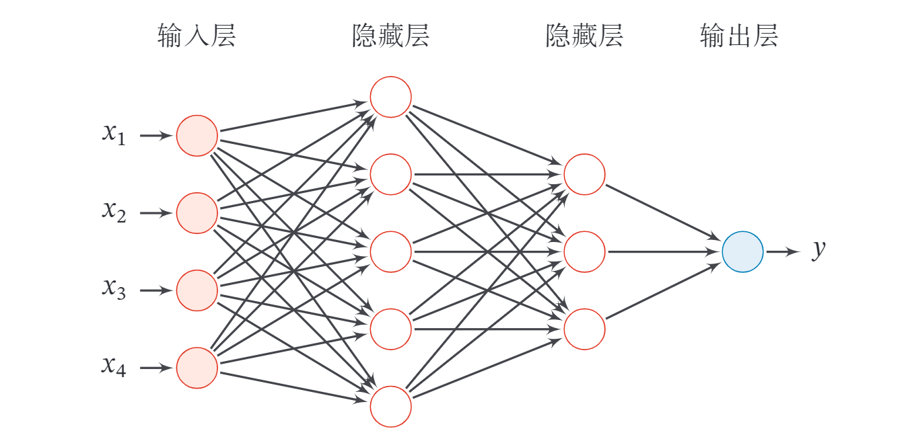
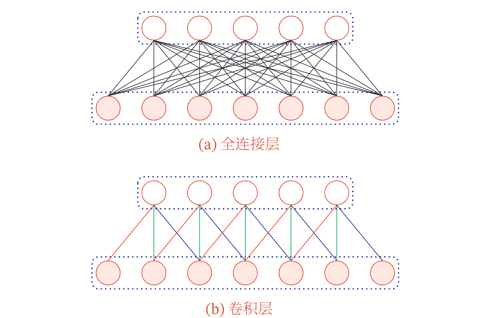
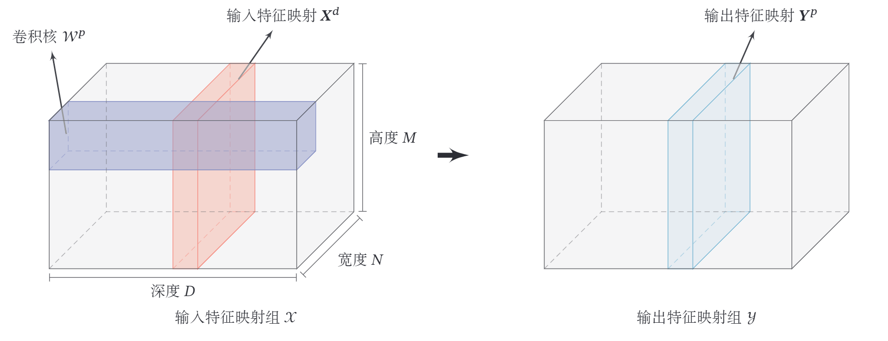

# 前馈神经网络  

## 一． 前馈神经网络

**前馈神经网络**（Feedforward Neural Network，FNN）是最早发明的简单人工神经网络．前馈神经网络也经常称为**多层感知器**（Multi-Layer Perceptron，MLP）．  

在前馈神经网络中，各神经元分别属于不同的层．每一层的神经元可以接收前一层神经元的信号，并产生信号输出到下一层．第 0 层称为**输入层**，最后一层称为**输出层**，其他中间层称为**隐藏层**．整个网络中无反馈，信号从输入层向输出层单向传播，可用一个有向无环图表示．  

  

下面用到的记号：  

- $L$ ：神经网络的层数
- $M_{l}$：第 $l$ 层神经元的个数
- $f_{l}(\cdot)$：第 $l$ 层神经元的激活函数
- $\boldsymbol{W}^{(l)} \in \mathbb{R}^{M_{l} \times M_{l-1}} \quad$ ：第 $l-1$ 层到第 $l$ 层的权重矩阵
- $\boldsymbol{b}^{(l)} \in \mathbb{R}^{M_{l}}:\text{第 } l-1 \text {层到第 } l \text { 层的偏置 }$
- $z^{(l)} \in \mathbb{R}^{M_{l}}$：第 $l$ 层神经元的净输入 $($ 净活性值 $)$
- $\boldsymbol{a}^{(l)} \in \mathbb{R}^{M_{l}}$：第 $l$ 层神经元的输出 $($ 活性值 $)$  

令 $\boldsymbol{a}^{(0)}=\boldsymbol{x}$ ，前馈神经网络通过不断迭代下面公式进行信息传播:
$$
\begin{array}{l}
\boldsymbol{z}^{(l)}=\boldsymbol{W}^{(l)} \boldsymbol{a}^{(l-1)}+\boldsymbol{b}^{(l)} \\
\boldsymbol{a}^{(l)}=f_{l}\left(\boldsymbol{z}^{(l)}\right)\tag{1.1}
\end{array}
$$

首先根据第 $l-1$ 层神经元的**活性值** ( Activation ) $\boldsymbol{a}^{(l-1)}$ 计算出第 $l$ 层神经元的**净活性值** ( Net Activation ) $\boldsymbol{z}^{(l)}$ ，然后经过一个激活函数得到第 $l$ 层神经元的活性
值因此，我们也可以把每个神经层看作一个仿射变换 ( Affine Transformation )
和一个非线性变换．
上述两式也可以合并写为:
$$
z^{(l)}=\boldsymbol{W}^{(l)} f_{l-1}\left(z^{(l-1)}\right)+\boldsymbol{b}^{(l)}\tag{1.2}
$$
或者
$$
\boldsymbol{a}^{(l)}=f_{l}\left(\boldsymbol{W}^{(l)} \boldsymbol{a}^{(l-1)}+\boldsymbol{b}^{(l)}\right)\tag{1.3}
$$

>**仿射变换**：又称仿射映射，是指在几何中，一个向量空间进行一次线性变换并接上一个平移，变换为另一个向量空间．  

这样， 前馈神经网络可以通过逐层的信息传递，得到网络最后的输出 $\boldsymbol{a}^{(L)}$ ．整个网络可以看作一个复合函数 $\phi(\boldsymbol{x} ; \boldsymbol{W}， \boldsymbol{b})$ ，将向量 $\boldsymbol{x}$ 作为第 1 层的输入 $\boldsymbol{a}^{(0)}$ ．将第 $L$ 层的输出 $\boldsymbol{a}^{(L)}$ 作为整个函数的输出．
$$
x=\boldsymbol{a}^{(0)} \rightarrow z^{(1)} \rightarrow \boldsymbol{a}^{(1)} \rightarrow \boldsymbol{z}^{(2)} \rightarrow \cdots \rightarrow \boldsymbol{a}^{(L-1)} \rightarrow \boldsymbol{z}^{(L)} \rightarrow \boldsymbol{a}^{(L)}=\phi(\boldsymbol{x} ; \boldsymbol{W}， \boldsymbol{b})，\tag{1.4}
$$

其中 $\boldsymbol{W}， \boldsymbol{b}$ 表示网络中所有层的连接权重和偏置．  

**通用近似定理**（Universal Approximation Theorem ) [Cy-
benko， 1989; Hornik et al.， 1989]: 令 $\phi(\cdot)$ 是一个非常数、有界、单调递增的连续函数，$\mathcal{J}_{D}$ 是一个 $D$ 维的单位超立方体 $[0，1]^{D}，C\left(\mathcal{J}_{D}\right)$ 是定义在 $\mathcal{J}_{D}$ 上的连续函数集合．对于任意给定的一个函数 $f \in C\left(\mathcal{T}_{D}\right)$ ，存在一个整数 $M$ ，和一组实数 $v_{m}， b_{m} \in \mathbb{R}$ 以及实数向量 $\boldsymbol{w}_{m} \in \mathbb{R}^{D}， m=1， \cdots， M$ ，以至于我
们可以定义函数
$$
F(\boldsymbol{x})=\sum_{m=1}^{M} v_{m} \phi\left(\boldsymbol{w}_{m}^{\top} \boldsymbol{x}+b_{m}\right)\tag{1.5}
$$
作为函数 $f$ 的近似实现，即
$$
|F(\boldsymbol{x})-f(\boldsymbol{x})|<\epsilon， \quad \forall \boldsymbol{x} \in \mathcal{J}_{D}\tag{1.6}
$$
其中 $\epsilon>0$ 是一个很小的正数．  

## 二． 反向传播  

假设采用随机梯度下降进行神经网络参数学习，给定一个样本 $(\boldsymbol{x}， \boldsymbol{y})$ ，将其输入到神经网络模型中，得到网络输出为 $\hat{y}$ ．假设损失函数为 $\mathcal{L}(\boldsymbol{y}， \hat{\boldsymbol{y}})$ ，要进行参数学习就需要计算损失函数关于每个参数的导数．  

不失一般性，对第 $l$ 层中的参数 $\boldsymbol{W}^{(l)}$ 和 $\boldsymbol{b}^{(l)}$ 计算偏导数．因为 $\frac{\partial \mathcal{L}(\boldsymbol{y}， \hat{\boldsymbol{y}})}{\partial \boldsymbol{W}^{(l)}}$ 的计算
涉及向量对矩阵的微分，十分繁銷，因此我们先计算 $\mathcal{L}(\boldsymbol{y}， \hat{\boldsymbol{y}})$ 关于参数矩阵中每个元素的偏导数 $\frac{\partial \mathcal{L}(\boldsymbol{y}， \boldsymbol{y})}{\partial w_{i j}^{(l)}}$ ．根据链式法则，
$$
\begin{aligned}
\frac{\partial \mathcal{L}(\boldsymbol{y}， \hat{\boldsymbol{y}})}{\partial w_{i j}^{(l)}}=\frac{\partial \boldsymbol{z}^{(l)}}{\partial w_{i j}^{(l)}} \frac{\partial \mathcal{L}(\boldsymbol{y}， \hat{\boldsymbol{y}})}{\partial \boldsymbol{z}^{(l)}} \tag{2.1}\\
\frac{\partial \mathcal{L}(\boldsymbol{y}， \hat{\boldsymbol{y}})}{\partial \boldsymbol{b}^{(l)}}=\frac{\partial \boldsymbol{z}^{(l)}}{\partial \boldsymbol{b}^{(l)}} \frac{\partial \mathcal{L}(\boldsymbol{y}， \hat{\boldsymbol{y}})}{\partial \boldsymbol{z}^{(l)}}
\end{aligned}
$$
上式中的第二项都是目标函数关于第 $l$ 层的神经元 $z^{(l)}$
的偏导数，称为**误差项**，可以一次计算得到，这样我们只需要计算三个偏导数， 分 别为 $\frac{\partial z^{(l)}}{\partial w_{i j}^{(l)}}， \frac{\partial z^{(l)}}{\partial \boldsymbol{b}^{(l)}}$ 和 $\frac{\partial \mathcal{L}(\boldsymbol{y}， \hat{\boldsymbol{y}})}{\partial \boldsymbol{z}^{(l)}} .$
下面分别来计算这三个偏导数．  

1. 计算偏导数 $\frac{\partial z^{(l)}}{\partial w_{i j}^{(l)}} \quad$ 因 $z^{(l)}=\boldsymbol{W}^{(l)} \boldsymbol{a}^{(l-1)}+\boldsymbol{b}^{(l)}$ ，偏导数
$$
\begin{aligned}
\frac{\partial \boldsymbol{z}^{(l)}}{\partial w_{i j}^{(l)}} &=[\frac{\partial z_{1}^{(l)}}{\partial w_{i j}^{(l)}}， \cdots， {\frac{\partial z_{i}^{(l)}}{\partial w_{i j}^{(l)}}}， \cdots， \frac{\partial z_{M_{l}}^{(l)}}{\partial w_{i j}^{(l)}}] \\
&=[0， \cdots， \frac{\partial\left(\boldsymbol{w}_{i:}^{(l)} \boldsymbol{a}^{(l-1)}+b_{i}^{(l)}\right)}{\partial w_{i j}^{(l)}}， \cdots， 0] \\
&=\left[0， \cdots， a_{j}^{(l-1)}， \cdots， 0\right] \\
& \triangleq \mathbb{I}_{i}\left(a_{j}^{(l-1)}\right) \in \mathbb{R}^{1 \times M_{l}}，\tag{2.2}
\end{aligned}
$$
其中 $\boldsymbol{w}_{i:}^{(l)}$ 为权重矩阵 $\boldsymbol{W}^{(l)}$ 的第 $i$ 行， $\mathbb{I}_{i}\left(a_{j}^{(l-1)}\right)$ 表示第 $i$ 个元素为 $a_{j}^{(l-1)}$ ，其余为 0 的行向量．  

2. 计算偏导数 $\frac{\partial z^{(l)}}{\partial b^{(l)}} \quad$ 因为 $z^{(l)}$ 和 $\boldsymbol{b}^{(l)}$ 的函数关系为 $z^{(l)}=\boldsymbol{W}^{(l)} \boldsymbol{a}^{(l-1)}+$
$\boldsymbol{b}^{(l)}$ ，因此偏导数
$$
\frac{\partial \boldsymbol{z}^{(l)}}{\partial \boldsymbol{b}^{(l)}}=\boldsymbol{I}_{M_{l}} \in \mathbb{R}^{M_{l} \times M_{l}}\tag{2.3}
$$
为 $M_{l} \times M_{l}$ 的单位矩阵．  

3. 计算偏导数 $\frac{\partial \mathcal{L}(\boldsymbol{y}， \hat{y})}{\partial z^{(l)}} \quad$ 偏导数 $\frac{\partial \mathcal{L}(\boldsymbol{y}， \hat{\boldsymbol{y}})}{\partial \boldsymbol{z}^{(l)}}$ 表示第 $l$ 层神经元对最终损失
的影响，也反映了最终损失对第 $l$ 层神经元的敏感程度，因此一般称为第 $l$ 层神经元的**误差项**，用 $\delta^{(l)}$ 来表示．
$$
\delta^{(l)} \triangleq \frac{\partial \mathcal{L}(\boldsymbol{y}， \hat{\boldsymbol{y}})}{\partial \boldsymbol{z}^{(l)}} \in \mathbb{R}^{M_{l}}\tag{2.4}
$$  

误差项 $\delta^{(l)}$ 也间接反映了不同神经元对网络能力的贡献程度，从而比较好地解决
了贡献度分配问题 ( Credit Assignment Problem， CAP )．  

根据 $\boldsymbol{z}^{(l+1)}=\boldsymbol{W}^{(l+1)} \boldsymbol{a}^{(l)}+\boldsymbol{b}^{(l+1)}$ ，有
$$
\frac{\partial z^{(l+1)}}{\partial \boldsymbol{a}^{(l)}}=\left(\boldsymbol{W}^{(l+1)}\right)^{\top} \in \mathbb{R}^{M_{l} \times M_{l+1}}\tag{2.5}
$$
根据 $\boldsymbol{a}^{(l)}=f_{l}\left(\boldsymbol{z}^{(l)}\right)$ ，其中 $f_{l}(\cdot)$ 为按位计算的函数，因此有
$$
\begin{aligned}
\frac{\partial \boldsymbol{a}^{(l)}}{\partial \boldsymbol{z}^{(l)}} &=\frac{\partial f_{l}\left(\boldsymbol{z}^{(l)}\right)}{\partial \boldsymbol{z}^{(l)}} \\
&=\operatorname{diag}\left(f_{l}^{\prime}\left(\boldsymbol{z}^{(l)}\right)\right) \quad \in \mathbb{R}^{M_{l} \times \boldsymbol{M}_{l}}\tag{2.6}
\end{aligned}
$$
因此，根据链式法则，第 $l$ 层的误差项为
$$
\begin{aligned}
\delta^{(l)} & \triangleq \frac{\partial \mathcal{L}(\boldsymbol{y}， \hat{\boldsymbol{y}})}{\partial \boldsymbol{z}^{(l)}} \\
&=\frac{\partial \boldsymbol{a}^{(l)}}{\partial \boldsymbol{z}^{(l)}} \cdot \frac{\partial \boldsymbol{z}^{(l+1)}}{\partial \boldsymbol{a}^{(l)}} \cdot {\frac{\partial \mathcal{L}(\boldsymbol{y}， \hat{\boldsymbol{y}})}{\partial \boldsymbol{z}^{(l+1)}}}] \\
&={\operatorname{diag}\left(f_{l}^{\prime}\left(\boldsymbol{z}^{(l)}\right)\right) \cdot\left(\boldsymbol{W}^{(l+1)}\right)^{\mathrm{T}} \cdot \cdot \delta^{(l+1)}} \\
&=f_{l}^{\prime}\left(\boldsymbol{z}^{(l)}\right) \odot\left(\left(\boldsymbol{W}^{(l+1)}\right)^{\top} \delta^{(l+1)}\right) \in \mathbb{R}^{M_{l}}，\tag{2.7}
\end{aligned}
$$
其中 $\odot$ 是向量的点积运算符，表示每个元素相乘．  

从上式可以看出，第 $l$ 层的误差项可以通过第 $l+1$ 层的误差项计算得到，这就是误差的**反向传播** ( BackPropagation， BP )．反向传播算法的含义是:
第 $l$ 层的一个神经元的误差项 $($ 或敏感性 $)$ 是所有与该神经元相连的第 $l+1$ 层
的神经元的误差项的权重和．然后，再乘上该神经元激活函数的梯度．  

在计算出上面三个偏导数之后，最初的式子可以写为
$$
\begin{aligned}
\frac{\partial \mathcal{L}(\boldsymbol{y}， \hat{\boldsymbol{y}})}{\partial w_{i j}^{(l)}} &=\mathbb{l}_{i}\left(a_{j}^{(l-1)}\right) \delta^{(l)} \\
&=\left[0， \cdots， a_{j}^{(l-1)}， \cdots， 0\right]\left[\delta_{1}^{(l)}， \cdots， \delta_{i}^{(l)}， \cdots， \delta_{M_{l}}^{(l)}\right]^{\top} \\
&=\delta_{i}^{(l)} a_{j}^{(l-1)}\tag{2.8}
\end{aligned}
$$
其中 $\delta_{i}^{(l)} a_{j}^{(l-1)}$ 相当于向量 $\delta^{(l)}$ 和向量 $\boldsymbol{a}^{(l-1)}$ 的外积的第 $i， j$ 个元素．上式可以进一步写为
$$
\left[\frac{\partial \mathcal{L}(\boldsymbol{y}， \hat{\boldsymbol{y}})}{\partial \boldsymbol{W}^{(l)}}\right]_{i j}=\left[\delta^{(l)}\left(\boldsymbol{a}^{(l-1)}\right)^{\top}\right]_{i j} .\tag{2.9}
$$
因此， $\mathcal{L}(\boldsymbol{y}， \hat{\boldsymbol{y}})$ 关于第 $l$ 层权重 $\boldsymbol{W}^{(l)}$ 的梯度为
$$
\frac{\partial \mathcal{L}(\boldsymbol{y}， \hat{\boldsymbol{y}})}{\partial \boldsymbol{W}^{(l)}}=\delta^{(l)}\left(\boldsymbol{a}^{(l-1)}\right)^{\mathrm{T}} \in \mathbb{R}^{M_{l} \times M_{l-1}}．\tag{2.10}
$$

同理， $\mathcal{L}(\boldsymbol{y}， \hat{\boldsymbol{y}})$ 关于第 $l$ 层偏置 $\boldsymbol{b}^{(l)}$ 的梯度为
$$
\frac{\partial \mathcal{L}(\boldsymbol{y}， \hat{\boldsymbol{y}})}{\partial \boldsymbol{b}^{(l)}}=\delta^{(l)} \in \mathbb{R}^{M_{l}}\tag{2.11}
$$
在计算出每一层的误差项之后，我们就可以得到每一层参数的梯度．因此，使用误差反向传播算法的前馈神经网络训练过程可以分为以下三步：

1. 前馈计算每一层的净输入 $z^{(l)}$ 和激活值 $\boldsymbol{a}^{(l)}$ ，直到最后一层；
2. 反向传播计算每一层的误差项 $\delta^{(l)}$ ；
3. 计算每一层参数的偏导数，并更新参数．  

  

## 三． 自动微分

**自动微分**（Automatic Differentiation，AD）．  

为简单起见，这里以一个神经网络中常见的复合函数的例子来说明自动微分的过程．令复合函数 $f(x ; w， b)$ 为
$$
f(x ; w， b)=\frac{1}{\exp (-(w x+b))+1}，\tag{3.1}
$$
其中 $x$ 为输入标量， $w$ 和 $b$ 分别为权重和偏置参数．  

首先，我们将复合函数 $f(x ; w， b)$ 分解为一系列的基本操作，并构成一个计算图 ( Computational Graph )．计算图是数学运算的图形化表示．计算图中的每个非叶子节点表示一个基本操作，每个叶子节点为一个输入变量或常量．下图给
出了当 $x=1， w=0， b=0$ 时复合函数 $f(x ; w， b)$ 的计算图，其中连边上的红色数字表示前向计算时复合函数中每个变量的实际取值．

  

从计算图上可以看出，复合函数 $f(x ; w， b)$ 由 6 个基本函数 $h_{i}， 1 \leq i \leq 6$ 组成．如下图所示，每个基本函数的导数都十分简单，可以通过规则来实现．  

  

整个复合函数 $f(x ; w， b)$ 关于参数 $w$ 和 $b$ 的导数可以通过计算图上的节点
$f(x ; w， b)$ 与参数 $w$ 和 $b$ 之间路径上所有的导数连乘来得到，即
$$
\begin{aligned}
\frac{\partial f(x ; w， b)}{\partial w}&=\frac{\partial f(x ; w， b)}{\partial h_{6}} \frac{\partial h_{6}}{\partial h_{5}} \frac{\partial h_{5}}{\partial h_{4}} \frac{\partial h_{4}}{\partial h_{3}} \frac{\partial h_{3}}{\partial h_{2}} \frac{\partial h_{2}}{\partial h_{1}} \frac{\partial h_{1}}{\partial w}， \\
\frac{\partial f(x ; w， b)}{\partial b}&=\frac{\partial f(x ; w， b)}{\partial h_{6}} \frac{\partial h_{6}}{\partial h_{5}} \frac{\partial h_{5}}{\partial h_{4}} \frac{\partial h_{4}}{\partial h_{3}} \frac{\partial h_{3}}{\partial h_{2}} \frac{\partial h_{2}}{\partial b}\tag{3.2}
\end{aligned}
$$
以 $\frac{\partial f(x ; w， b)}{\partial w}$ 为例，当 $x=1， w=0， b=0$ 时，可以得到
$$
\begin{aligned}
\left.\frac{\partial f(x ; w， b)}{\partial w}\right|_{x=1， w=0， b=0} &=\frac{\partial f(x ; w， b)}{\partial h_{6}} \frac{\partial h_{6}}{\partial h_{5}} \frac{\partial h_{5}}{\partial h_{4}} \frac{\partial h_{4}}{\partial h_{3}} \frac{\partial h_{3}}{\partial h_{2}} \frac{\partial h_{2}}{\partial h_{1}} \frac{\partial h_{1}}{\partial w} \\
&=1 \times-0.25 \times 1 \times 1 \times-1 \times 1 \times 1 \\
&=0.25 .\tag{3.3}
\end{aligned}
$$
如果函数和参数之间有多条路径，可以将这多条路径上的导数再进行相加，得到最终的梯度．  

按照计算导数的顺序，自动微分可以分为两种模式：前向模式和反向模式．  

**前向模式** $\quad$ 前向模式是按计算图中计算方向的相同方向来递归地计算梯度．以 $\frac{\partial f(x ; w， b)}{\partial w}$ 为例，当 $x=1， w=0， b=0$ 时，前向模式的累积计算顺序如下:
$$
\begin{aligned}
\frac{\partial h_{1}}{\partial w}=x&=1， \\
\frac{\partial h_{2}}{\partial w}=\frac{\partial h_{2}}{\partial h_{1}} \frac{\partial h_{1}}{\partial w}=1 \times 1&=1， \\
\frac{\partial h_{3}}{\partial w}=\frac{\partial h_{3}}{\partial h_{2}} \frac{\partial h_{2}}{\partial w}&=-1 \times 1\\
\vdots \qquad \qquad \qquad \vdots\\
\frac{\partial h_{6}}{\partial w}=\frac{\partial h_{6}}{\partial h_{5}} \frac{\partial h_{5}}{\partial w}&=-0.25 \times-1=0.25 \\
\frac{\partial f(x ; w， b)}{\partial w}=\frac{\partial f(x ; w， b)}{\partial h_{6}} \frac{\partial h_{6}}{\partial w}&=1 \times 0.25=0.25\tag{3.4}
\end{aligned}
$$
**反向模式** $\quad$ 反向模式是按计算图中计算方向的相反方向来递归地计算梯度．以 $\frac{\partial f(x ; w， b)}{\partial w}$ 为例，当 $x=1， w=0， b=0$ 时，反向模式的累积计算顺序如下：
$$
\begin{aligned}
\frac{\partial f(x ; w， b)}{\partial h_{6}}&=1 \\
\frac{\partial f(x ; w， b)}{\partial h_{5}}=\frac{\partial f(x ; w， b)}{\partial h_{6}} \frac{\partial h_{6}}{\partial h_{5}}&=1 \times-0.25 \\
\frac{\partial f(x ; w， b)}{\partial h_{4}}=\frac{\partial f(x ; w， b)}{\partial h_{5}} \frac{\partial h_{5}}{\partial h_{4}}&=-0.25 \times 1=-0.25， \\
\vdots \qquad \qquad \qquad \vdots \\
\frac{\partial f(x ; w， b)}{\partial w}=\frac{\partial f(x ; w， b)}{\partial h_{1}} \frac{\partial h_{1}}{\partial w}&=0.25 \times 1=0.25\tag{3.5}
\end{aligned}
$$
前向模式和反向模式可以看作应用链式法则的两种梯度累积方式．从反向模式的计算顺序可以看出，反向模式和反向传播的计算梯度的方式相同．对于一般的函数形式 $f: \mathbb{R}^{N} \rightarrow \mathbb{R}^{M}$ ，前向模式需要对每一个输入变量都进行一遍遍历，共需要 $N$ 遍．而反向模式需要对每一个输出都进行一个遍历，共需要 $M$ 遍．当 $N>M$ 时，反向模式更高效．在前馈神经网络的参数学习中，风险函数为 $f: \mathbb{R}^{N} \rightarrow \mathbb{R}$ ，输出为标量，因此采用反向模式为最有效的计算方式，只需要一遍计算．  

>静态计算图和动态计算图计算图按构建方式可以分为静态计算图（StaticCom-putational Graph）和动态计算图（Dynamic Computational Graph）．在目前深度学习框架里，Theano和Ten-sorflow采用的是静态计算图，而DyNet、Chainer和PyTorch采用的是动态计算图．Tensorflow 2.0也支持了动态计算图．静态计算图是在编译时构建计算图，计算图构建好之后在程序运行时不能改变，而动态计算图是在程序运行时动态构建．两种构建方式各有优缺点．静态计算图在构建时可以进行优化，并行能力强，但灵活性比较差．动态计算图则不容易优化，当不同输入的网络结构不一致时，难以并行计算，但是灵活性比较高．

## 四． 卷积神经网络  

**卷积神经网络**（Convolutional Neural Network，CNN或ConvNet）是一种具有局部连接、权重共享等特性的深层前馈神经网络．卷积神经网络最早主要是用来处理图像信息．在用全连接前馈网络来处理图像时，会存在以下两个问题：  

1. 参数太多：如果输入图像大小为 100×100×3（即图像高度为 100 ，宽度为 100 以及RGB 3 个颜色通道），在全连接前馈网络中，第一个隐藏层的每个神经元到输入层都有 100 × 100 × 3 = 30000 个互相独立的连接，每个连接都对应一个权重参数．随着隐藏层神经元数量的增多，参数的规模也会急剧增加．这会导致整个神经网络的训练效率非常低，也很容易出现过拟合．
2. 局部不变性特征：自然图像中的物体都具有局部不变性特征，比如尺度缩放、平移、旋转等操作不影响其语义信息．而全连接前馈网络很难提取这些局部不变性特征，一般需要进行数据增强来提高性能．  

卷积神经网络是受生物学上感受野机制的启发而提出的．**感受野**（Recep-tive Field）机制主要是指听觉、视觉等神经系统中一些神经元的特性，即神经元只接受其所支配的刺激区域内的信号．在视觉神经系统中，视觉皮层中的神经细胞的输出依赖于视网膜上的光感受器．视网膜上的光感受器受刺激兴奋时，将神经冲动信号传到视觉皮层，但不是所有视觉皮层中的神经元都会接受这些信号．一个神经元的感受野是指视网膜上的特定区域，只有这个区域内的刺激才能够激活该神经元．  

目前的卷积神经网络一般是由卷积层、汇聚层和全连接层交叉堆叠而成的前馈神经网络．卷积神经网络有三个结构上的特性：**局部连接**、**权重共享**以及**汇聚**．这些特性使得卷积神经网络具有一定程度上的平移、缩放和旋转不变性．和前馈神经网络相比，卷积神经网络的参数更少．卷积神经网络主要使用在图像和视频分析的各种任务（比如图像分类、人脸识别、物体识别、图像分割等）上，其准确率一般也远远超出了其他的神经网络模型．近年来卷积神经网络也广泛地应用到自然语言处理、推荐系统等领域．  

## 4.1 卷积

### 4.1.1 卷积的定义

卷积（Convolution），也叫褶积，是分析数学中一种重要的运算．在信号处理或图像处理中，经常使用一维或二维卷积．  

#### 4.1.1.1 一维卷积

一维卷积经常用在信号处理中，用于计算信号的延迟累积．假设一个信号发生器每个时刻 $t$ 产生一个信号 $x_{t}$ ，其信息的衰减率为 $w_{k}$ ，即在 $k-1$ 个时间步长后，信息为原来的 $w_{k}$ 倍．假设 $w_{1}=1， w_{2}=1 / 2， w_{3}=1 / 4$ ，那么在**时刻 $t$ 收到的信号 $y_{t}$** 为当前时刻产生的信息和以前时刻延迟信息的叠加．
$$
\begin{aligned}
y_{t} &=1 \times x_{t}+1 / 2 \times x_{t-1}+1 / 4 \times x_{t-2} \\
&=w_{1} \times x_{t}+w_{2} \times x_{t-1}+w_{3} \times x_{t-2} \\
&=\sum_{k=1}^{3} w_{k} x_{t-k+1}\tag{4.1.1}
\end{aligned}
$$
我们把 $w_{1}， w_{2}， \cdots$ 称为**滤波器** ( Filter ) 或**卷积核** ( Convolution Kernel )．假设滤波器长度为 $K$ ，它和一个信号序列 $x_{1}， x_{2}， \cdots$ 的卷积为
$$
y_{t}=\sum_{k=1}^{K} w_{k} x_{t-k+1}\tag{4.1.2}
$$
为了简单起见，这里假设卷积的输出 $y_{t}$ 的下标 $t$ 从 $K$ 开始．  

信号序列 $x$ 和滤波器 $\boldsymbol{w}$ 的卷积定义为
$$
y=w *x\tag{4.1.3}
$$
其中 $*$ 表示卷积运算．一般情况下滤波器的长度 $K$ 远小于信号序列 $\boldsymbol{x}$ 的长度．  

我们可以设计不同的滤波器来提取信号序列的不同特征．比如，当令滤波器 $\boldsymbol{w}=[1 / K， \cdots， 1 / K]$ 时，卷积相当于信号序列的简单移动平均 $($ 窗口大小为 $K)$；当令滤波器 $\boldsymbol{w}=[1，-2，1]$ 时，可以近似实现对信号序列的二阶微分，即
$$
x^{\prime \prime}(t)=x(t+1)+x(t-1)-2 x(t) .\tag{4.1.4}
$$
下图给出了两个滤波器的一维卷积示例．可以看出，两个滤波器分别提取了输入序列的不同特征．滤波器 $\boldsymbol{w}=[1 / 3，1 / 3，1 / 3]$ 可以检测信号序列中的低频信息，而滤波器 $\boldsymbol{w}=[1，-2，1]$ 可以检测信号序列中的高频信息．（高低频指信号变化的强烈程度）  

  

#### 4.1.1.2 二维卷积  

卷积也经常用在图像处理中．因为图像为一个二维结构，所以需要将一维卷积进行扩展．给定一个图像 $\boldsymbol{X} \in \mathbb{R}^{M \times N}$ 和一个滤波器 $\boldsymbol{W} \in \mathbb{R}^{U \times V}$ ，一般
$U<<M， V<<N$ ，其卷积为
$$
y_{i j}=\sum_{u=1}^{U} \sum_{v=1}^{V} w_{u v} x_{i-u+1， j-v+1}\tag{4.1.5}
$$
为了简单起见，这里假设卷积的输出 $y_{i j}$ 的下标 $(i， j)$ 从 $(U， V)$ 开始．  

输入信息 $\boldsymbol{X}$ 和滤波器 $\boldsymbol{W}$ 的二维卷积定义为
$$
\boldsymbol{Y}=\boldsymbol{W} *\boldsymbol{X}\tag{4.1.6}
$$
其中*表示二维卷积运算. 下图给出了二维卷积示例.  

  

在图像处理中常用的**均值滤波** ( Mean Filter ) 就是一种二维卷积，将当前位置的像素值设为滤波器窗口中所有像素的平均值，即 $w_{u v}=\frac{1}{U V}$ ．  

在图像处理中，卷积经常作为特征提取的有效方法．一幅图像在经过卷积操作后得到结果称为**特征映射**（Feature Map）．下图给出在图像处理中几种常用的滤波器，以及其对应的特征映射．图中最上面的滤波器是常用的**高斯滤波器**，可以用来对图像进行平滑去噪；中间和最下面的滤波器可以用来提取边缘特征．

  

### 4.1.2 互相关

在机器学习和图像处理领域，卷积的主要功能是在一个图像 ( 或某种特征 ) 居滑动一个卷积核 ( 即滤波器 $)，$ 通过卷积操作得到一组新的特征．在计算卷积的过程中，需要进行**卷积核翻转**．在具体实现上，一般会以互相关操作来代替卷积，从而会减少一些不必要的操作或开销．互相关 ( Cross-Correlation ) 是一个
衡量两个序列相关性的函数，通常是用滑动窗口的点积计算来实现．给定一个图像 $X \in \mathbb{R}^{M \times N}$ 和卷积核 $\boldsymbol{W} \in \mathbb{R}^{U \times V}$ ，它们的互相关为
$$
y_{i j}=\sum_{u=1}^{U} \sum_{v=1}^{V} w_{u v} x_{i+u-1， j+v-1}\tag{4.1.7}
$$
和公式 (4.1) 对比可知，互相关和卷积的区别仅仅在于卷积核是否进行翻转．因此互相关也可以称为**不翻转卷积**．  

公式 (4.2) 可以表述为
$$
\begin{aligned}
\boldsymbol{Y}&=\boldsymbol{W} \otimes \boldsymbol{X}
&=\operatorname{rot} 180(\boldsymbol{W}) * \boldsymbol{X}\tag{4.1.8}
\end{aligned}
$$
其中 $\otimes$ 表示互相关运算， $\operatorname{rot} 180(\cdot)$ 表示旋转 180 度，$\boldsymbol{Y} \in \mathbb{R}^{M-U+1， N-V+1}$ 为输出
矩阵．  

在神经网络中使用卷积是为了进行特征抽取，卷积核是否进行翻转和其特征抽取的能力无关．特别是当卷积核是可学习的参数时，卷积和互相关在能力上是等价的．因此，为了实现上 (或描述上 ) 的方便起见，我们用互相关来代替卷积．事实上，很多深度学习工具中卷积操作其实都是互相关操作．  

### 4.1.3 卷积的变种

在卷积的标准定义基础上，还可以引入卷积核的滑动**步长**和**零填充**来增加卷积的多样性，可以更灵活地进行特征抽取．

- **步长**（Stride）是指卷积核在滑动时的时间间隔．下图左给出了步长为2的卷积示例．（步长也可以小于1，即微步卷积）
- **零填充**（Zero Padding）是在输入向量两端进行补零．下图右给出了输入的两端各补一个零后的卷积示例．  

  

假设卷积层的输入神经元个数为 $M$ ，卷积大小为 $K$ ，步长为 $S$ ，在输入两端各填补 $P$ 个 0 ( zero padding ) ，那么该卷积层的神经元数量为 $(M-K+2 P) / S+1 .$  

一般常用的卷积有以下三类:

1. 窄卷积 ( Narrow Convolution ) : 步长 $S=1$ ，两端不补零 $P=0$ ，卷积后输出长度为 $M-K+1 .$
2. 宽卷积 ( Wide Convolution ) : 步长 $S=1$ ，两端补零 $P=K-1$ ，卷积后输出长度 $M+K-1$ ．
(3) 等宽卷积 ( Equal-Width Convolution ) $:$ 步长 $S=1$ ，两端补零 $P=$ $(K-1) / 2$ ，卷积后输出长度 $M$ ．上图右就是一个等宽卷积示例．  

### 4.1.4 卷积的数学性质

#### 4.1.4.1 交换性

如果不限制两个卷积信号的长度，真正的翻转卷积是具有交换性的，即 $\boldsymbol{x} *y=y* x$ ．对于互相关的“卷积”，也同样具有一定的“交换性”．  

我们先介绍**宽卷积** ( Wide Convolution ) 的定义．给定一个二维图像 $\boldsymbol{X} \in$ $\mathbb{R}^{M \times N}$ 和一个二维卷积核 $\boldsymbol{W} \in \mathbb{R}^{U \times V}$， 对图像 $\boldsymbol{X}$ 进行零填充，两端各补 $U-1$ 和 $V-1$ 个零，得到**全填充** ( Full Padding $)$ 的图像 $\tilde{\boldsymbol{X}} \in \mathbb{R}^{(M+2 U-2) \times(N+2 V-2)}$ ．图像 $X$ 和卷积核 $\boldsymbol{W}$ 的宽卷积定义为
$$
\boldsymbol{W} \tilde{\otimes} \boldsymbol{X} \triangleq \boldsymbol{W} \otimes \tilde{\boldsymbol{X}}\tag{4.1.9}
$$
其中 $\tilde{\otimes}$ 表示宽卷积运算．当输入信息和卷积核有固定长度时，它们的宽卷积依然具有交换性，即
$$
\operatorname{rot} 180(\boldsymbol{W}) \tilde{\otimes} \boldsymbol{X}=\operatorname{rot} 180(\boldsymbol{X}) \tilde{\otimes} \boldsymbol{W}\tag{4.1.10}
$$
其中 $\operatorname{rot} 180(\cdot)$ 表示旋转 180 度．

#### 4.1.4.2 导数

假设 $\boldsymbol{Y}=\boldsymbol{W} \otimes \boldsymbol{X}$ ，其中 $\boldsymbol{X} \in \mathbb{R}^{M \times N}，\boldsymbol{W} \in \mathbb{R}^{U \times V}，\boldsymbol{Y} \in \mathbb{R}^{(M-U+1) \times(N-V+1)}$ ，函数 $f(\boldsymbol{Y}) \in \mathbb{R}$ 为一个标量函数，则
$$
\begin{aligned}
\frac{\partial f(\boldsymbol{Y})}{\partial w_{u v}} &=\sum_{i=1}^{M-U+1} \sum_{j=1}^{N-V+1} \frac{\partial y_{i j}}{\partial w_{u v}} \frac{\partial f(\boldsymbol{Y})}{\partial y_{i j}} \\
&=\sum_{i=1}^{M-U+1} \sum_{j=1}^{N-V+1} x_{i+u-1， j+v-1} \frac{\partial f(\boldsymbol{Y})}{\partial y_{i j}} \\
&=\sum_{i=1}^{M-U+1} \sum_{j=1}^{N-V+1} \frac{\partial f(\boldsymbol{Y})}{\partial y_{i j}} x_{u+i-1， v+j-1} .\tag{4.1.11}
\end{aligned}
$$
从上式可以看出， $f(\boldsymbol{Y})$ 关于 $\boldsymbol{W}$ 的偏导数为 $\boldsymbol{X}$ 和 $\frac{\partial f(\boldsymbol{Y})}{\partial \boldsymbol{Y}}$ 的卷积
$$
\frac{\partial f(\boldsymbol{Y})}{\partial \boldsymbol{W}}=\frac{\partial f(\boldsymbol{Y})}{\partial \boldsymbol{Y}} \otimes \boldsymbol{X}\tag{4.1.12}
$$
同理得到，
$$
\frac{\partial f(\boldsymbol{Y})}{\partial x_{s t}}=\sum_{i=1}^{M-U+1} \sum_{j=1}^{N-V+1} \frac{\partial y_{i j}}{\partial x_{s t}} \frac{\partial f(\boldsymbol{Y})}{\partial y_{i j}}\tag{4.1.13}
$$
其中当 $(s-i+1)<1$ ，或 $(s-i+1)>U$ ，或 $(t-j+1)<1$ ，或 $(t-j+1)>V$ 时，$w_{s-i+1， t-j+1}=0$ ．即相当于对 $\boldsymbol{W}$ 进行了 $P=(M-U， N-V)$ 的零填充．  

从上式可以看出， $f(\boldsymbol{Y})$ 关于 $\boldsymbol{X}$ 的偏导数为 $\boldsymbol{W}$ 和 $\frac{\partial f(\boldsymbol{Y})}{\partial \boldsymbol{Y}}$ 的宽卷积．上式中的卷积是真正的卷积而不是互相关，为了一致性，我们用互相关的“卷积”，即
$$
\begin{aligned}
\frac{\partial f(\boldsymbol{Y})}{\partial \boldsymbol{X}} &=\operatorname{rot} 180\left(\frac{\partial f(\boldsymbol{Y})}{\partial \boldsymbol{Y}}\right) \tilde{\otimes} \boldsymbol{W} \\
&=\operatorname{rot} 180(\boldsymbol{W}) \tilde{\otimes} \frac{\partial f(\boldsymbol{Y})}{\partial \boldsymbol{Y}}\tag{4.1.14}
\end{aligned}
$$
其中 $\operatorname{rot} 180(\cdot)$ 表示旋转 180 度．

## 4.2 卷积神经网络  

卷积神经网络一般由卷积层、汇聚层和全连接层构成．  

### 4.2.1 用卷积代替全连接

在全连接前馈神经网络中，如果第 $l$ 层有 $M_{l}$ 个神经元，第 $l-1$ 层有 $M_{l-1}$ 个神经元，连接边有 $M_{l} \times M_{l-1}$ 个，也就是权重矩阵有 $M_{l} \times M_{l-1}$ 个参数．当 $M_{l}$ 和 $M_{l-1}$ 都很大时，权重矩阵的参数非常多，训练的效率会非常低．  

如果采用卷积来代替全连接，第 $l$ 层的净输入 $z^{(l)}$ 为第 $l-1$ 层活性值 $\boldsymbol{a}^{(l-1)}$ 和卷积核 $\boldsymbol{w}^{(l)} \in \mathbb{R}^{K}$ 的卷积，即
$$
\boldsymbol{z}^{(l)}=\boldsymbol{w}^{(l)} \otimes \boldsymbol{a}^{(l-1)}+b^{(l)}\tag{4.2.1}
$$
其中卷积核 $\boldsymbol{w}^{(l)} \in \mathbb{R}^{K}$ 为可学习的权重向量， $b^{(l)} \in \mathbb{R}$ 为可学习的偏置．  

根据卷积的定义，卷积层有两个很重要的性质 :  

**局部连接** 在卷积层 $($ 假设是第 $l$ 层 $)$ 中的每一个神经元都只和下一层 $($ 第 $l-1$ 层 ) 中某个局部窗口内的神经元相连，构成一个局部连接网络．如下图所示，卷积层和下一层之间的连接数大大减少，由原来的 $M_{l} \times M_{l-1}$ 个连接变为 $M_{l} \times K$ 个连接， $K$ 为卷积核大小．  

**权重共享** 从上式可以看出，作为参数的卷积核 $\boldsymbol{w}^{(l)}$ 对于第 $l$ 层的所有的神经元都是相同的．如下图中，所有的同颜色连接上的权重是相同的．权重共享可以理解为一个卷积核只捕捉输入数据中的一种特定的局部特征．因此，如果要提取多种特征就需要使用多个不同的卷积核．  

  

由于局部连接和权重共享，卷积层的参数只有一个 $K$ 维的权重 $\boldsymbol{w}^{(l)}$ 和 1 维的偏置 $b^{(l)}$ ，共 $K+1$ 个参数．参数个数和神经元的数量无关．此外，第 $l$ 层的神经
元个数不是任意选择的，而是满足 $M_{l}=M_{l-1}-K+1$．  

### 4.2.2 卷积层

卷积层的作用是提取一个局部区域的特征，不同的卷积核相当于不同的特征提取器．上一节中描述的卷积层的神经元和全连接网络一样都是一维结构．由于卷积网络主要应用在图像处理上，而图像为二维结构，因此为了更充分地利用图像的局部信息，通常将神经元组织为三维结构的神经层，其大小为高度 $M \times$ 宽
度 $N \times$ 深度 $D$ ，由 $D$ 个 $M \times N$ 大小的特征映射构成．  

**特征映射** ( Feature Map ) 为一幅图像 ( 或其他特征映射 ) 在经过卷积提取到的特征，每个特征映射可以作为一类抽取的图像特征．为了提高卷积网络的表示能力，可以在每一层使用多个不同的特征映射，以更好地表示图像的特征．  

在输入层，特征映射就是图像本身．如果是灰度图像，就是有一个特征映射，输入层的深度 $D=1$ ；如果是彩色图像，分别有 $\mathrm{RGB}$ 三个颜色通道的特征映射，输入层的深度 $D=3$ ．  

不失一般性，假设一个卷积层的结构如下：

1. 输入特征映射组: $x \in \mathbb{R}^{M \times N \times D}$ 为三维张量 ( Tensor )， 其中每个切
片 ( Slice ) 矩阵 $\boldsymbol{X}^{d} \in \mathbb{R}^{M \times N}$ 为一个输入特征映射， $1 \leq d \leq D$;
2. 输出特征映射组: $y \in \mathbb{R}^{M^{\prime} \times N^{\prime} \times P}$ 为三维张量，其中每个切片矩阵 $\boldsymbol{Y}^{p} \in \mathbb{R}^{M^{\prime} \times N^{\prime}}$ 为一个输出特征映射， $1 \leq p \leq P$；
3. 卷积核：$\mathcal{W} \in \mathbb{R}$
为四维张量，其中每个切片矩阵 $\boldsymbol{W}^{p, d} \in \mathbb{R}^{U \times V}$ 为一个二维卷积核， $1 \leq p \leq P, 1 \leq d \leq D$ ．  

下图给出卷积层的三维结构表示.  

  

为了计算输出特征映射 $\boldsymbol{Y}^{p}$ ，用卷积核 $\boldsymbol{W}^{p, 1}, \boldsymbol{W}^{p, 2}, \cdots, \boldsymbol{W}^{p, D}$ 分别对输入特征映射 $\boldsymbol{X}^{1}, \boldsymbol{X}^{2}, \cdots, \boldsymbol{X}^{D}$ 进行卷积，然后将卷积结果相加，并加上一个标量偏置 $b$ 得到卷积层的净输入 $\boldsymbol{Z}^{p}$ ，再经过非线性激活函数后得到输出特征映射 $\boldsymbol{Y}^{p}$ ．
$$
\begin{aligned}
\boldsymbol{Z}^{p}&=\boldsymbol{W}^{p} \otimes \boldsymbol{X}+b^{p}=\sum_{d=1}^{D} \boldsymbol{W}^{p, d} \otimes \boldsymbol{X}^{d}+b^{p} \\
\boldsymbol{Y}^{p}&=f\left(\boldsymbol{Z}^{p}\right)\tag{4.2.2}
\end{aligned}
$$
其中 $\boldsymbol{W}^{p} \in \mathbb{R}^{U \times V \times D}$ 为三维卷积核， $f(\cdot)$ 为非线性激活函数，一般用 $\operatorname{ReLU}$ 函数．  

整个计算过程如下图所示．如果希望卷积层输出 $P$ 个特征映射，可以将上述计算过程重复 $P$ 次，得到 $P$ 个输出特征映射 $\boldsymbol{Y}^{1}, \boldsymbol{Y}^{2}, \cdots, \boldsymbol{Y}^{P}$ ．  

  

在输入为 $x \in \mathbb{R}^{M \times N \times D}$ ，输出为 $y \in \mathbb{R}^{M^{\prime} \times N^{\prime} \times P}$ 的卷积层中，每一个输出特征映射都需要 $D$ 个卷积核以及一个偏置．假设每个卷积核的大小为 $U \times V$ ，那么
共需要 $P \times D \times(U \times V)+P$ 个参数．

### 4.2.3 汇聚层

**汇聚层** ( Pooling Layer ) 也叫**子采样层** ( Subsampling Layer ) ，其作用是进
行特征选择，降低特征数量，从而减少参数数量．  

卷积层虽然可以显著减少网络中连接的数量，但特征映射组中的神经元个数并没有显著减少．如果后面接一个分类，分类器的输入维数依然很高，很容易出现过拟合．为了解决这个问题，可以在卷积层之后加上一个汇聚层，从而降低特征维数，避免过拟合．  

假设汇聚层的输入特征映射组为 $x \in \mathbb{R}^{M \times N \times D}$ ，对于其中每一个特征映射 $\boldsymbol{X}^{d} \in \mathbb{R}^{M \times N}, 1 \leq d \leq D$ ，将其划分为很多区域 $R_{m, n}^{d}, 1 \leq m \leq M^{\prime}, 1 \leq n \leq N^{\prime}$ ，这些区域可以重叠，也可以不重叠，汇聚 ( Pooling ) 是指对每个区域进行**下采样** ( Down Sampling ) 得到一个值，作为这个区域的概括．  

常用的汇聚函数有两种:  

1. 最大汇聚 ( Maximum Pooling 或 Max Pooling ) ：对于一个区域 $R_{m, n}^{d}$ ，选择这个区域内所有神经元的最大活性值作为这个区域的表示，即
$$
y_{m, n}^{d}=\max _{i \in R_{m, n}^{d}} x_{i}\tag{4.2.3}
$$
其中 $x_{i}$ 为区域 $R_{k}^{d}$ 内每个神经元的活性值．
2. 平均汇聚 ( Mean Pooling ) ：一般是取区域内所有神经元活性值的平均值，即
$$
y_{m, n}^{d}=\frac{1}{\left|R_{m, n}^{d}\right|} \sum_{i \in R_{m, n}^{d}} x_{i}\tag{4.2.4}
$$
对每一个输入特征映射 $\boldsymbol{X}^{d}$ 的 $M^{\prime} \times N^{\prime}$ 个区域进行子采样，得到汇聚层的输出特征映射 $\boldsymbol{Y}^{d}=\left\{y_{m, n}^{d}\right\}, 1 \leq m \leq M^{\prime}, 1 \leq n \leq N^{\prime}$ ．  

下图给出了采样最大汇聚进行子采样操作的示例．可以看出，汇聚层不但可以有效地减少神经元的数量，还可以使得网络对一些小的局部形态改变保持不变性，并拥有更大的感受野．  

  

目前主流的卷积网络中，汇聚层仅包含**下采样**操作．但在早期的一些卷积网络 $($ 比如 LeNet-5 ) 中，有时也会在汇聚层使用非线性激活函数，比如
$$
\boldsymbol{Y}^{\prime d}=f\left(w^{d} \boldsymbol{Y}^{d}+b^{d}\right)\tag{4.2.4}
$$
其中 $Y^{\prime d}$ 为汇聚层的输出，$f(\cdot)$ 为非线性激活函数， $w^{d}$ 和 $b^{d}$ 为可学习的标量权重和偏置．  

典型的汇聚层是将每个特征映射划分为 $2 \times 2$ 大小的不重叠区域，然后使用最大汇聚的方式进行下采样．汇聚层也可以看作一个特殊的卷积层，卷积核大小 为 $K \times K$ ，步长为 $S \times S$ ，卷积核为 $\max$ 函数或 mean 函数．过大的采样区域会急
剧减少神经元的数量，也会造成过多的信息损失．  

### 4.2.4 卷积网络的整体结构

一个典型的卷积网络是由卷积层、汇聚层、全连接层交叉堆叠而成．目前常用的卷积网络整体结构如下图所示．一个卷积块为连续 $M$ 个卷积层和 $b$ 个汇聚层 $(M$ 通常设置为 $2 \sim 5, b$ 为 0 或 1 )．一个卷积网络中可以堆叠 $N$ 个连续的卷积块，然后在后面接着 $K$ 个全连接层 $(N$ 的取值区间比较大，比如 $1 \sim 100$ 或者更大； $K$ 一般为 $0 \sim 2$ )．

  

目前，卷积网络的整体结构趋向于使用更小的卷积核 $($ 比如 $1 \times 1$ 和 $3 \times 3)$ 以及更深的结构 $($ 比如层数大于 50 )．此外，由于卷积的操作性越来越灵活 ( 比如不同的步长 )，汇聚层的作用也变得越来越小，因此目前比较流行的卷积网络中，汇聚层的比例正在逐渐降低，趋向于全卷积网络．

## 4.3 参数学习（卷积网络的反向传播）

在卷积网络中，参数为卷积核中权重以及偏置．和全连接前软网络类似，卷积网络也可以通过误差反向传播算法来进行参数学习．  

在全连接前馈神经网络中，梯度主要通过每一层的误差项 $\delta$ 进行反向传播，并进一步计算每层参数的梯度．  

在卷积神经网络中，主要有两种不同功能的神经层：卷积层和汇聚层．而参数为卷积核以及偏置，因此只需要计算卷积层中参数的梯度．  

不失一般性，对第 $l$ 层为卷积层，第 $l-1$ 层的输入特征映射为 $x^{(l-1)} \in$ $\mathbb{R}^{M \times N \times D}$ ，通过卷积计算得到第 $l$ 层的特征映射净输入 $z^{(l)} \in \mathbb{R}^{M^{\prime} \times N^{\prime} \times P}$ ．第 $l$ 层的第 $p(1 \leq p \leq P)$ 个特征映射净输入
$$
Z^{(l, p)}=\sum_{d=1}^{D} \boldsymbol{W}^{(l, p, d)} \otimes \boldsymbol{X}^{(l-1, d)}+b^{(l, p)}\tag{4.3.1}
$$
其中 $\boldsymbol{W}^{(l, p, d)}$ 和 $b^{(l, p)}$ 为卷积核以及偏置．第 $l$ 层中共有 $P \times D$ 个卷积核和 $P$ 个偏
置，可以分别使用链式法则来计算其梯度．  

根据上式，损失函数 $\mathcal{L}$ 关于第 $l$ 层的卷积核 $\boldsymbol{W}^{(l, p, d)}$ 的偏
导数为
$$
\begin{aligned}
\frac{\partial \mathcal{L}}{\partial \boldsymbol{W}^{(l, p, d)}} &=\frac{\partial \mathcal{L}}{\partial \boldsymbol{Z}^{(l, p)}} \otimes \boldsymbol{X}^{(l-1, d)} \\
&=\delta^{(l, p)} \otimes \boldsymbol{X}^{(l-1, d)}\tag{4.3.2}
\end{aligned}
$$
其中 $\delta^{(l, p)}=\frac{\partial \mathcal{L}}{\partial Z^{(l, p)}}$ 为损失函数关于第 $l$ 层的第 $p$ 个特征映射净输入 $Z^{(l, p)}$ 的偏导数．  

同理可得，损失函数关于第 $l$ 层的第 $p$ 个偏置 $b^{(l, p)}$ 的偏导数为
$$
\frac{\partial \mathcal{L}}{\partial b^{(l, p)}}=\sum_{i, j}\left[\delta^{(l, p)}\right]_{i, j}\tag{4.3.3}
$$
在卷积网络中，每层参数的梯度依赖其所在层的误差项 $\delta^{(l, p)}$ ．  

### 4.3.1 卷积神经网络的反向传播算法

卷积层和汇聚层中误差项的计算有所不同，因此我们分别计算其误差项．  

**汇聚层** $\quad$ 当第 $l+1$ 层为汇聚层时，因为汇聚层是下采样操作， $l+1$ 层的每个神经元的误差项 $\delta$ 对应于第 $l$ 层的相应特征映射的一个区域． $l$ 层的第 $p$ 个特征映射中的每个神经元都有一条边和 $l+1$ 层的第 $p$ 个特征映射中的一个神经元相连．根据链式法则，第 $l$ 层的一个特征映射的误差项 $\delta^{(l, p)}$ ，只需要将 $l+1$ 层对应特征映射的误差项 $\delta^{(l+1, p)}$ 进行**上采样**操作 $($ 和第 $l$ 层的大小一样 $)$ ，再和 $l$ 层特征映射的激活值偏导数逐元素相乘，就得到了 $\delta^{(l, p)}$ ．  

第 $l$ 层的第 $p$ 个特征映射的误差项 $\delta^{(l, p)}$ 的具体推导过程如下：
$$
\begin{aligned}
\delta^{(l, p)} & \triangleq \frac{\partial \mathcal{L}}{\partial \boldsymbol{Z}^{(l, p)}} \\
&=\frac{\partial \boldsymbol{X}^{(l, p)}}{\partial \boldsymbol{Z}^{(l, p)}} \frac{\partial \boldsymbol{Z}^{(l+1, p)}}{\partial \boldsymbol{X}^{(l, p)}} \frac{\partial \mathcal{L}}{\partial \boldsymbol{Z}^{(l+1, p)}} \\
&=f_{l}^{\prime}\left(\boldsymbol{Z}^{(l, p)}\right) \odot \operatorname{up}\left(\delta^{(l+1, p)}\right)\tag{4.3.4}
\end{aligned}
$$
其中 $f_{l}^{\prime}(\cdot)$ 为第 $l$ 层使用的激活函数导数，up 为上采样函数 ( up sampling )，与汇聚层中使用的下采样操作刚好相反．如果下采样是**最大汇聚**，误差项 $\delta^{(l+1, p)}$ 中每个值会直接传递到上一层对应区域中的最大值所对应的神经元，该区域中其他神经元的误差项都设为 $0$ ．如果下采样是平均汇聚，误差项 $\delta^{(l+1, p)}$ 中每个值会被平均分配到上一层对应区域中的所有神经元上．  

**卷积层** $\quad$ 当 $l+1$ 层为卷积层时，假设特征映射净输入 $z^{(l+1)} \in \mathbb{R}^{M^{\prime} \times N^{\prime} \times P}$ ，其中
第 $p(1 \leq p \leq P)$ 个特征映射净输入
$$
Z^{(l+1, p)}=\sum_{d=1}^{D} \boldsymbol{W}^{(l+1, p, d)} \otimes \boldsymbol{X}^{(l, d)}+b^{(l+1, p)}\tag{4.3.5}
$$
其中 $\boldsymbol{W}^{(l+1, p, d)}$ 和 $b^{(l+1, p)}$ 为第 $l+1$ 层的卷积核以及偏置．第 $l+1$ 层中共有 $P \times D$ 个卷积核和 $P$ 个偏置．  

第 $l$ 层的第 $d$ 个特征映射的误差项 $\delta^{(l, d)}$ 的具体推导过程如下：
$$
\begin{aligned}
\delta^{(l, d)} & \triangleq \frac{\partial \mathcal{L}}{\partial Z^{(l, d)}} \\
&=\frac{\partial \boldsymbol{X}^{(l, d)}}{\partial \boldsymbol{Z}^{(l, d)}} \frac{\partial \mathcal{L}}{\partial \boldsymbol{X}^{(l, d)}} \\
&=f_{l}^{\prime}\left(\boldsymbol{Z}^{(l, d)}\right) \odot \sum_{P=1}^{P}\left(\operatorname{rot} 180\left(\boldsymbol{W}^{(l+1, p, d)}\right) \tilde{\otimes} \frac{\partial \mathcal{L}}{\partial \boldsymbol{Z}^{(l+1, p)}}\right) \\
&=f_{l}^{\prime}\left(\boldsymbol{Z}^{(l, d)}\right) \odot \sum_{P=1}^{P}\left(\operatorname{rot} 180\left(\boldsymbol{W}^{(l+1, p, d)}\right) \tilde{\otimes} \delta^{(l+1, p)}\right)\tag{4.3.6}
\end{aligned}
$$
其中 $\tilde{8}$ 为宽卷积．  

## 4.4 几种典型的卷积神经网络

### 4.4.1 LeNet-5

### 4.4.2 AlexNet

### 4.4.3 Inception网络

### 4.4.4 残差网络

**残差网络** ( Residual Network, ResNet ) 通过给非线性的卷积层增加**直连边** ( Shortcut Connection ) ( 也称为**残差连接** ( Residual Connection ) ) 的方式来提高信息的传播效率．

假设在一个深度网络中，我们期望一个非线性单元 (可以为一层或多层的卷积层 $) f(x ; \theta)$ 去逼近一个目标函数为 $h(\boldsymbol{x})$ ．如果将目标函数拆分成两部分 : **恒等函数** ( Identity Function ) $\boldsymbol{x}$ 和**残差函数** ( Residue Function) $h(\boldsymbol{x})-\boldsymbol{x}$.
$$
h(\boldsymbol{x})= \underbrace{\boldsymbol{x}}_{\text { 恒等函数 }}+\underbrace{(h(\boldsymbol{x})-\boldsymbol{x})}_{\text {残差函数 }} .
$$
根据通用近似定理，一个由神经网络构成的非线性单元有足够的能力来近似逼近原始目标函数或残差函数,但实际中后者更容易学习 [He et al., 2016]．因此，原来的优化问题可以转换为：让非线性单元 $f(\boldsymbol{x} ; \theta)$ 去近似残差函数 $h(\boldsymbol{x})-\boldsymbol{x}$, 并用 $f(\boldsymbol{x} ; \theta)+\boldsymbol{x}$ 去逼近 $h(\boldsymbol{x})$．

下图给出了一个典型的残差单元示例．残差单元由多个级联的 ( 等宽 ) 卷积层和一个跨层的直连边组成，再经过 ReLU 激活后得到输出．

残差网络就是将很多个**残差单元**串联起来构成的一个非常深的网络.和残差网络类似的还有 Highway Network[Srivastava et al., 2015].

## 4.5 其他卷积方式

在第4.1.3节中介绍了一些卷积的变种，可以通过步长和零填充来进行不同的卷积操作．本节介绍一些其他的卷积方式．

### 4.5.1 转置卷积

我们一般可以通过卷积操作来实现高维特征到低维特征的转换．比如在一维卷积中，一个 5 维的输入特征，经过一个大小为 3 的卷积核，其输出为 3 维特征．如果设置步长大于 1 ，可以进一步降低输出特征的维数．但在一些任务中，我们需要将低维特征映射到高维特征，并且依然希望通过卷积操作来实现．

假设有一个高维向量为 $x \in \mathbb{R}^{d}$ 和一个低维向量为 $z \in \mathbb{R}^{p}, p<d$ ．如果用**仿射变换** ( Affine Transformation ) 来实现高维到低维的映射，
$$
z=W x
$$
其中 $W \in \mathbb{R}^{p \times d}$ 为转换矩阵．我们可以很容易地通过转置 $\boldsymbol{W}$ 来实现低维到高维的反向映射，即
$$
\boldsymbol{x}=\boldsymbol{W}^{\top} \boldsymbol{z}
$$
需要说明的是，上两式并不是逆运算，两个映射只是形式上 的**转置**关系．

在全连接网络中，忽略激活函数，前向计算和反向传播就是一种转置关系．比如前向计算时，第 $l+1$ 层的净输入为 $z^{(l+1)}=\boldsymbol{W}^{(l+1)} \boldsymbol{z}^{(l)}$ ，反向传播时，第 $l$ 层的误差项为 $\delta^{(l)}=\left(\boldsymbol{W}^{(l+1)}\right)^{\top} \delta^{(l+1)}$．

卷积操作也可以写为仿射变换的形式．假设一个 5 维向量 $\boldsymbol{x}$ ，经过大小为 3 的卷积核 $\boldsymbol{w}=\left[w_{1}, w_{2}, w_{3}\right]^{\top}$ 进行卷积，得到 3 维向量 $z$ ．卷积操作可以写为
$$
\begin{aligned}
z &=\boldsymbol{w} \otimes \boldsymbol{x} \\
&=\left[\begin{array}{lllll}
w_{1} & w_{2} & w_{3} & 0 & 0 \\
0 & w_{1} & w_{2} & w_{3} & 0 \\
0 & 0 & w_{1} & w_{2} & w_{3}
\end{array}\right] \boldsymbol{x} \\
&=\boldsymbol{C x}
\end{aligned}
$$
其中 $C$ 是一个稀疏矩阵，其非零元素来自于卷积核 $\boldsymbol{w}$ 中的元素．

如果要实现 3 维向量 $z$ 到 5 维向量 $x$ 的映射，可以通过仿射矩阵的转置来实现，即
$$
\begin{aligned}
\boldsymbol{x} &=\boldsymbol{C}^{\top} \boldsymbol{z} \\
&=\left[\begin{array}{lll}
w_{1} & 0 & 0 \\
w_{2} & w_{1} & 0 \\
w_{3} & w_{2} & w_{1} \\
0 & w_{3} & w_{2} \\
0 & 0 & w_{3}
\end{array}\right] z \\
&=\operatorname{rot} 180(\boldsymbol{w}) \tilde{\otimes} \boldsymbol{z},
\end{aligned}
$$
其中 $\operatorname{rot} 180(\cdot)$ 表示旋转 180 度．

可以看出，从仿射变换的角度来看两个卷积操作
$z=\boldsymbol{w} \otimes \boldsymbol{x}$ 和 $\boldsymbol{x}=\operatorname{rot} 180(\boldsymbol{w}) \tilde{\otimes} z$ 也是形式上的转置关系．因此，我们将低维特征映射到高维特征的卷积操作称为**转置卷积** ( Transposed Convolution ) [Dumoulin
et al., 2016]，也称为**反卷积** ( Deconvolution ) [Zeiler et al., 2011]．

在卷积网络中，卷积层的前向计算和反向传播也是一种转置关系．

对一个 $M$ 维的向量 $\boldsymbol{z}$ ，和大小为 $K$ 的卷积核，如果希望通过卷积操作来映射到更高维的向量，只需要对向量 $\boldsymbol{z}$ 进行两端补零 $P=K-1$ ，然后进行卷积，可以得到 $M+K-1$ 维的向量．

转置卷积同样适用于二维卷积．下图给出了一个步长 $S=1$ ，无零填充 $P=0$ 的二维卷积和其对应的转置卷积．

**微步卷积** $\quad$ 我们可以通过增加卷积操作的步长 $S>1$ 来实现对输入特征的**下采样**操作，大幅降低特征维数．同样，我们也可以通过减少转置卷积的步长 $S<1$
来实现上采样操作，大幅提高特征维数．步长 $S<1$ 的转置卷积也称为**微步卷积** ( Fractionally-Strided Convolution ) [Long et al., 2015]．为了实现微步卷积，我们可以在输入特征之间插入 0 来间接地使得步长变小．

如果卷积操作的步长为 $S>1$ ，希望其对应的转置卷积的步长为 $\frac{1}{S}$ ，需要在输入特征之间插入 $S-1$ 个 0 来使得其移动的速度变慢．

以一维转置卷积为例, 对一个 $M$ 维的向量 $\boldsymbol{z}$ ，和大小为 $K$ 的卷积核，通过对向量 $\boldsymbol{z}$ 进行两端补零 $P=K-1$ ，并且在每两个向量元素之间插入 $D$ 个 0 ，然后进行步长为 1 的卷积，可以得到 $(D+1) \times(M-1)+K$ 维的向量．

下图给出了一个步长 $S=2$ ，无零填充 $P=0$ 的二维卷积和其对应的转置卷积．

### 4.5.2 空洞卷积

对于一个卷积层，如果希望增加输出单元的感受野，一般可以通过三种方式实现: 1 ）增加卷积核的大小; 2 ) 增加层数，比如两层 $3 \times 3$ 的卷积可以近似一层
$5 \times 5$ 卷积的效果 ; 3 ) 在卷积之前进行汇聚操作．前两种方式会增加参数数量，而第三种方式会丢失一些信息．

**空洞卷积**（Atrous Convolution ) 是一种不增加参数数量，同时增加输出单元感受野的一种方法，也称为**膨胀卷积** ( Dilated Convolution ) [Chen et al.
2018; Yu et al., 2015$]$.

空洞卷积通过给卷积核插入 “空洞”来变相地增加其大小．如果在卷积核的每两个元素之间插入 $D-1$ 个空洞，卷积核的有效大小为
$$
K^{\prime}=K+(K-1) \times(D-1)
$$
其中 $D$ 称为**膨胀率** ( Dilation Rate )．当 $D=1$ 时卷积核为普通的卷积核．

下图给出了空洞卷积的示例．

## 4.6 总结和深入阅读

卷积神经网络是受生物学上感受野机制启发而提出的．1959 年，[Hubel et al., 1959] 发现在猫的初级视觉皮层中存在两种细胞：简单细胞和复杂细胞．这两种细胞承担不同层次的视觉感知功能 [Hubel et al., 1962]．简单细胞的感受野是狭长型的，每个简单细胞只对感受野中特定角度 ( orientation ) 的光带敏感，而复杂细胞对于感受野中以特定方向 ( direction ) 移动的某种角度 ( ori-
entation ) 的光带敏感．受此启发，福岛邦彦 ( Kunihiko Fukushima ) 提出了一种带卷积和子采样操作的多层神经网络：新知机 ( Neocognitron ) [Fukushima, 1980]．但当时还没有反向传播算法，新知机采用了无监督学习的方式来训练．[LeCun et al., 1989 ] 将反向传播算法引入了卷积神经网络，并在手写体数字识别上取得了很大的成功 [LeCun et al., 1998]．

AlexNet[Krizhevsky et al., 2012 ] 是第一个现代深度卷积网络模型，可以说是深度学习技术在图像分类上真正突破的开端． AlexNet 不用预训练和逐层训练，首次使用了很多现代深度网络的技术，比如使用 GPU 进行并行训练，采用了
ReLU作为非线性激活函数，使用 Dropout 防止过拟合，使用数据增强来提高模型准确率等．这些技术极大地推动了端到端的深度学习模型的发展．

在 AlexNet 之后，出现了很多优秀的卷积网络，比如 VGG 网络 [Simonyan et al., 2014]、Inception v1,v2, v4 网络 [Szegedy et al., 2015, 2016, 2017] 、残差网
络 [He et al., 2016] 等．

目前，卷积神经网络已经成为计算机视觉领域的主流模型．通过引入跨层的直连边，可以训练上百层乃至上千层的卷积网络．随着网络层数的增加，卷积层越来越多地使用 $1 \times 1$ 和 $3 \times 3$ 大小的小卷积核，也出现了一些不规则的卷积操作，比如空洞卷积 [Chen et al., 2018; Yu et al., 2015] 可变形卷积 [Dai et al., 2017] 等．网络结构也逐渐趋向于**全卷积网络** ( Fully Convolutional Network, FCN ) [Long et al., 2015]，减少汇聚层和全连接层的作用．

各种卷积操作的可视化示例可以参考 [Dumoulin et al., 2016]．