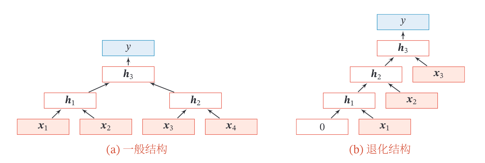

# 循环神经网络

**循环神经网络**（Recurrent Neural Network，RNN）是一类具有短期记忆能力的神经网络．在循环神经网络中，神经元不但可以接受其他神经元的信息，也可以接受自身的信息，形成具有环路的网络结构．和前馈神经网络相比，循环神经网络更加符合生物神经网络的结构．循环神经网络已经被广泛应用在语音识别、语言模型以及自然语言生成等任务上．循环神经网络的参数学习可以通过**随时间反向传播算法**来学习．随时间反向传播算法即按照时间的逆序将错误信息一步步地往前传递．当输入序列比较长时，会存在梯度爆炸和消失问题，也称为长程依赖问题．为了解决这个问题，人们对循环神经网络进行了很多的改进，其中最有效的改进方式引入**门控机制**（Gating Mechanism）．  
此外，循环神经网络可以很容易地扩展到两种更广义的记忆网络模型：递归神经网络和图网络．  

## 一． 循环神经网络  

给定一个输入序列 $x_{1:T} = (x_1,x_2,...,x_t,...,x_T)$ ，循环神经网络通过下面公式更新带反馈边的隐藏层的活性值 $h_t$：
$$
h_t = f(h_{t-1},x_t),\tag{1.1}
$$
其中 $h_0 = 0$ ，$f(\cdot)$ 为一个非线性函数，可以是一个前馈网络．  
给出了循环神经网络的示例，其中“延时器”为一个虚拟单元，记录神经元的最近一次（或几次）活性值．  

  

从数学上讲，上式可以看成一个动力系统．因此，隐藏层的活性值 $h_t$ 在很多文献上也称为状态（State）或隐状态（Hidden State）．由于循环神经网络具有短期记忆能力，相当于存储装置，因此其计算能力十分强大．理论上，循环神经网络可以近似任意的非线性动力系统．前馈神经网络可以模拟任何连续函数，而循环神经网络可以模拟任何程序．  

## 二． 简单循环网络  

简单循环网络（Simple Recurrent Network，SRN）只有一个隐藏层．在一个两层的前馈神经网络中，连接存在于相邻的层与层之间，隐藏层的节点之间是无连接的．而简单循环网络增加了从隐藏层到隐藏层的反馈连接．  
令向量 $x_t\in \mathbb{R}^M$ 表示在时刻 $t$ 时网络的输入， $h_t\in \mathbb{R}^D$ 表示隐藏层状态（即隐藏层神经元活性值），则 $h_t$ 不仅和当前时刻的输入 $x_t$ 相关，也和上一个时刻的隐藏层状态 $h_{t-1}$ 相关．简单循环网络在时刻 $t$ 的更新公式为
$$
z_{t}=\boldsymbol{U} \boldsymbol{h}_{t-1}+\boldsymbol{W} \boldsymbol{x}_{t}+\boldsymbol{b}\tag{2.1}
$$
其中 $z_t$ 为隐藏层的净输入， $U\in \mathbb{R}^{D\times D}$ 为状态-状态权重矩阵， $W\in \mathbb{R}^{D\times M}$ 为状态-输入权重矩阵，$b\in \mathbb{R}^D$ 为偏置向量，$f(\cdot)$ 是非线性激活函数，通常为Logistic函数或Tanh函数．也经常直接写为
$$
\boldsymbol{h}_{t}=f\left(\boldsymbol{U} \boldsymbol{h}_{t-1}+\boldsymbol{W} \boldsymbol{x}_{t}+\boldsymbol{b}\right)\tag{2.2}
$$
下图给出了按时间展开的循环神经网络：  

  

### 循环神经网络的通用近似定理

一个完全连接的循环网络是任何非线性动力系统的近似器．  
**定理：循环神经网络的通用近似定理**[Haykin,2009]：如果一个完全连接的循环神经网络有足够数量的sigmoid型隐藏神经元，那么它可以以任意的准确率去近似任何一个非线性动力系统
$$
\begin{array}{l}
\boldsymbol{s}_{t}=g\left(\boldsymbol{s}_{t-1}, \boldsymbol{x}_{t}\right), \\
\boldsymbol{y}_{t}=o\left(\boldsymbol{s}_{t}\right),\tag{2.3}
\end{array}
$$
其中 $s_t$ 为每个时刻的隐状态， $x_t$ 是外部输入， $g(\cdot)$ 是可测的状态转换函数， $o(\cdot)$ 是连续输出函数，并且对状态空间的紧致性没有限制．  

## 三． 参数学习

循环神经网络的参数可以通过梯度下降方法来进行学习．  

以随机梯度下降为例，给定一个训练样本 $(\boldsymbol{x}, \boldsymbol{y})$ ，其中 $\boldsymbol{x}_{1: T}=\left(\boldsymbol{x}_{1}, \cdots, \boldsymbol{x}_{T}\right)$
为长度是 $T$ 的输入序列， $y_{1: T}=\left(y_{1}, \cdots, y_{T}\right)$ 是长度为 $T$ 的标签序列．即在每个时刻 $t$ ，都有一个监督信息 $y_{t}$ ，我们定义时刻 $t$ 的损失函数为
$$
\mathcal{L}_{t}=\mathcal{L}\left(y_{t}, g\left(\boldsymbol{h}_{t}\right)\right)\tag{3.1}
$$
其中 $g\left(\boldsymbol{h}_{t}\right)$ 为第 $t$ 时刻的输出， $\mathcal{L}$ 为可微分的损失函数，比如交叉熵．那么整个序列的损失函数为
$$
\mathcal{L}=\sum_{t=1}^{T} \mathcal{L}_{t}\tag{3.2}
$$
整个序列的损失函数 $\mathcal{L}$ 关于参数 $\boldsymbol{U}$ 的梯度为
$$
\frac{\partial \mathcal{L}}{\partial \boldsymbol{U}}=\sum_{t=1}^{T} \frac{\partial \mathcal{L}_{t}}{\partial \boldsymbol{U}}\tag{3.3}
$$
即每个时刻损失 $\mathcal{L}_{t}$ 对参数 $\boldsymbol{U}$ 的偏导数之和．  

循环神经网络中存在一个递归调用的函数 $f(\cdot)$, 因此其计算参数梯度的方式和前馈神经网络不太相同．在循环神经网络中主要有两种计算梯度的方式：随
时间反向传播 ( BPTT ) 算法和实时循环学习 ( RTRL ) 算法．  

### 3.1 随时间反向传播

随时间反向传播 ( BackPropagation Through Time, BPTT ) 算法的主要思想是通过类似前馈神经网络的错误反向传播算法 [Werbos, 1990]来计算梯度．  

BPTT 算法将循环神经网络看作一个展开的多层前馈网络，其中“每一层”对应循环网络中的“每个时刻”．这样，循环神经网络就可以按照前馈网络中的反向传播算法计算参数梯度．在“展开”的前馈网络中，所有层的参数是共 享的，因此参数的真实梯度是所有“展开层”的参数梯度之和．  

**计算偏导数** $\frac{\partial \mathcal{L}_{t}}{\partial U} \quad$ 先来计算第 $t$ 时刻损失对参数 $\boldsymbol{U}$ 的偏导数 $\frac{\partial \mathcal{L}_{t}}{\partial U}$ ．  

因为参数 $\boldsymbol{U}$ 和隐藏层在每个时刻 $k(1 \leq k \leq t)$ 的净输入 $\boldsymbol{z}_{k}=\boldsymbol{U} \boldsymbol{h}_{k-1}+$
$W x_{k}+b$ 有关，因此第 $t$ 时刻的损失函数 $\mathcal{L}_{t}$ 关于参数 $u_{i j}$ 的梯度为：
$$
\frac{\partial \mathcal{L}_{t}}{\partial u_{i j}}=\sum_{k=1}^{t} \frac{\partial^{+} z_{k}}{\partial u_{i j}} \frac{\partial \mathcal{L}_{t}}{\partial z_{k}}\tag{3.1.1}
$$
其中 $\frac{\partial^{+} z_{k}}{\partial u_{i j}}$ 表示**“直接”偏导数**，即公式 $z_{k}=U \boldsymbol{h}_{k-1}+\boldsymbol{W} \boldsymbol{x}_{k}+\boldsymbol{b}$ 中保持 $\boldsymbol{h}_{k-1}$ 不变，对 $u_{i j}$ 进行求偏导数，得到
$$
\begin{aligned}
\frac{\partial^{+} z_{k}}{\partial u_{i j}}&=[0, \cdots, {\left[\boldsymbol{h}_{k-1}\right]}, \cdots, 0]\\
&{\triangleq \mathbb{I}_{i}\left(\left[\boldsymbol{h}_{k-1}\right]_{j}\right),}\tag{3.1.2}
\end{aligned}
$$
其中 $\left[\boldsymbol{h}_{k-1}\right]_{j}$ 为第 $k-1$ 时刻隐状态的第 $j$ 维; $\mathbb{I}_{l}(x)$ 是除了第 $i$ 行值为 $x$ 外，其余都为 0 的行向量．  

定义**误差项** $\delta_{t, k}=\frac{\partial \mathcal{L}_{t}}{\partial z_{k}}$ 为第 $t$ 时刻的损失对第 $k$ 时刻隐藏神经层的净输入 $z_{k}$ 的导数，则当 $1 \leq k<t$ 时
$$
\begin{aligned}
\delta_{t, k} &=\frac{\partial \mathcal{L}_{t}}{\partial z_{k}} \\
&=\frac{\partial \boldsymbol{h}_{k}}{\partial z_{k}} \frac{\partial \boldsymbol{z}_{k+1}}{\partial \boldsymbol{h}_{k}} \frac{\partial \mathcal{L}_{t}}{\partial \boldsymbol{z}_{k+1}} \\
&=\operatorname{diag}\left(f^{\prime}\left(\boldsymbol{z}_{k}\right)\right) \boldsymbol{U}^{\top} \delta_{t, k+1} .\tag{3.1.3}
\end{aligned}
$$
由上面三式得到
$$
\frac{\partial \mathcal{L}_{t}}{\partial u_{i j}}=\sum_{k=1}^{t}\left[\delta_{t, k}\right]_{i}\left[\boldsymbol{h}_{k-1}\right]_{j}\tag{3.1.4}
$$
将上式写成矩阵形式为
$$
\frac{\partial \mathcal{L}_{t}}{\partial \boldsymbol{U}}=\sum_{k=1}^{t} \delta_{t, k} \boldsymbol{h}_{k-1}^{\top} .\tag{3.1.5}
$$
下图给出了误差项随时间进行反向传播算法的示例．  

  

**参数梯度** $\quad$ 由几式，得到整个序列的损失函数 $\mathcal{L}$ 关于参数 $\boldsymbol{U}$ 的梯度
$$
\frac{\partial \mathcal{L}}{\partial \boldsymbol{U}}=\sum_{t=1}^{T} \sum_{k=1}^{t} \delta_{t, k} \boldsymbol{h}_{k-1}^{\top}\tag{3.1.6}
$$
同理可得， $\mathcal{L}$ 关于权重 $\boldsymbol{W}$ 和偏置 $\boldsymbol{b}$ 的梯度为
$$
\begin{aligned}
\frac{\partial \mathcal{L}}{\partial \boldsymbol{W}}&=\sum_{t=1}^{T} \sum_{k=1}^{t} \delta_{t, k} \boldsymbol{x}_{k}^{\top} \\
\frac{\partial \mathcal{L}}{\partial \boldsymbol{b}}&=\sum_{t=1}^{T} \sum_{k=1}^{t} \delta_{t, k}\tag{3.1.7}
\end{aligned}
$$
**计算复杂度** $\quad$ 在BPTT算法中，参数的梯度需要在一个完整的“前向”计算和“反向”计算后才能得到并进行参数更新．

### 3.2 实时循环学习

与反向传播的 BPTT 算法不同的是, **实时循环学习** ( Real-Time Recurrent
Learning, RTRL ) 是通过前向传播的方式来计算梯度 [Williams et al., 1995]．  

假设循环神经网络中第 $t+1$ 时刻的状态 $\boldsymbol{h}_{t+1}$ 为
$$
\boldsymbol{h}_{t+1}=f\left(\boldsymbol{z}_{t+1}\right)=f\left(\boldsymbol{U} \boldsymbol{h}_{t}+\boldsymbol{W} \boldsymbol{x}_{t+1}+\boldsymbol{b}\right),\tag{3.2.1}
$$
其关于参数 $u_{i j}$ 的偏导数为
$$
\begin{aligned}
\frac{\partial \boldsymbol{h}_{t+1}}{\partial u_{i j}} &=\left(\frac{\partial^{+} z_{t+1}}{\partial u_{i j}}+\frac{\partial \boldsymbol{h}_{t}}{\partial u_{i j}} \boldsymbol{U}^{\top}\right) \frac{\partial \boldsymbol{h}_{t+1}}{\partial \boldsymbol{z}_{t+1}} \tag{3.2.2}\\
&=\left(\mathbb{l}_{i}\left(\left[\boldsymbol{h}_{t}\right]_{j}\right)+\frac{\partial \boldsymbol{h}_{t}}{\partial u_{i j}} \boldsymbol{U}^{\top}\right) \operatorname{diag}\left(f^{\prime}\left(\boldsymbol{z}_{t+1}\right)\right)\\
&=\left(\mathbb{l}_{i}\left(\left[\boldsymbol{h}_{t}\right]_{j}\right)+\frac{\partial \boldsymbol{h}_{t}}{\partial u_{i j}} \boldsymbol{U}^{\top}\right) \odot\left(f^{\prime}\left(\boldsymbol{z}_{t+1}\right)\right)^{\mathrm{T}},
\end{aligned}
$$
其中 $\mathbb{I}_{i}(x)$ 是除了第 $i$ 行值为 $x$ 外，其余都为 0 的行向量．  

RTRL 算法从第 1 个时刻开始，除了计算循环神经网络的隐状态之外，还利用上式依次前向计算偏导数 $\frac{\partial \boldsymbol{h}_{1}}{\partial u_{i j}}, \frac{\partial \boldsymbol{h}_{2}}{\partial u_{i j}}, \frac{\partial \boldsymbol{h}_{3}}{\partial u_{i j}}, \cdots$ ．  

这样，假设第 $t$ 个时刻存在一个监督信息，其损失函数为 $\mathcal{L}_{t}$ ，就可以同时计
算损失函数对 $u_{i j}$ 的偏导数
$$
\frac{\partial \mathcal{L}_{t}}{\partial u_{i j}}=\frac{\partial \boldsymbol{h}_{t}}{\partial u_{i j}} \frac{\partial \mathcal{L}_{t}}{\partial \boldsymbol{h}_{t}}\tag{3.2.3}
$$
这样在第 $t$ 时刻，可以实时地计算损失 $\mathcal{L}_{t}$ 关于参数 $\boldsymbol{U}$ 的梯度，并更新参数．参数 $\boldsymbol{W}$ 和 $\boldsymbol{b}$ 的梯度也可以同样按上述方法实时计算.  

**两种算法比较** $\quad$ RTRL算法和 BPTT 算法都是基于梯度下降的算法，分别通过前向模式和反向模式应用链式法则来计算梯度．在循环神经网络中，一般网络输出维度远低于输入维度，因此 BPTT 算法的计算量会更小，但是 BPTT 算法需要保存所有时刻的中间梯度，空间复杂度较高．RTRL算法不需要梯度回传，因此非常
适合用于需要在线学习或无限序列的任务中．  

## 四． 长程依赖问题

循环神经网络在学习过程中的主要问题是由于梯度消失或爆炸问题，很难建模**长时间间隔** ( Long Range ) 的状态之间的依赖关系．  

在 BPTT 算法中，将公式(6.36)展开得到
$$
\delta_{t, k}=\prod_{\tau=k}^{t-1}\left(\operatorname{diag}\left(f^{\prime}\left(\boldsymbol{z}_{\tau}\right)\right) \boldsymbol{U}^{\top}\right) \delta_{t, t} .\tag{4.1}
$$
如果定义 $\gamma \cong\left\|\operatorname{diag}\left(f^{\prime}\left(\boldsymbol{z}_{\tau}\right)\right) \boldsymbol{U}^{\top}\right\|$ ，则
$$
\delta_{t, k} \cong \gamma^{t-k} \delta_{t, t}\tag{4.2}
$$
若 $\gamma>1$ ，当 $t-k \rightarrow \infty$ 时， $\gamma^{t-k} \rightarrow \infty$ ．当间隔 $t-k$ 比较大时，梯度也变得很大，会造成系统不稳定，称为**梯度爆炸问题** ( Gradient Exploding Problem )．  

相反，若 $\gamma<1$ ，当 $t-k \rightarrow \infty$ 时， $\gamma^{t-k} \rightarrow 0$ ．当间隔 $t-k$ 比较大时，梯度也变得非常小，会出现和深层前馈神经网络类似的梯度消失问题 ( Vanishing
Gradient Problem )．  

>要注意的是，在循环神经网络中的梯度消失不是说 $\frac{\partial \mathcal{L}_{t}}{\partial U}$ 的梯度消失了，而是 $\frac{\partial \mathcal{L}_{t}}{\partial \boldsymbol{h}_{k}}$ 的梯度消失了 (当间隔 $t-k$ 比较大时 $)$ ．也就是说，参数 $U$ 的更新主要靠当前时刻 $t$ 的几个相邻状态 $\boldsymbol{h}_{k}$ 来更新，长距离的状态对参数 $\boldsymbol{U}$ 没有影响．  

由于循环神经网络经常使用非线性激活函数为 Logistic 函数或 Tanh 函数作为非线性激活函数，其导数值都小于 1 ，并且权重矩阵 $\|\boldsymbol{U}\|$ 也不会太大，因此如果时间间隔 $t-k$ 过大， $\delta_{t, k}$ 会趋向于 0 ，因而经常会出现梯度消失问题．  

虽然简单循环网络理论上可以建立长时间间隔的状态之间的依赖关系，但是由于梯度爆炸或消失问题，实际上只能学习到短期的依赖关系．这样，如果时刻 $t$ 的输出 $y_{t}$ 依赖于时刻 $k$ 的输入 $\boldsymbol{x}_{k}$ ，当间隔 $t-k$ 比较大时 ，简单神经网络很难建模这种长距离的依赖关系，称为**长程依赖问题** ( Long-Term Dependencies Problem )．  

### 4.1 改进方法

为了避免梯度爆炸或消失问题，一种最直接的方式就是选取合适的参数，同时使用非饱和的激活函数，尽量使得 $\operatorname{diag}\left(f^{\prime}(\boldsymbol{z})\right) \boldsymbol{U}^{\top} \approx 1$ ，这种方式需要足够的人
工调参经验，限制了模型的广泛应用．比较有效的方式是通过改进模型或优化方法来缓解循环网络的梯度爆炸和梯度消失问题．  

**梯度爆炸** $\quad$ 一般而言，循环网络的梯度爆炸问题比较容易解决，一般通过**权重衰减**或**梯度截断**来避免．  

权重衰减是通过给参数增加 $\ell_{1}$ 或 $\ell_{2}$ 范数的正则化项来限制参数的取值范围，从而使得 $\gamma \leq 1$ ．梯度截断是另一种有效的启发式方法，当梯度的模大于一定阈值时，就将它截断成为一个较小的数．  

**梯度消失** $\quad$ 梯度消失是循环网络的主要问题．除了使用一些优化技巧外，更有效的方式就是改变模型，比如让 $\boldsymbol{U}=\boldsymbol{I}$ ，同时令 $\frac{\partial \boldsymbol{h}_{t}}{\partial \boldsymbol{h}_{t-1}}=\boldsymbol{I}$ 为单位矩阵，即
$$
\boldsymbol{h}_{t}=\boldsymbol{h}_{t-1}+g\left(\boldsymbol{x}_{t} ; \theta\right),\tag{4.1.1}
$$
其中 $g(\cdot)$ 是一个非线性函数， $\theta$ 为参数．
公式(6.49)中， $\boldsymbol{h}_{t}$ 和 $\boldsymbol{h}_{t-1}$ 之间为线性依赖关系，且权重系数为 1 ，这样就不存在梯度爆炸或消失问题．但是，这种改变也丢失了神经元在反馈边上的非线性
激活的性质，因此也降低了模型的表示能力．  

为了避免这个缺点, 我们可以采用一种更加有效的改进策略:
$$
\boldsymbol{h}_{t}=\boldsymbol{h}_{t-1}+g\left(\boldsymbol{x}_{t}, \boldsymbol{h}_{t-1} ; \theta\right),\tag{4.1.2}
$$
这样 $\boldsymbol{h}_{t}$ 和 $\boldsymbol{h}_{t-1}$ 之间为既有线性关系，也有非线性关系，并且可以缓解梯度消失问题．但这种改进依然存在两个问题：

1. 梯度爆炸问题：令 $z_{k}=\boldsymbol{U} \boldsymbol{h}_{k-1}+\boldsymbol{W} \boldsymbol{x}_{k}+\boldsymbol{b}$ 为在第 $k$ 时刻函数 $g(\cdot)$ 的输入，在计算公式(6.34)中的误差项 $\delta_{t, k}=\frac{\partial \mathcal{L}_{t}}{\partial z_{k}}$ 时，梯度可能会过大，从而导致梯度爆炸问题．
2. 记忆容量 ( Memory Capacity ) 问题：随着 $\boldsymbol{h}_{t}$ 不断累积存储新的输入信息，会发生饱和现象．假设 $g(\cdot)$ 为 Logistic 函数，则随着时间 $t$ 的增长，$\boldsymbol{h}_{t}$ 会变得越来越大，从而导致 $\boldsymbol{h}$ 变得饱和．也就是说，隐状态 $\boldsymbol{h}_{t}$ 可以存储的信息是有限的，随着记忆单元存储的内容越来越多，其丢失的信息也越来越多．  

为了解决这两个问题,可以通过引入门控机制来进一步改进模型．

## 五． 基于门控的循环神经网络

为了改善循环神经网络的长程依赖问题，一种非常好的解决方案是在公式(6.50)的基础上引入门控机制来控制信息的累积速度，包括有选择地加入新的信息，并有选择地遗忘之前累积的信息. 这一类网络可以称为基于门控的循环神经网络 ( Gated RNN ) . 本节中，主要介绍两种基于门控的循环神经网络：长短期记忆网络和门控循环单元网络．

### 5.1 长短期记忆网络

长短期记忆网络 ( Long Short-Term Memory Network, LSTM ) [Gers et al. 2000; Hochreiter et al., 1997] 是循环神经网络的一个变体，可以有效地解决简单
循环神经网络的梯度爆炸或消失问题．

在公式 $(6.50)$ 的基础上，LSTM 网络主要改进在以下两个方面:

**新的内部状态** $\quad$ LSTM 网络引入一个新的内部状态 ( internal state ) $\boldsymbol{c}_{t} \in \mathbb{R}^{D}$ 专门进行线性的循环信息传递，同时 $($ 非线性地 $)$ 输出信息给隐藏层的外部状态
$\boldsymbol{h}_{t} \in \mathbb{R}^{D}$ ．内部状态 $\mathbf{c}_{t}$ 通过下面公式计算；
$$
\begin{array}{l}
\boldsymbol{c}_{t}=\boldsymbol{f}_{t} \odot \boldsymbol{c}_{t-1}+\boldsymbol{i}_{t} \odot \tilde{\boldsymbol{c}}_{t} \\
\boldsymbol{h}_{t}=\boldsymbol{o}_{t} \odot \tanh \left(\boldsymbol{c}_{t}\right)\tag{5.1}
\end{array}
$$
其中 $\boldsymbol{f}_{t} \in[0,1]^{D}{\boldsymbol{i}}_{t} \in[0,1]^{D}$ 和 $\boldsymbol{o}_{t} \in[0,1]^{D}$ 为三个门 $($ gate $)$ 来控制信息传递的路径； $\odot$ 为向量元素乘积 $; \mathbf{c}_{t-1}$ 为上一时刻的记忆单元 $; \tilde{\mathbf{c}}_{t} \in \mathbb{R}^{D}$ 是通过非线性函数得到的候选状态:
$$
\tilde{\boldsymbol{c}}_{t}=\tanh \left(\boldsymbol{W}_{c} \boldsymbol{x}_{t}+\boldsymbol{U}_{c} \boldsymbol{h}_{t-1}+\boldsymbol{b}_{c}\right)
$$
在每个时刻 $t, \mathrm{LSTM}$ 网络的内部状态 $\boldsymbol{c}_{t}$ 记录了到当前时刻为止的历史信息．

**门控机制** $\quad$ 在数字电路中，门 $($ gate $)$ 为一个二值变量 $\{0,1\}, 0$ 代表关闭状态，不许任何信息通过 $; 1$ 代表开放状态，允许所有信息通过

LSTM 网络引入**门控机制** ( Gating Mechanism ) 来控制信息传递的路径. 公式 (4.1)中三个 "门"分别为输入门 $\boldsymbol{i}_{t}$ 遗忘门 $\boldsymbol{f}_{t}$ 和输出门 $\boldsymbol{o}_{t}$ ．这二个门的作用为

1. 遗忘门 $\boldsymbol{f}_{t}$ 控制上一个时刻的内部状态 $\mathbf{c}_{t-1}$ 需要遗忘多少信息．
2. 输入门 $\boldsymbol{i}_{t}$ 控制当前时刻的候选状态 $\tilde{c}_{t}$ 有多少信息需要保存．
3. 输出门 $\boldsymbol{o}_{t}$ 控制当前时刻的内部状态 $\mathbf{c}_{t}$ 有多少信息需要输出给外部状态 $\boldsymbol{h}_{t}$

当 $\boldsymbol{f}_{t}=0, \boldsymbol{i}_{t}=1$ 时，记忆单元将历史信息清空，并将候选状态向量 $\tilde{\boldsymbol{c}}_{t}$ 写入．但此时记忆单元 $c_{t}$ 依然和上一时刻的历史信息相关．当 $\boldsymbol{f}_{t}=1, \boldsymbol{i}_{t}=0$ 时，记忆单元将复制上一时刻的内容，不写入新的信息．

LSTM 网络中的“门”是一种“软”门，取值在 $(0,1)$ 之间，表示以一定的比例允许信息通过．三个门的计算方式为：
$$
\begin{aligned}
\boldsymbol{i}_{t} &=\sigma\left(\boldsymbol{W}_{i} \boldsymbol{x}_{t}+\boldsymbol{U}_{i} \boldsymbol{h}_{t-1}+\boldsymbol{b}_{i}\right) \\
\boldsymbol{f}_{t} &=\sigma\left(\boldsymbol{W}_{f} \boldsymbol{x}_{t}+\boldsymbol{U}_{f} \boldsymbol{h}_{t-1}+\boldsymbol{b}_{f}\right), \\
\boldsymbol{o}_{t} &=\sigma\left(\boldsymbol{W}_{0} \boldsymbol{x}_{t}+\boldsymbol{U}_{o} \boldsymbol{h}_{t-1}+\boldsymbol{b}_{o}\right)
\end{aligned}
$$
其中 $\sigma(\cdot)$ 为 Logistic 函数，其输出区间为 $(0,1), x_{t}$ 为当前时刻的输入， $\boldsymbol{h}_{t-1}$ 为上一时刻的外部状态．

下图给出了 LSTM 网络的循环单元结构，其计算过程为 $: 1$ ) 首先利用上一时刻的外部状态 $\boldsymbol{h}_{t-1}$ 和当前时刻的输入 $\boldsymbol{x}_{t}$ ，计算出三个门，以及候选状态 $\tilde{\boldsymbol{c}}_{t} ; 2$ ) 结合遗忘门 $\boldsymbol{f}_{t}$ 和输入门 $\boldsymbol{i}_{t}$ 来更新记忆单元 $\boldsymbol{c}_{t} ; 3$ ) 结合输出门 $\boldsymbol{o}_{t}$ ，将内部状态的信息传递给外部状态 $\boldsymbol{h}_{t}$．

通过 $\mathrm{LSTM}$ 循环单元，整个网络可以建立较长距离的时序依赖关系．公式可以简洁地描述为
$$
\begin{aligned}
\left[\begin{array}{c}
\tilde{c}_{t} \\
\boldsymbol{o}_{t} \\
\boldsymbol{i}_{t} \\
\boldsymbol{f}_{t}
\end{array}\right] &=\left[\begin{array}{c}
\tanh \\
\sigma \\
\sigma \\
\sigma
\end{array}\right]\left(\boldsymbol{W}\left[\begin{array}{c}
\boldsymbol{x}_{t} \\
\boldsymbol{h}_{t-1}
\end{array}\right]+\boldsymbol{b}\right) \\
\boldsymbol{c}_{t} &=\boldsymbol{f}_{t} \odot \boldsymbol{c}_{t-1}+\boldsymbol{i}_{t} \odot \tilde{\boldsymbol{c}}_{t} \\
\boldsymbol{h}_{t} &=\boldsymbol{o}_{t} \odot \tanh \left(\boldsymbol{c}_{t}\right),
\end{aligned}
$$
其中 $x_{t} \in \mathbb{R}^{M}$ 为当前时刻的输入，$\boldsymbol{W} \in \mathbb{R}^{4 D \times(D+M)}$ 和 $\boldsymbol{b} \in \mathbb{R}^{4 D}$ 为网络参数．

**记忆** $\quad$ 循环神经网络中的隐状态 $\boldsymbol{h}$ 存储了历史信息，可以看作一种记忆 ( Mem-
ory ）．在简单循环网络中，隐状态每个时刻都会被重写，因此可以看作一种短期记忆 ( Short-Term Memory )．在神经网络中，长期记忆 ( Long-Term Memory ) 可以看作网络参数，隐含了从训练数据中学到的经验，其更新周期要远远慢于短期记忆．而在 LSTM 网络中，记忆单元 $c$ 可以在某个时刻捕捉到某个关键信息，并有能力将此关键信息保存一定的时间间隔．记忆单元 $c$ 中保存信息的生命周期要长于短期记忆 $\boldsymbol{h}$，但又远远短于长期记忆，因此称为长短期记忆 ( Long Short-Term Memory )．

>一般在深度网络参数学习时，参数初始化的值一般都比较小．但是在训练 LSTM 网络时，过小的值会使得遗忘门的值比较小．这意味着前一时刻的信息大部分都丢失了，这样网络很难捕捉到长距离的依赖信息．并且相邻时间间隔的梯度会非常小，这会导致梯度弥散问题．因此遗忘的参数初始值一般都设得比较大，其偏置向量 $\boldsymbol{b}_{f}$ 设为 1 或2．

### 5.2 LSTM网络的各种变体

目前主流的 LSTM 网络用三个门来动态地控制内部状态应该遗忘多少历史信息，输入多少新信息，以及输出多少信息．我们可以对门控机制进行改进并获得 LSTM 网络的不同变体．

**无遗忘门的 LSTM 网络** [Hochreiter et al., 1997] $\quad$ 最早提出的 LSTM 网络是没有遗忘门的，其内部状态的更新为
$$
\mathbf{c}_{t}=\mathbf{c}_{t-1}+\boldsymbol{i}_{t} \odot \tilde{\boldsymbol{c}}_{t} .
$$
如之前的分析，记忆单元 $c$ 会不断增大．当输入序列的长度非常大时，记忆单元的容量会饱和，从而大大降低 LSTM 模型的性能．
**peephole 连接** $\quad$ 另外一种变体是三个门不但依赖于输入 $\boldsymbol{x}_{t}$ 和上一时刻的隐状态 $\boldsymbol{h}_{t-1}$ ，也依赖于上一个时刻的记忆单元 $\boldsymbol{c}_{t-1}$ ，即
$$
\begin{aligned}
\boldsymbol{i}_{t} &=\sigma\left(\boldsymbol{W}_{i} \boldsymbol{x}_{t}+\boldsymbol{U}_{i} \boldsymbol{h}_{t-1}+\boldsymbol{V}_{i} \boldsymbol{c}_{t-1}+\boldsymbol{b}_{i}\right) \\
\boldsymbol{f}_{t} &=\sigma\left(\boldsymbol{W}_{f} \boldsymbol{x}_{t}+\boldsymbol{U}_{f} \boldsymbol{h}_{t-1}+\boldsymbol{V}_{f} \boldsymbol{c}_{t-1}+\boldsymbol{b}_{f}\right), \\
\boldsymbol{o}_{t} &=\sigma\left(\boldsymbol{W}_{0} \boldsymbol{x}_{t}+\boldsymbol{U}_{o} \boldsymbol{h}_{t-1}+\boldsymbol{V}_{0} \boldsymbol{c}_{t}+\boldsymbol{b}_{o}\right)
\end{aligned}
$$
其中 $V_{i}, V_{f}$ 和 $\boldsymbol{V}_{o}$ 为对角矩阵．

**耦合输入门和遗忘门** $\quad$ LSTM 网络中的输入门和遗忘门有些互补关系，因此同时用两个门比较冗余．为了减少 LSTM 网络的计算复杂度，将这两门合并为一个
门．令 $\boldsymbol{f}_{t}=1-\boldsymbol{i}_{t}$, 内部状态的更新方式为
$$
\boldsymbol{c}_{t}=\left(1-\boldsymbol{i}_{t}\right) \odot \boldsymbol{c}_{t-1}+\boldsymbol{i}_{t} \odot \tilde{\boldsymbol{c}}_{t} .
$$

### 5.3 门控循环单元网络

**门控循环单元** ( Gated Recurrent Unit, GRU ) 网络 [Cho et al., 2014; Chung et al., 2014] 是一种比 LSTM 网络更加简单的循环神经网络.

GRU 网络引入门控机制来控制信息更新的方式．和 LSTM 不同，GRU 不引入额外的记忆单元， GRU 网络也是在公式 $(6.50)$ 的基础上引入一个**更新门** ( Up-
date Gate ) 来控制当前状态需要从历史状态中保留多少信息 ( 不经过非线性变换 ) ，以及需要从候选状态中接受多少新信息，即
$$
\boldsymbol{h}_{t}=\boldsymbol{z}_{t} \odot \boldsymbol{h}_{t-1}+\left(1-\boldsymbol{z}_{t}\right) \odot g\left(\boldsymbol{x}_{t}, \boldsymbol{h}_{t-1} ; \theta\right),
$$
其中 $z_{t} \in[0,1]^{D}$ 为更新门 $:$
$$
\boldsymbol{z}_{t}=\sigma\left(\boldsymbol{W}_{\mathrm{z}} \boldsymbol{x}_{t}+\boldsymbol{U}_{z} \boldsymbol{h}_{t-1}+\boldsymbol{b}_{z}\right) .
$$
在 LSTM 网络中，输入门和遗忘门是互补关系，具有一定的咒余性．GRU 网络直接使用一个门来控制输入和遗忘之间的平衡．当 $z_{t}=0$ 时，当前状态 $\boldsymbol{h}_{t}$ 和前一时刻的状态 $\boldsymbol{h}_{t-1}$ 之间为非线性函数关系；当 $\boldsymbol{z}_{t}=1$ 时， $\boldsymbol{h}_{t}$ 和 $\boldsymbol{h}_{t-1}$ 之间为线性函数关系．

在 GRU 网络中,函数 $g\left(\boldsymbol{x}_{t}, \boldsymbol{h}_{t-1} ; \theta\right)$ 的定义为
$$
\tilde{\boldsymbol{h}}_{t}=\tanh \left(\boldsymbol{W}_{h} \boldsymbol{x}_{t}+\boldsymbol{U}_{h}\left(\boldsymbol{r}_{t} \odot \boldsymbol{h}_{t-1}\right)+\boldsymbol{b}_{h}\right),
$$
其中 $\tilde{\boldsymbol{h}}_{t}$ 表示当前时刻的候选状态， $\boldsymbol{r}_{t} \in[0,1]^{D}$ 为**重置门** ( Reset Gate )
$$
\boldsymbol{r}_{t}=\sigma\left(\boldsymbol{W}_{r} \boldsymbol{x}_{t}+\boldsymbol{U}_{r} \boldsymbol{h}_{t-1}+\boldsymbol{b}_{r}\right)
$$
用来控制**候选状态** $\tilde{\boldsymbol{h}}_{t}$ 的计算是否依赖上一时刻的状态 $\boldsymbol{h}_{t-1}$．
当 $\boldsymbol{r}_{t}=0$ 时，候选状态 $\tilde{\boldsymbol{h}}_{t}=\tanh \left(\boldsymbol{W}_{c} \boldsymbol{x}_{t}+\boldsymbol{b}\right)$ 只和当前输入 $\boldsymbol{x}_{t}$ 相关，和历史
状态无关．当 $r_{t}=1$ 时，候选状态 $\tilde{\boldsymbol{h}}_{t}=\tanh \left(\boldsymbol{W}_{h} \boldsymbol{x}_{t}+\boldsymbol{U}_{h} \boldsymbol{h}_{t-1}+\boldsymbol{b}_{h}\right)$ 和当前输入 $\boldsymbol{x}_{t}$ 以及历史状态 $\boldsymbol{h}_{t-1}$ 相关，和**简单循环网络**一致．

综上，GRU网络的状态更新方式为
$$
\boldsymbol{h}_{t}=\boldsymbol{z}_{t} \odot \boldsymbol{h}_{t-1}+\left(1-\boldsymbol{z}_{t}\right) \odot \tilde{\boldsymbol{h}}_{t} \cdot
$$
可以看出，当 $z_{t}=0, r=1$ 时，GRU 网络退化为**简单循环网络**；若 $z_{t}=0, r=0$ 时，当前状态 $\boldsymbol{h}_{t}$ 只和当前输入 $\boldsymbol{x}_{t}$ 相关，和历史状态 $\boldsymbol{h}_{t-1}$ 无关． 当 $\boldsymbol{z}_{t}=1$ 时，当前状态 $\boldsymbol{h}_{t}=\boldsymbol{h}_{t-1}$ 等于上一时刻状态 $\boldsymbol{h}_{t-1}$ ，和当前输入 $\boldsymbol{x}_{t}$ 无关．

下图给出了GRU 网络的循环单元结构．

## 六． 深层循环神经网络

如果将深度定义为网络中信息传递路径长度的话，循环神经网络可以看作既“深”又“浅”的网络．一方面来说，如果我们把循环网络按时间展开，长时间间隔的状态之间的路径很长，循环网络可以看作一个非常深的网络．从另一方面来说，如果同一时刻网络输入到输出之间的路径 $\boldsymbol{x}_{t} \rightarrow \boldsymbol{y}_{t}$ ，这个网络是非常浅的．

因此，我们可以增加循环神经网络的深度从而增强循环神经网络的能力．增加循环神经网络的深度主要是增加同一时刻网络输入到输出之间的路径 $\boldsymbol{x}_{t}\rightarrowy_{t}$ ，比如增加隐状态到输出 $\boldsymbol{h}_{t} \rightarrow \boldsymbol{y}_{t}$ ，以及输入到隐状态 $\boldsymbol{x}_{t} \rightarrow \boldsymbol{h}_{t}$ 之间的路径的
深度．

### 6.1 堆叠循环神经网络

一种常见的增加循环神经网络深度的做法是将多个循环网络堆叠起来，称为**堆叠循环神经网络** ( Stacked Recurrent Neural Network, SRNN ) ．一个堆叠的简单循环网络 ( Stacked SRN ) 也称为**循环多层感知器** ( Recurrent Multi-Layer Perceptron, RMLP ) [Parlos et al., 1991]．

下图给出了按时间展开的堆肯循环神经网络．第 $l$ 层网络的输入是第 $l-1$ 层网络的输出．我们定义 $\boldsymbol{h}_{t}^{(l)}$ 为在时刻 $t$ 时第 $l$ 层的隐状态
$$
\boldsymbol{h}_{t}^{(l)}=f\left(\boldsymbol{U}^{(l)} \boldsymbol{h}_{t-1}^{(l)}+\boldsymbol{W}^{(l)} \boldsymbol{h}_{t}^{(l-1)}+\boldsymbol{b}^{(l)}\right)
$$
其中 $\boldsymbol{U}^{(l)}, \boldsymbol{W}^{(l)}$ 和 $\boldsymbol{b}^{(l)}$ 为权重矩阵和偏置向量，$\boldsymbol{h}_{t}^{(0)}=\boldsymbol{x}_{t}$．

### 6.2 双向循环神经网络

在有些任务中，一个时刻的输出不但和过去时刻的信息有关，也和后续时刻的信息有关．比如给定一个句子，其中一个词的词性由它的上下文决定，即包含左右两边的信息．因此，在这些任务中，我们可以增加一个按照时间的逆序来传递信息的网络层，来增强网络的能力．

**双向循环神经网络** ( Bidirectional Recurrent Neural Network, Bi-RNN ) 由两层循环神经网络组成，它们的输入相同，只是信息传递的方向不同．

假设第 1 层按时间顺序，第 2 层按时间逆序，在时刻 $t$ 时的隐状态定义为 $\boldsymbol{h}_{t}^{(1)}$ 和 $\boldsymbol{h}_{t}^{(2)}$, 则
$$
\begin{aligned}
\boldsymbol{h}_{t}^{(1)} &=f\left(\boldsymbol{U}^{(1)} \boldsymbol{h}_{t-1}^{(1)}+\boldsymbol{W}^{(1)} \boldsymbol{x}_{t}+\boldsymbol{b}^{(1)}\right) \\
\boldsymbol{h}_{t}^{(2)} &=f\left(\boldsymbol{U}^{(2)} \boldsymbol{h}_{t+1}^{(2)}+\boldsymbol{W}^{(2)} \boldsymbol{x}_{t}+\boldsymbol{b}^{(2)}\right) \\
\boldsymbol{h}_{t} &=\boldsymbol{h}_{t}^{(1)} \oplus \boldsymbol{h}_{t}^{(2)}
\end{aligned}
$$
其中 $\oplus$ 为向量拼接操作．

下图给出了按时间展开的双向循环神经网络．

## 七． 扩展到图结构

如果将循环神经网络按时间展开，每个时刻的隐状态 $\boldsymbol{h}_{t}$ 看作一个**节点**，那么这些节点构成一个链式结构，每个节点 $t$ 都收到其父节点的**消息**（Message），更新自己的状态，并传递给其子节点．而链式结构是一种特殊的图结构，我们可以比较容易地将这种**消息传递** ( Message Passing ) 的思想扩展到任意的图结 构上．

### 7.1 递归神经网络

**递归神经网络** ( Recursive Neural Network, $\operatorname{RecNN}$ ) 是循环神经网络在**有向无循环图**上的扩展 [Pollack, 1990]．递归神经网络的一般结构为树状的层次结构,如下图左所示．

以上图左中的结构为例，有三个隐藏层 $\boldsymbol{h}_{1}, \boldsymbol{h}_{2}$ 和 $\boldsymbol{h}_{3}$, 其中 $\boldsymbol{h}_{1}$ 由两个输入层 $\boldsymbol{x}_{1}$ 和 $\boldsymbol{x}_{2}$ 计算得到， $\boldsymbol{h}_{2}$ 由另外两个输入层 $\boldsymbol{x}_{3}$ 和 $\boldsymbol{x}_{4}$ 计算得到， $\boldsymbol{h}_{3}$ 由两个隐藏层 $\boldsymbol{h}_{1}$ 和 $\boldsymbol{h}_{2}$ 计算得到．

对于一个节点 $\boldsymbol{h}_{i}$ ，它可以接受来自父节点集合 $\pi_{i}$ 中所有节点的消息，并更新自己的状态．
$$
\boldsymbol{h}_{i}=f\left(\boldsymbol{h}_{\pi_{i}}\right)
$$
其中 $\boldsymbol{h}_{\pi_{i}}$ 表示集合 $\pi_{i}$ 中所有节点状态的拼接， $f(\cdot)$ 是一个和节点位置无关的非线性函数，可以为一个单层的前馈神经网络．比如上图左所示的递归神经网络具体可以写为
$$
\begin{array}{l}
\boldsymbol{h}_{1}=\sigma\left(\boldsymbol{W}\left[\begin{array}{l}
\boldsymbol{x}_{1} \\
\boldsymbol{x}_{2}
\end{array}\right]+\boldsymbol{b}\right), \\
\boldsymbol{h}_{2}=\sigma\left(\boldsymbol{W}\left[\begin{array}{l}
\boldsymbol{x}_{3} \\
\boldsymbol{x}_{4}
\end{array}\right]+\boldsymbol{b}\right) \\
\boldsymbol{h}_{3}=\sigma\left(\boldsymbol{W}\left[\begin{array}{l}
\boldsymbol{h}_{1} \\
\boldsymbol{h}_{2}
\end{array}\right]+\boldsymbol{b}\right),
\end{array}
$$
其中 $\sigma(\cdot)$ 表示非线性激活函数， $\boldsymbol{W}$ 和 $\boldsymbol{b}$ 是可学习的参数．同样，输出层 $y$ 可以为一个分类器，比如
$$
y=g\left(\boldsymbol{W}^{\prime} \boldsymbol{h}_{3}+\boldsymbol{b}^{\prime}\right),
$$
其中 $g(\cdot)$ 为分类器， $\boldsymbol{W}^{\prime}$ 和 $\boldsymbol{b}^{\prime}$ 为分类器的参数．当递归神经网络的结构退化为线性序列结构 (上图右) 时，递归神经网络就等价于**简单循环网络**．

递归神经网络主要用来建模自然语言句子的语义[Socher et al., 2011,2013]．给定一个句子的语法结构 ( 一般为树状结构 )，可以使用递归神经网络来按照句法的组合关系来合成一个句子的语义．句子中每个短语成分又可以分成一些子
成分，即每个短语的语义都可以由它的子成分语义组合而来，并进而合成整句的语义．

同样，我们也可以用门控机制来改进递归神经网络中的长距离依赖问题，比如**树结构的长短期记忆模型** ( Tree-Structured LSTM ) [Tai et al., 2015; Zhu
et al., 2015 ] 就是将 LSTM 模型的思想应用到树结构的网络中，来实现更灵活的组合函数．

### 7.2 图神经网络

在实际应用中，很多数据是图结构的，比如知识图谱、社交网络、分子网络等．而前馈网络和反馈网络很难处理图结构的数据．

**图神经网络** ( Graph Neural Network, GNN ) 是将消息传递的思想扩展到图结构数据上的神经网络．

对于一个任意的图结构 $G(\mathcal{V}, \mathcal{E})$ ，其中 $\mathcal{V}$ 表示节点集合， $\varepsilon$ 表示边集合．每条边表示两个节点之间的依赖关系．节点之间的连接可以是有向的，也可以是无向的．图中每个节点 $v$ 都用一组神经元来表示其状态 $\boldsymbol{h}^{(v)}$, 初始状态可以为节点 $v$ 的输入特征 $\boldsymbol{x}^{(v)}$ ．每个节点可以收到来自相邻节点的消息，并更新自己的状态．
$$
\begin{aligned}
\boldsymbol{m}_{t}^{(v)} &=\sum_{u \in \mathcal{N}(v)} f\left(\boldsymbol{h}_{t-1}^{(v)}, \boldsymbol{h}_{t-1}^{(u)}, \boldsymbol{e}^{(u, v)}\right) \\
\boldsymbol{h}_{t}^{(v)} &=g\left(\boldsymbol{h}_{t-1}^{(v)}, \boldsymbol{m}_{t}^{(v)}\right)
\end{aligned}
$$
其中 $\mathcal{N}(v)$ 表示节点 $v$ 的邻居， $\boldsymbol{m}_{t}^{(v)}$ 表示在第 $t$ 时刻节点 $v$ 收到的信息， $\boldsymbol{e}^{(u, v)}$ 为 边 $e^{(u, v)}$ 上的特征．

上式是一种同步的更新方式，所有的结构同时接受信息并更新自己的状态．而对于有向图来说，使用异步的更新方式会更有效率，比如循环神经网络或递归神经网络，在整个图更新 $T$ 次后，可以通过一个读出函数 ( Readout Function ) $g(\cdot)$ 来得到整个网络的表示：
$$
\boldsymbol{o}_{t}=g\left(\left\{\boldsymbol{h}_{T}^{(v)} \mid v \in \mathcal{V}\right\}\right) .
$$

## 八． 总结和深入阅读

循环神经网络可以建模时间序列数据之间的相关性．和**延时神经网络**[Lang et al., 1990; Waibel et al., 1989] 以及**有外部输入的非线性自回归模型**[Leontaritis et al., 1985 ]相比，循环神经网络可以更方便地建模长时间间隔的相关性．

常用的循环神经网络的参数学习算法是 BPTT算法 [Werbos, 1990]，其计算时间和空间要求会随时间线性增长．为了提高效率，当输入序列的长度比较大时，可以使用带截断 ( truncated ) 的 BPTT算法[Williams et al., 1990]，只计算固定时间间隔内的梯度回传．

一个完全连接的循环神经网络有着强大的计算和表示能力，可以近似任何**非线性动力系统**以及**图灵机**，解决所有的可计算问题．然而由于梯度爆炸和梯度消失问题,简单循环网络存在**长期依赖问题**[Bengio et al., 1994; Hochreiter et al., 2001]．为了解决这个问题，人们对循环神经网络进行了很多的改进，其中最有效的改进方式为引入**门控**机制，比如 **LSTM 网络** [Gers et al., 2000; Hochreiter et al., 1997]和**GRU网络**[Chung et al., 2014]．当然还有一些其他方法，比如**时钟循环神经网络** ( Clockwork RNN ) [Koutnik et al., 2014]、**乘法RNN**[Sutskever et al., 2011; Wu et al., 2016] 以及引入**注意力机制**等．

LSTM 网络是目前为止最成功的循环神经网络模型，成功应用在很多领域，比如语音识别、机器翻译 [Sutskever et al., 2014] 语音模型以及文本生成． LSTM 网络通过引入线性连接来缓解长距离依赖问题．虽然 LSTM 网络取得了很大的 成功，其结构的合理性一直受到广泛关注．人们不断尝试对其进行改进来寻找最优结构，比如减少门的数量、提高并行能力等．关于 LSTM 网络的分析可以参考文献 [Greff et al., 2017; Jozefowicz et al., 2015; Karpathy et al., 2015]．

LSTM 网络的**线性连接**以及**门控**机制是一种十分有效的避免梯度消失问题的方法．这种机制也可以用在深层的前馈网络中，比如残差网络 [He et al., 2016] 和高速网络[Srivastava et al., 2015] 都通过引入线性连接来训练非常深的卷积网络．对于循环神经网格，这种机制也可以用在非时间维度上，比如 Gird LSTM 网络 [Kalchbrenner et al., 2015] 、Depth Gated RNN[Chung et al., 2015$]$ 等．

此外，循环神经网络可以很容易地扩展到更广义的图结构数据上，称为**图网络**[Scarselli et al., 2009]．**递归神经网络**是一种在有向无环图上的简单的图网络．图网络是目前新兴的研究方向，还没有比较成熟的网络模型．在不同的网络结构以及任务上，都有很多不同的具体实现方式．其中比较有名的图网络模型包括**图卷积网络** ( Graph Convolutional Network, GCN ) [Kipf et al., 2016]、**图注意力网络** ( Graph Attention Network, GAT ) [Veličković et al., 2017] **消息传递神经网络** ( Message Passing Neural Network, MPNN ) [Gilmer et al., 2017] 等．关于图网络的综述可以参考文献 [Battaglia et al., 2018]．