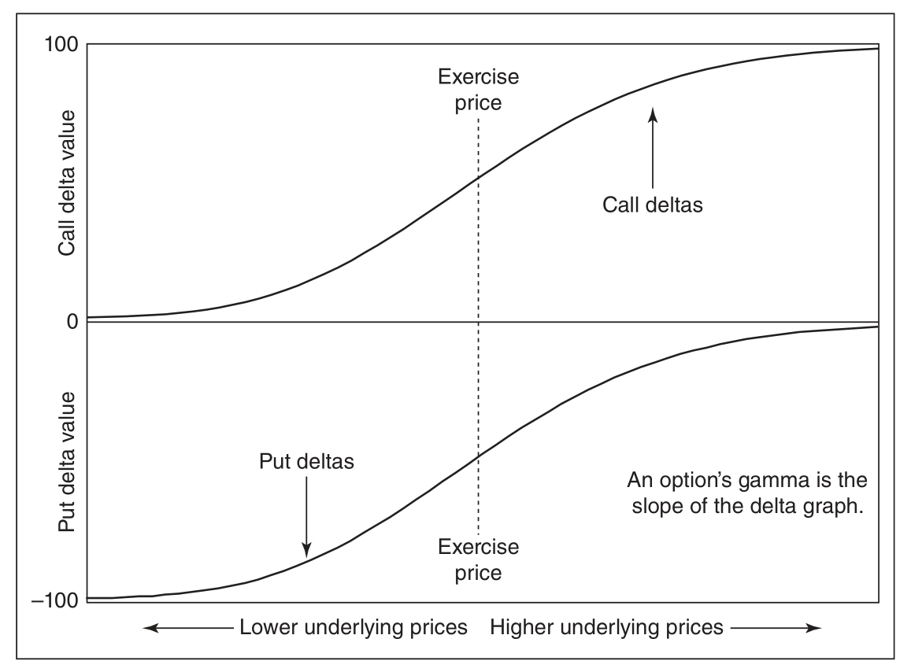
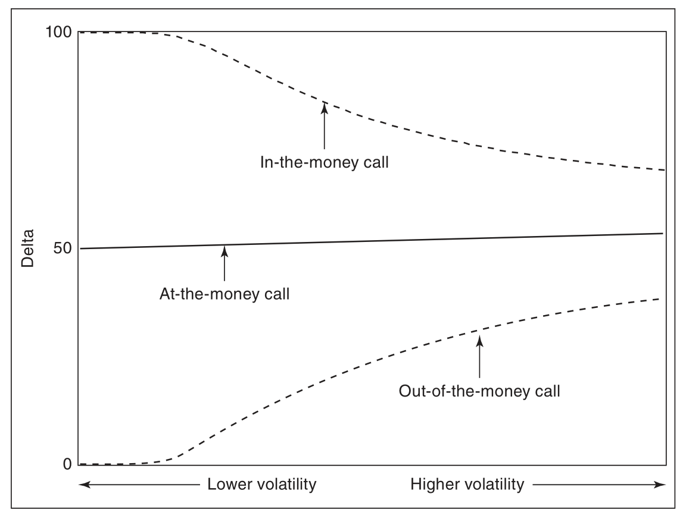
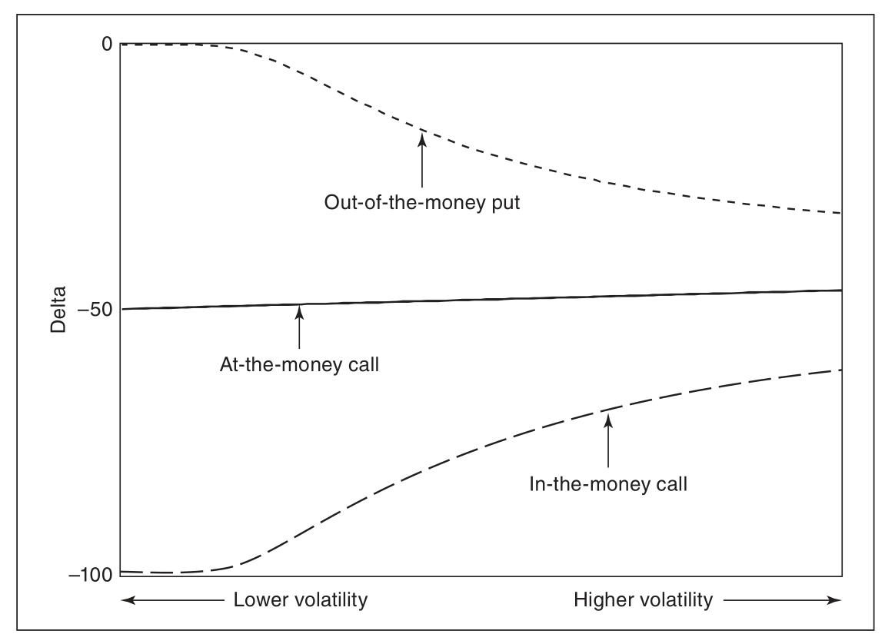

# $\dagger$期权$\dagger$

## 一．基础概念

### 1.1 BS公式（Delta对冲下）

BS部分参考[知乎专栏：Black-Scholes 模型学习框架](https://zhuanlan.zhihu.com/p/265727886)  

假设股价满足
$$
d S_{t}=\mu S_{t} d t+\sigma S_{t} d W_{t}
$$
自融资资产组合（此处为期权价格的一个复制）价值变化为
$$
d \Pi_{t}=r \gamma_{t} B_{t} d t+\Delta_{t} d S_{t}
$$
对 $V\left(S_{t}, t\right)$ （ $t$ 时刻衍生品的价值）做Ito公式，比较项的系数得到Delta 对冲下 的 **BS 偏微分方程**  （在比较系数过程中会使用到$\gamma_{t} B_{t}$替换为$V_{t}-V_{x}^{\prime} S_{t}$，即为持有的债券份额为自融资总份额减去持有的标的份额，标的的持有量已经使用为$\Delta_t$）
$$
\left\{\begin{array}{l}
V_{x}^{\prime}=\Delta_{t} \\
V_{t}^{\prime}+r S_{t} V_{x}^{\prime}+\frac{1}{2} \sigma^{2} S_{t}^{2} V_{x x}^{\prime \prime}-r V_{t}=0
\end{array}\right.
$$
终值条件（看涨期权）为
$$V\left(S_{T}, T\right)=\left(S_{T}-K\right)^{+}$$
解即为 **BS 公式**
$$
\begin{array}{l}
V\left(S_{t}, t\right)=S N\left(d_{1}\right)-K e^{-r(T-t)} N\left(d_{2}\right) \\
d_{1}=\frac{\ln \left(\frac{S_{t}}{K}\right)+\left(r+\frac{1}{2} \sigma^{2}\right)(T-t)}{\sigma \sqrt{T-t}} \\
d_{2}=d_{1}-\sigma \sqrt{T-t}
\end{array}
$$
注意到 $dS_t$ 的漂移项 $\mu$ 对期权定价没有影响．

#### BS公式解法（欧式call）

$$
\frac{\partial C}{\partial t}+\frac{1}{2} \sigma^{2} S^{2} \frac{\partial^{2} C}{\partial S^{2}}=r C-r S \frac{\partial C}{\partial S}
$$

有考虑边界条件
$$
\begin{aligned}
C(0, t) &=0 \text { for all } t \\
C(S, t) & \rightarrow S \text { as } S \rightarrow \infty \\
C(S, T) &=\max \{S-K, 0\}
\end{aligned}
$$

注意到这是一个 Cauchy-Euler 方程，能通过下述变量代换将其转化为一个扩散方程
The solution of the PDE gives the value of the option at any earlier time, $\mathbb{E}[\max \{S-K, 0\}] .$
$$
\begin{aligned}
&\tau=T-t \\
&u=C e^{r \tau} \\
&x=\ln \left(\frac{S}{K}\right)+\left(r-\frac{1}{2} \sigma^{2}\right) \tau
\end{aligned}
$$
Black-Scholes PDE 变为一个扩散方程：
$$
\frac{\partial u}{\partial \tau}=\frac{1}{2} \sigma^{2} \frac{\partial^{2} u}{\partial x^{2}}
$$
终值条件 $C(S, T)=\max \{S-K, 0\}$ 现在变为了初值条件
$$
u(x, 0)=u_{0}(x):=K\left(e^{\max \{x, 0\}}-1\right)=K\left(e^{x}-1\right) H(x)
$$
其中 $H(x)$ 是 Heaviside 阶梯函数，

使用解给定了初值函数 $u(x, 0)$ 的扩散方程的标准卷积法，得到
$$
u(x, \tau)=\frac{1}{\sigma \sqrt{2 \pi \tau}} \int_{-\infty}^{\infty} u_{0}(y) \exp \left[-\frac{(x-y)^{2}}{2 \sigma^{2} \tau}\right] d y
$$
经过处理，得到：
$$
u(x, \tau)=K e^{x+\frac{1}{2} \sigma^{2} \tau} N\left(d_{1}\right)-K N\left(d_{2}\right)
$$
其中 N 为正态分布累计密度函数，
$$
\begin{aligned}
&d_{1}=\frac{1}{\sigma \sqrt{\tau}}\left[\left(x+\frac{1}{2} \sigma^{2} \tau\right)+\frac{1}{2} \sigma^{2} \tau\right] \\
&d_{2}=\frac{1}{\sigma \sqrt{\tau}}\left[\left(x+\frac{1}{2} \sigma^{2} \tau\right)-\frac{1}{2} \sigma^{2} \tau\right]
\end{aligned}
$$

BS model给出了期权价格的函数，作为一个波动率的函数．可以通过这个公式在给定期权价格时计算**隐含波动率**（implied volatility）．但事实是 BS 波动率强烈依赖于欧式期权的到期日和行权价．

波动率微笑是指给定到期日下，隐含波动率与行权价（maturity）的关系．  

### 1.2 Delta对冲

我们现在考虑用衍生品 $V(S_t,t)$ 和其标的资产 $S_t$ 构建一个“**无风险组合**”，考虑这样的自融资组合 $\Pi_{t}=\Delta_{t} S_{t}-V_{t}$，即每一单位的空头衍生品，我们用 $\Delta_{t}$ 单位多头的股票对其进行对冲 (Hedging)，由于其自融资的特性，根据定义，我们有 $d \Pi_{t}=\Delta_{t} d S_{t}-d V_{t}$ ，将股价的 SDE 和上一节中通过伊藤-德布林公式求出的 $d V_{t}$ 带入这个式子，我们可以得到:
$$
d \Pi_{t}=\left[\left(\Delta_{t}-V_{x}^{\prime}\right) \mu S_{t}-V_{t}^{\prime}-\frac{1}{2} \sigma^{2} S_{t}^{2} V_{x x}^{\prime \prime}\right] d t+\left(\Delta_{t}-V_{x}^{\prime}\right) \sigma S_{t} d W_{t}
$$
因为要使资产组合为无风险的，
>一个自融资组合 $V_{t}$ 如果是无风险的，则可以表示为 $d V_{t}=k_{t} V_{t} d t$ ，且 $k_{t} \equiv r$ ．  
$$
\left\{\begin{array}{l}
\Delta_{t}-V_{x}^{\prime}=0 \\
\left(\Delta_{t}-V_{x}^{\prime}\right) \mu S_{t}-V_{t}^{\prime}-\frac{1}{2} \sigma^{2} S_{t}^{2} V_{x x}^{\prime \prime}=r \Pi_{t}
\end{array}\right.
$$
1式即 Delta 对冲法则，将 $\Pi_{t}=V_{x}^{\prime} S_{t}-V_{t}$ 带入2式我们再次得到 BlackScholes 偏微分方程: $V_{t}^{\prime}+r S_{t} V_{x}^{\prime}+\frac{1}{2} \sigma^{2} S_{t}^{2} V_{x x}^{\prime \prime}-r V_{t}=0$ ．

### 1.3 BS公式（风险中性定价下）

#### 1.3.1 鞅

**定义** 在 $(\Omega, \mathcal{F}, P)$ 上的随机过程 $X_{t}$ ， $t \in[0, T]$ ，称其是关于域流 $\mathcal{F}_{t}$ 的鞅，如果满足:

1. $X_{t}$ 是 $\mathcal{F}_{t}$ -适应的 (adapted)；
2. $E\left|X_{t}\right|<\infty, \forall t \in[0, T]$；
3. 对于 $s \leq t$ ，有 $E\left[X_{t} \mid \mathcal{F}_{s}\right]=X_{s}$．  

#### 1.3.2 Radon-Nikodym导数  

**定义**  设 $P$ 和 $\tilde{P}$ 为 $(\Omega, \mathcal{F})$ 上的等价测度，若 $Z>0$，$E[Z]=1 ($a.s.$)$，且有 $\forall A \in \mathcal{F}， \tilde{P}(A)=\int_{A} Z(w) d P(w)$, 则称 $Z$ 是
$\tilde{P}$ 关于 $P$ 的 Radon-Nikodym 导数，记作: $Z=\frac{d \tilde{P}}{d P}$．  

$\int_{\Omega} X d \tilde{P}=\int_{\Omega} X Z d P$，即 $\tilde{E}[X]=E[Z X]$，其中 $\tilde{E}[\cdot]$ 表示在测度 $d \tilde{P}$ 下的期望．进一步的，可以用条件期望定义R-N导数过程: $Z_{t}=E\left[Z \mid \mathcal{F}_{t}\right]，t \in[0, T]$ ．用鞅和RN导数过程的定义，可以简单的证明，R-N导数过程 $Z_{t}$ 是一个 $\mathcal{F}_{t}$ -鞅．  

#### 1.3.3 资产的现值

用 $V_t$ 表示风险资产的价值过程．首先要知道，在 $\mathrm{BS}$ 模型的假设下，市场是完备 (Complete) 的，即任意资产 $V_{t}$ 都可以被风险资产 $S_{t}$ 和无风险资产 $B_{t}$ 构成的组合所复制，即对任意一个 $V_{t}$ ，我们可以把它表示 为一个自融资组合:
$$
\begin{aligned}
d V_{t} &=\gamma_{t} d B_{t}+\Delta_{t} d S_{t} \\
&=\left(r \gamma_{t} B_{t}+\mu \Delta_{t} S_{t}\right) d t+\sigma \Delta_{t} S_{t} d W_{t} \\
&=\left[r V_{t}+(\mu-r) \Delta_{t} S_{t}\right] d t+\sigma \Delta_{t} S_{t} d W_{t}
\end{aligned}
$$
可以看到该组合的收益率部分由组合的时间价值 $r V_{t} d t$ 与风险资产的超额收益 $(\mu-r) \Delta_{t} S_{t} d t$ 构成．我们考虑该资产的折现价值过程 $V_{t} / B_{t}:$
$$
\begin{aligned}
d\left(\frac{V_{t}}{B_{t}}\right) &=\frac{1}{B_{t}} d V_{t}-\frac{V_{t}}{B_{t}^{2}} d B_{t} \\
&=(\mu-r) \Delta_{t} \frac{S_{t}}{B_{t}} d t+\sigma \Delta_{t} \frac{S_{t}}{B_{t}} d W_{t} \\
&=\sigma \Delta_{t} \frac{S_{t}}{B_{t}}\left(\frac{\mu-r}{\sigma} d t+d W_{t}\right)
\end{aligned}
$$

#### 1.3.4 鞅表示

**定理(鞅表示)**  设 $\left\{W_{t}，\mathcal{F}_{t}^{\mathcal{W}}，t \in[0,T]\right\}$ 是 $(\Omega, \mathcal{F}, P)$ 上的布朗运动，而 $\left\{M_{t}，t \in[0, T]\right\}$ 为 $\mathcal{F}_{t}^{\mathcal{W}}$ -鞅, 且满足 $M_{t} \in \mathcal{L}^{2}(\Omega)，t \in[0, T]$ ，则存在一个 $\mathcal{F}_{t}^{\mathcal{W}}-$ 适应的过程 $\left\{\Gamma_{t}, t \in[0, T]\right\} \in \mathcal{V}[0, T]$ ，使得 $M_{t}-M_{0}=\int_{0}^{t} \Gamma_{u} d W_{u}$ ．  

可以看到，如果 $M_{t}$ 是鞅，那么 $M_{t}$ 可以被表示为一个伊藤积分的形式，即没有 $d t$ 项而仅仅只有 $d W_{t}$ 项．再看我们的折现价值过程 $d\left(\frac{V_{t}}{B_{t}}\right)=\sigma \Delta_{t} \frac{S_{t}}{B_{t}}\left(\frac{\mu-r}{\sigma} d t+d W_{t}\right)$ ，如果想让它只有 $d W_{t}$ 项从而变成一个鞅，我们貌似只需要做变换: $d \tilde{W}_{t}=\frac{\mu-r}{\sigma} d t+d W_{t}$ ，这样折现价值过程就可以被表示为: $d\left(\frac{V_{t}}{B_{t}}\right)=\sigma \Delta_{t} \frac{S_{t}}{B_{t}} d \tilde{W}_{t}$

但是，鞅表示定理有个非常非常重要的前提，就是你需要保证 $\int_{0}^{t} \Gamma_{u} d W_{u}$ 这玩意儿是个伊藤积分，即 $W_{t}$ 需要是一个布朗运动． $W_{t}$ 我们知道是布朗运动，但是经过这样变换过后的 $\tilde{W}_{t}$ 还是布朗运动么，或者说我们需要如何选择新的测度, 来保证经过变换之后的 $\tilde{W}_{t}$ 仍然是个布朗运动?

#### 1.3.5 Girsanov定理

**定理(Grisanov)** 设 $\left\{W_{t}，\mathcal{F}_{t}^{\mathcal{W}}，t \in[0, T]\right\}$ 是 $(\Omega, \mathcal{F}, P)$ 上的布朗运动．$\left\{\theta_{t}, t \in[0, T]\right\}$ 为一个相适应的过程, 定义指数鞅过程，$Z_{t}=\exp \left(X_{t}-\frac{1}{2}[X, X]_{t}\right)$．其中 $X_{t}$ 是初值 $X_{0}=0$ 的相适应的过程，$[\cdot, \cdot]$ 表示二次变差．则可以定义新的概率测度 $\left.\frac{d \tilde{P}}{d P}\right|_{\mathcal{F}_{t}}=Z_{t}$ ．如果在概率测度 $P$ 下 $W_{t}$ 是一个布朗运动，那么: $\tilde{W}_{t}=W_{t}-[W, X]_{t}$ 在新的概率测度 $\tilde{P}$ 下也是一个布朗运动．  

这样一来, 我们就找到了新的测度和两个测度之下布朗运动之间的关系．我们看新定义的这个布朗运动：$d \tilde{W}_{t}=\frac{\mu-r}{\sigma} d t+d W_{t}$，它的实质是把资产的风险溢价项给消除了．风险溢价是什么？是对承担单位风险的补偿，在新的测度下风险溢价是没有补偿的，所以说在这个世界里，风险是中性的，因此我们把这样定义的新测度 $\tilde{P}$ 称为**风险中性测度**，并且用 $Q$ 来表示．

#### 1.3.6 风险定价公式

现在我们知道了变换公式 $d \tilde{W}_{t}=\frac{\mu-r}{\sigma} d t+d W_{t}$，那么在风险中性测度 $Q$ 下，风险资产 $S_{t}$ 所满足的 SDE 也需要进行相应的变化:
$$
\begin{aligned}
d S_{t} &=\mu S_{t} d t+\sigma S_{t}\left(d W_{t}^{Q}-\frac{\mu-r}{\sigma} d t\right) \\
&=r S_{t} d t+\sigma S_{t} d W_{t}^{Q}
\end{aligned}
$$
由此可见，在风险中性世界里，风险资产 (例如股票) 的收益率完全等于无风险收益率．  

此时任意资产的折现价值过程可以被表示为: $d\left(\frac{V_{t}}{B_{t}}\right)=\sigma \Delta_{t} \frac{S_{t}}{B_{t}} d W_{t}^{Q}$．我们知道 $\frac{V_{t}}{B_{t}}$ 在 $Q$ 下是一个鞅，那么由鞅的性贡我们可以知道: $\frac{V_{t}}{B_{t}}=E^{Q}\left[\frac{V_{T}}{B_{T}} \mid \mathcal{F}_{t}\right]$．常利率假设下有：$V_{t}=e^{-r(T-t)} E^{Q}\left[V_{T} \mid \mathcal{F}_{t}\right]$ ．

假设我们需要对一个欧式看涨期权进行定价，我们知道该期权在到期日 $T$ 的价值为 $\left(S_{T}-K\right)^{+}$，则有：
$$
\begin{aligned}
V_{t} &=e^{-r(T-t)} E^{Q}\left[\left(S_{T}-K\right) \cdot \mathbf{1}_{\left\{S_{T} \geq K\right\}} \mid \mathcal{F}_{t}\right] \\
&=S_{t} Q\left\{x \geq-d_{2}-\sigma \sqrt{T-t}\right\}-K e^{-r(T-t)} Q\left\{x \geq-d_{2}\right\} \\
&=S_{t} N\left(d_{1}\right)-K e^{-r(T-t)} N\left(d_{2}\right)
\end{aligned}
$$
其中:
$$
\begin{array}{l}
d_{1}=\frac{\ln \left(\frac{S_{t}}{K}\right)+\left(r+\frac{1}{2} \sigma^{2}\right)(T-t)}{\sigma \sqrt{T-t}} \\
d_{2}=d_{1}-\sigma \sqrt{T-t}
\end{array}
$$
与PDE方法一致．  

我们来总结一下 Risk-neutral Pricing 的几个步骤：

1. 找到资产的折现价值过程；
2. 作测度变换令这个折现价值在新的测度下为鞅；
3. 用 Girsanov 定理找到新的变换；
4. 利用鞅性质得到风险中性定价公式。

## 二．波动率价差

### 2.1 各种形式

#### 2.1.1 跨式期权

**跨式期权**（straddle）由一个看涨期权和一个看跌期权组成，这两个期权具有相同的行权价格和到期日．在跨式期权中，这两个期权要么同时买入（**跨式期权多头**），要么同时卖出（**跨式期权空头**）．

#### 2.1.2 宽跨式期权

与跨式期权一样，**宽跨式期权**（straggle）由一个看涨期权和一个看跌期权组成，且两个期权的到期时间相同．但在宽跨式期权中，两个期权的行权价格不同．

为了避免混淆，通常假设宽跨式期权由虚值期权组成．如果当前标的市场价格为 100，而交易者想买入 3 月行权价格为 90/110 的宽跨式期权，这意味着他想买入 1 份 3 月行权价格为 90 的看跌期权和 1 份 3 月行权价格为 110 的看涨期权．

#### 2.1.3 蝶式期权

**蝶式期权**（butterfly）通常就是一个由相同类型（要么都是看涨，要么都看跌）并具有相同到期时间，且合约间行权价格间距相等的 3 份期货合约组成的三腿价差．蝶式期权多头中，买入外部行权价格的期权合约，卖出内部行权价格的期权合约．构成比例固定不变：都为 1x2x1 ．

为何买外卖内算作蝶式的多头？ 根据损益图，如果不考虑期权费，买外卖内的损益总不小于零，故必须付出一定金额，所以称为多头．

**跨式期权潜在收益或风险都是无限的，而蝶式都是有限的**．

#### 2.1.4 鹰式期权

**鹰式期权**（condor）由 4 份期权组成，2 个内部行权价格和两个外部行权价格．构成比例总是 1x1x1x1 ，尽管两个内部行权价格的差额可以变化，*但是 2 个最低行权价格的差额一定要与 2 个最高行权价格的差额相等*(why?)．与蝶式期权一样，鹰式期权中所有期权的到期时间和类型都相同．买入两个外部行权价格的期权，卖出两个内部行权价格的期权就构成了鹰式期权多头．

上述四个策略对标的市场的变动方向没有偏好，损益图为对称的．

#### 2.1.5 比例价差

在波动率价差中，交易者不能完全不关心标的市场的变动方向．交易者可能认为向一个方向变动的可能性要大于向另一个方向变动的可能性．鉴于这个原因，交易者可能希望构建一个当标的向一个方向而不是另一个方向变动时能最大化收益或最小化损失的价差策略．为了实现这个目标，交易者可以构建一个**比例价差**（ratio spread）——买入并卖出不同数量的期权，所有期权都是同一类型的，且具有相同的到期时间．和其他波动率头寸一样，比例价差也是典型的 Delta 中性策略．

## 三．希腊值的含义

### 序:各种希腊值特性

#### delta

call 的价值变化：标的相对于行权价的变化

put 的价值变化：标的相对于行权价的变化

delta 随标的的变化

call_delta 随 volatility 的变化

put_delta 随 volatility 的变化

call_delta 随到期时间变化

put_delta 随到期时间变化

call_delta 随着时间推移或者波动率下降的变化

### Vanna

Vanna：作为 Delta 对波动率的偏导，或者 Vega 对标的价格的偏导．

### theta

theta：期权价格随着标的价格变化，此处取了绝对值(**call 与 put 一样，都是负的！跟恒正 GAMMA 比较**)

### vega

### gamma

恒正的 GAMMA：

$$
V_{t} =S_{t} N\left(d_{1}\right)-K e^{-r(T-t)} N\left(d_{2}\right)
$$
其中
$$
\begin{array}{l}
d_{1}=\frac{\ln \left(\frac{S_{t}}{K}\right)+\left(r+\frac{1}{2} \sigma^{2}\right)(T-t)}{\sigma \sqrt{T-t}} \\
d_{2}=d_{1}-\sigma \sqrt{T-t}
\end{array}
$$

### 3.0 随机分析几大基础定理

#### 3.0.1 Radon–Nikodym

##### 3.0.1.1 Radon-Nikodym 定理

测度空间 $(X, \Sigma)$ 上定义有两个 **$\sigma$-有限测度**：$\mu$ 和 $\nu$．定理表明：如果 $\nu \ll \mu$ （i.e. $\nu$ 关于  $\mu$ **绝对连续**），则存在一个 $\Sigma$-可测函数 $f: X \rightarrow[0, \infty)$ s.t. $\forall A \subseteq X$ 可测集，
$$
\nu(A)=\int_{A} f d \mu
$$

>**$\sigma$-有限**：$(X, \mathcal{A})$ 是一个测度空间，$\mu$ 是上面一测度．$\mu$ 称为其上一个 $\sigma$-有限测度若 $X$ 可以写成至多可列个有限测度集合的无交并．

>**绝对连续**：实线上 Borel 子集上的测度 $\mu$ 称为关于 Lebesgue 测度 $\lambda$ 绝对连续若对任何 $\lambda(A)=0$ 的可测集 $A$ 有 $\mu(A)=0$．记为 $\mu \ll \lambda$．

>等价测度：$\mu$ 和 $\nu$ 称为等价测度若 $\mu \ll \nu$ 且 $\nu \ll \mu$．

##### 3.0.1.2 Radon-Nikodym 导数

上述函数 $f$ 在几乎处处意义下唯一，通常写为 $\frac{d \nu}{d \mu}$ ，通常称为 Radon-Nikodym 导数．

#### 3.0.2 Girsanov 定理

>二次变差（quadratic variation）：$[X]_{t}=\lim_{\|P\| \rightarrow 0} \sum_{k=1}^{n}\left(X_{t_{k}}-X_{t_{k-1}}\right)^{2}$，$[X, Y]_{t}=\lim _{\|P\| \rightarrow 0} \sum_{k=1}^{n}\left(X_{t_{k}}-X_{t_{k-1}}\right)\left(Y_{t_{k}}-Y_{t_{k-1}}\right)$，计算公式为 $d X_{t} d Y_{t}=d[X, Y]_{t}$．

$\left\{W_{t}\right\}$ 是 Wiener 概率空间 $(\Omega, \mathcal{F}, P)$ 上的 Wiener 过程．令 $\left\{X_{t}\right\}$ 是适应于 Wiener 过程生成的自然域流 $\left\{\mathcal{F}_{t}^{W}\right\}$ 的可测过程，$X_{0}=0$．

定义 $X$ 关于 $W$ 的 Doléans-Dade exponential $\mathcal{E}(X)_{t}$ 如下：
$$
\mathcal{E}(X)_{t}=\exp \left(X_{t}-\frac{1}{2}[X]_{t}\right)
$$
其中 $[X]_{t}$ 是 $X_{t}$ 的二次变差．若 $\mathcal{E}(X)_{t}$ 是严格正的鞅，那么可以定义 $(\Omega, \mathcal{F})$ 上的概率测度 $Q$ s.t. 有 Radon-Nikodym 导数：
$$
\left.\frac{d Q}{d P}\right|_{\mathcal{F}_{t}}=\mathcal{E}(X)_{t}
$$
则对每个 $t$ ，$Q$ 限制在未扩充的 $\sigma$-域 $\mathcal{F}_{t}^{W}$ 上和 $P$ 限制在 $\mathcal{F}_{t}^{W}$ 是等价的．进一步，若 $Y$ 是 $P$ 下的局部鞅，那么过程
$$
\tilde{Y}_{t}=Y_{t}-[Y, X]_{t}
$$
是 $Q$ 下的在 $\left(\Omega, \mathcal{F},\left\{\mathcal{F}_{t}^{W}\right\}, Q\right)$ 上的局部鞅．

**推论**：若 $X$ 是连续过程，$W$ 是 $P$ 下的布朗运动，那么：
$$
\tilde{W}_{t}=W_{t}-[W, X]_{t}
$$
是 $Q$ 下的布朗运动．

### 3.1 BS公式含义

Moneyness 指的是标的现价相对于行权价格的关系．下面考虑的是远期 F，

$$
\ln (F / K)=\ln (S / K)+r T
$$
进行标准化后为：
$$
m=\frac{\ln (F / K)}{\sigma \sqrt{\tau}}
$$

下面我们记 $d_{+}=d_{1},d_{-}=d_{2}$ ，故

$$
d_{\pm}=\frac{\ln (F / K) \pm\left(\sigma^{2} / 2\right) \tau}{\sigma \sqrt{\tau}}
$$
标准的 moneyness 为如下均值：
$$
m=\frac{\ln (F / K)}{\sigma \sqrt{\tau}}=\frac{1}{2}\left(d_{-}+d_{+}\right)
$$
大小关系为：
$$
d_{-}<m<d_{+}
$$
每级相差 $\sigma \sqrt{\tau} / 2$ ，这几项都在单位标准差内，所以把这几项转换成百分数，用标准正态的累计密度函数来评估．对这几个量的解释很精细(subtle)，与风险中性测度有关．简单来说，有如下解释：

- $N\left(d_{-}\right)$ 是二项 call option 的未来价值，或者风险中性下期权会在价内行权的可能性，with **numéraire cash**（风险中性资产）
- $N(m)$ 是标准化的货币价值的百分比（概率？）
- $N\left(d_{+}\right)$ 是 Delta，或者风险中性下期权会在价内行权的可能性，with **numéraire asset**（注意与上面的不同之处，cash 与 asset，债券与标的资产）

These have the same ordering, asis monotonic (since it is a CDF):
因为 $N$ 是单调的（是一个CDF），他们有大小关系
$$
N\left(d_{-}\right)<N(m)<N\left(d_{+}\right)=\Delta．
$$

### 3.2 计价单位的变换

[知乎：BS模型之计价单位变换](https://zhuanlan.zhihu.com/p/335247802)

[wiki: Numéraire](https://en.wikipedia.org/wiki/Num%C3%A9raire)

----------------

wiki 概述：

在证券交易的金融市场中，计价单位的变换可以用来对资产定价．例如，若 $M(t)=$ exp $\left(\int_{0}^{t} r(s) d s\right)$ 是 $0$ 时刻投资在货币市场的 $1$ 元在 $t$ 时刻的价格，那么以货币市场定价的所有资产（记作 $S(t)$ ）在风险测度（记作 $Q$ ）下是鞅：
$$
\frac{S(t)}{M(t)}=E_{Q}\left[\frac{S(T)}{M(T)} \mid \mathcal{F}(t)\right] \quad \forall t \leq T
$$
现在假定 $N(t)>0$ 是另一个严格正的交易资产（因此在货币市场的定价下是一个鞅），那么我们能根据 Radon-Nikodym 导数定义一个新的概率测度：
$$
\frac{d Q^{N}}{d Q}=\frac{M(0)}{M(T)} \frac{N(T)}{N(0)}
$$
根据贝叶斯定理可以证明 $S(t)$ 关于新的计价单位 $N(t)$ 在 $Q^{N}$ 下是一个鞅：
$$
\begin{aligned}
& E_{Q^{N}}\left[\frac{S(T)}{N(T)} \mid \mathcal{F}(t)\right] \\
=& E_{Q}\left[\frac{M(0)}{M(T)} \frac{N(T)}{N(0)} \frac{S(T)}{N(T)} \mid \mathcal{F}(t)\right] / E_{Q}\left[\frac{M(0)}{M(T)} \frac{N(T)}{N(0)} \mid \mathcal{F}(t)\right] \\
=& \frac{M(t)}{N(t)} E_{Q}\left[\frac{S(T)}{M(T)} \mid \mathcal{F}(t)\right]\\
=&\frac{M(t)}{N(t)} \frac{S(t)}{M(t)}\\
=&\frac{S(t)}{N(t)}
\end{aligned}
$$

----------------

知乎总结：

#### 3.2.1 概述

在探讨计价单位变换之前，我们先来粗略的看一下这个公式长什么样子: $\frac{V_{0}}{N_{0}}=E^{Q^{N}}\left[\frac{V_{T}}{N_{T}}\right]$ ，这里 $N_{t}$ 是一个计价单位 (Numéraire)．乍一看，这个式子和风险中性定价公式 $\frac{V_{0}}{B_{0}}=E^{Q}\left[\frac{V_{T}}{B_{T}}\right]$ 长得一模一样，只不过是将债券 $B$ 替换为了另一个东西 $N$ ，然后从 $Q$ 测度下的期望变成了在 $Q^{N}$ 下的期望．

直观上来理解，就是这个意思，风险中性定价公式其实是以债券为计价单位，从而得出的资产的期望价值，那在某些情况下，我们也可以用其他资产作为计价单位，来对某些资产进行定价，或者是进行计算上的简化，这就是计价单位变换的动机所在．

其实可以看到，计价单位变换的本质，就是从一个 $Q$ 测度转化为另一个 $Q^{N}$ 测度，所以这个公式的核心，是找到连接两个测度的 Radon-Nikodym 导数 $Z$ ．

#### 3.2.2 计价单位变换公式的推导

##### 3.2.2.1 RN 导数的存在

这里我们想到的第一个问题是，对于任意一个给出的计价单位 $N_{t}$ ，存在这样的 RN 导数来定义测度 $Q^{N}$ 么？

这里我们需要注意的是，计价单位变换公式中，要求 $N_{t}$ 是任意一个价格严格为正的资产，由先前的知识可以知道，这样的资产以债券计价时 (或者说以货币账户计价时) 是一个鞅，即 $\frac{N_{t}}{B_{t}}$ 在测度 $Q$ 下是一个鞅，这样良好的性质，保证了 RN 导数 $Z$ 的存在性．
>定理( $Z$ 的存在性). 设测度 $P$ 与 $\tilde{P}$ 为 $(\Omega, \mathcal{F})$ 上的等价摡率测度，则存在 $Z>0$ ，满足 $E[Z]=1$ ，且 $\tilde{P}(A)=\int_{A} Z(\omega) d P(\omega)$ ．

根据这个定理，我们可以找到那个存在的 $Z: Z=\left.\frac{d Q^{N}}{d Q}\right|_{\mathcal{F}_{0}}:=\frac{N_{T}}{B_{T}} \cdot \frac{B_{0}}{N_{0}}$．可以验证，这样定义的 $Z$ 严格为正，且有 $E^{Q}[Z]=1$ ，满足上述定理：
$$
E^{Q}[Z]=\frac{B_{0}}{N_{0}} E^{Q}\left[\frac{N_{T}}{B_{T}}\right]=\frac{B_{0}}{N_{0}} \cdot \frac{N_{0}}{B_{0}}=1
$$
定义 RN 导数过程 $Z_{t}=E^{Q}\left[Z \mid \mathcal{F}_{t}\right]$ ，可以证明 $Z_{t}$ 在原本的测度 $Q$ 下是一个 $\mathcal{F}_{t}$-鞅：$E^{Q}\left[Z_{t} \mid \mathcal{F}_{s}\right]=E^{Q}\left[E^{Q}\left[Z \mid \mathcal{F}_{t}\right] \mid \mathcal{F}_{s}\right]=E^{Q}\left[Z \mid \mathcal{F}_{s}\right]=Z_{s}$ (鞅性质)．

##### 3.2.2.2 RN 导数的性质

这里设 $Q^{N}(A)=\int_{A} Z(\omega) d Q(\omega)，Z$ 是由上一节中的定义 $Z=\left.\frac{d Q^{N}}{d Q}\right|_{\mathcal{F}_{0}}:=\frac{N_{T}}{B_{T}} \cdot \frac{B_{0}}{N_{0}}$ 给出．

则在两个测度下期望的运算之间，可以用 RN 导数过程来联系．

设 $X$ 为 $\mathcal{F}_{t}$-可测的随机变量．给定 $0 \leq t \leq T$ ，则无条件期望之间的关系:
$$
E^{Q^{N}}[X]=E^{Q}\left[X Z_{t}\right]
$$
给出简单的证明:
$$
\begin{aligned}
E^{Q^{N}}[X] &=E^{Q}[X Z] \\
&=E^{Q}\left[E^{Q}\left[Y Z \mid \mathcal{F}_{t}\right]\right] \\
&=E^{Q}\left[X E^{Q}\left[Z \mid \mathcal{F}_{t}\right]\right] \\
&=E^{Q}\left[X Z_{t}\right]
\end{aligned}
$$
更进一步的，给定 $0 \leq s \leq t \leq T$ ，则条件期望之间的关系:
$$
E^{Q^{N}}\left[X \mid \mathcal{F}_{s}\right]=\frac{E^{Q}\left[X Z_{t} \mid \mathcal{F}_{s}\right]}{Z_{s}}
$$
这里的其实是贝叶斯定理 (Abstract Bayes' Theorem) 的结论．

>**定理 (Abstract Bayes)**. 设 $X$ 为 $(\Omega, \mathcal{F}, P)$ 上的随机变量, $\tilde{P}$ 是 $(\Omega, \mathcal{F})$ 上由 $R N$ 导数 $Z=\left.\frac{d \tilde{P}}{d P}\right|_{\mathcal{F}}$ 定义的测度．设 $\mathcal{G}$ 为 $\sigma$-代数且 $\mathcal{G} \subset \mathcal{F}$ ，则有: $E^{\tilde{P}}[X \mid \mathcal{G}]=\frac{E^{P}[X Z \mid \mathcal{G}]}{E^{P}[Z \mid \mathcal{G}]}$．

##### 3.2.2.3 计价单位变换公式

首先我们有风险中性定价公式 $\frac{V_{0}}{B_{0}}=E^{Q}\left[\frac{V_{T}}{B_{T}}\right]$ ，接着根据定义的 RN 导数 $Z=\left.\frac{d Q^{N}}{d Q}\right|_{\mathcal{F}_{0}}:=\frac{N_{T}}{B_{T}} \cdot \frac{B_{0}}{N_{0}}$ ，可以得到:
$$
\begin{aligned}
V_{0} &=B_{0} E^{Q}\left[\frac{V_{T}}{B_{T}}\right] \\
&=B_{0} E^{Q}\left[\frac{V_{T}}{B_{T}} \frac{1}{Z} \frac{d Q^{N}}{d Q}\right] \\
&=B_{0} E^{Q}\left[\frac{V_{T}}{B_{T}} \frac{B_{T}}{N_{T}} \frac{N_{0}}{B_{0}} \frac{d Q^{N}}{d Q}\right] \\
&=N_{0} \int_{\Omega} \frac{V_{T}}{N_{T}} \frac{d Q^{N}}{d Q} d Q \\
&=N_{0} \int_{\Omega} \frac{V_{T}}{N_{T}} d Q^{N} \\
&=N_{0} E^{Q^{N}}\left[\frac{V_{T}}{N_{T}}\right]
\end{aligned}
$$

对于 conditional on $\mathcal{F}_{t}$ 的公式，根据 Abstract Bayes' Theorem 有:
$$
\begin{aligned}
V_{t} &=B_{t} E^{Q}\left[\frac{V_{T}}{B_{T}} \mid \mathcal{F}_{t}\right] \\
&=B_{t} E^{Q^{N}}\left[\frac{V_{T}}{B_{T}} \frac{Z_{t}}{Z_{T}} \mid \mathcal{F}_{t}\right] \\
&=B_{t} E^{Q^{N}}\left[\frac{V_{T}}{B_{T}} \frac{N_{t}}{N_{T}} \frac{B_{T}}{B_{t}} \mid \mathcal{F}_{t}\right] \\
&=N_{t} E^{Q^{N}}\left[\frac{V_{T}}{N_{T}} \mid \mathcal{F}_{t}\right]
\end{aligned}
$$

##### 3.2.2.4 新测度下的股价

根据这个计价单位变换公式，在实际运用时我们首先需要找到合适的计价单位 $N_{t}$ ，然后将风险中性定价公式中的 $B_{t}$ 替换为 $N_{t}$ ，接着求一个在测度 $Q^{N}$ 下的期望 $E^{Q^{N}}[\cdot]$ 就可以了．

但要求出 $E^{Q^{N}}[\cdot]$ ，我们还需要知道某个随机变量在 $Q^{N}$ 下的分布，或者说需要知道它新的 dynamics 是什么，此时还需要 Girsanov 定理来帮助我们找到 $Q^{N}$ 下的布朗运动 $W_{t}^{Q^{N}}$ 和 $Q$ 下的布朗运动之间的关系 $W_{t}^{Q}$ ．

>定理 (Grisanov). 设 $\left\{W_{t}, \mathcal{F}_{t}^{\mathcal{W}}, t \in[0, T]\right\}$ 是 $(\Omega, \mathcal{F}, P)$ 上的布朗运动, $\left\{\theta_{t}, t \in[0, T]\right\}$ 为一个相适应的过程，定义指数鞅过程：$Z_{t}=\exp \left(X_{t}-\frac{1}{2}[X, X]_{t}\right)$，其中 $X_{t}$ 是初值 $X_{0}=0$ 的相适应的过程， $[, \cdot,]$ 表示二次变差．则可以定义新的概率测度 $\left.\frac{d \tilde{P}}{d P}\right|_{\mathcal{F}_{t}}=Z_{t}$ ．如果在概率测度 $P$ 下 $W_{t}$ 是一个布朗运动，那么:$\tilde{W}_{t}=W_{t}-[W, X]_{t}$ 在新的概率测度 $\tilde{P}$ 下也是一个布朗运动．

我们这里以股价 $S_{t}$ 为计价单位来运用 Girsanov 定理，找到 $W_{t}^{Q^{S}}$ 与 $W_{t}^{Q}$ 之间的关系．根据 $Z$ 的定义，有:
$$
\begin{aligned}
Z=\frac{d Q^{S}}{d Q} &=\frac{S_{T}}{B_{T}} \cdot \frac{B_{0}}{S_{0}} \\
&=\exp \left\{\left(r-\frac{\sigma^{2}}{2}\right) T+\sigma W_{T}^{Q}-r T\right\} \\
&=\exp \left\{\sigma W_{T}^{Q}-\frac{\sigma^{2}}{2}\left[W_{T}^{Q}, W_{T}^{Q}\right]\right\}
\end{aligned}
$$
根据 Girsanov 定理，可以得到 $d W_{t}^{Q^{S}}=d W_{t}^{Q}-\sigma d t$ ，于是在 $Q^{S}$ 下，对数价格 $\ln S_{t}$ 的 SDE 为:
$$
\begin{aligned}
d \ln S_{t} &=\left(\mu-\frac{\sigma^{2}}{2}\right) d t+\sigma d W_{t}^{Q} \\
&=\left(\mu-\frac{\sigma^{2}}{2}\right) d t+\sigma\left(d W_{t}^{Q^{S}}+\sigma d t\right) \\
&=\left(\mu+\frac{\sigma^{2}}{2}\right) d t+\sigma d W_{t}^{Q^{S}}
\end{aligned}
$$

#### 3.2.3 一些栗子

根据风险中性公式， 0 时刻欧式看涨期权的价值应为:
$$
\begin{aligned}
c(0, S) &=e^{-r T} E^{Q}\left[\left(S_{T}-K\right)^{+}\right] \\
&=e^{-r T} E^{Q}\left[S_{T} \cdot \mathbf{1}_{\left\{S_{T} \geq K\right\}}\right]-K e^{-r T} E^{Q}\left[\mathbf{1}_{\left\{S_{T} \geq K\right\}}\right]
\end{aligned}
$$
此时，如果我们不想计算一个比较复杂的期望，则可以用 $S_{t}$ 作为计价单位处理第一项，得到:
$$
\begin{aligned}
c(0, S) &=S E^{Q^{S}}\left[\mathbf{1}_{\left\{S_{T} \geq K\right\}}\right]-K e^{-r T} E^{Q}\left[\mathbf{1}_{\left\{S_{T} \geq K\right\}}\right] \\
&=S \cdot Q^{S}\left\{S_{T} \geq K\right\}-K e^{-r T} \cdot Q\left\{S_{T} \geq K\right\}
\end{aligned}
$$
可以看到，我们其实是将原式转化为求事件 $\left\{S_{T} \geq K\right\}$ 分别在 $Q^{S}$ 和 $Q$ 下的概率．

由上一节可以知道，在 $Q^{S}$ 下有 $d \ln S_{t}=\left(\mu+\frac{\sigma^{2}}{2}\right) d t+\sigma d W_{t}^{Q^{S}}$ ，则：
$$
\begin{aligned}
Q^{S}\left\{S_{T} \geq K\right\} &=Q^{S}\left\{\frac{W_{T}^{Q^{S}}}{\sqrt{T}} \geq \frac{\ln \frac{K}{S}-\left(\mu+\frac{\sigma^{2}}{2}\right)}{\sigma \sqrt{T}}\right\} \\
&=Q^{S}\left\{\frac{W_{T}^{Q^{S}}}{\sqrt{T}} \leq \frac{\ln \frac{S}{K}+\left(\mu+\frac{\sigma^{2}}{2}\right)}{\sigma \sqrt{T}}\right\} \\
&=N\left(d_{1}\right) \\
Q\left\{S_{T} \geq K\right\} &=Q\left\{\frac{W_{T}^{Q}}{\sqrt{T}} \geq \frac{\ln \frac{K}{S}-\left(\mu-\frac{\sigma^{2}}{2}\right)}{\sigma \sqrt{T}}\right\} \\
&=Q\left\{\frac{W_{T}^{Q}}{\sqrt{T}} \leq \frac{\ln \frac{S}{K}+\left(\mu-\frac{\sigma^{2}}{2}\right)}{\sigma \sqrt{T}}\right\} \\
&=N\left(d_{2}\right)
\end{aligned}
$$

此时可以很快的得到欧式看矤期权的定价公式: $c(0, S)=S N\left(d_{1}\right)-K e^{-r T} N\left(d_{2}\right)$

上述推导也说明了，$N\left(d_{2}\right)$ 表示在 $Q$ 下事件 $\left\{S_{T} \geq K\right\}$ 的概率，即代表了在风险中性世界 中，该看涨期权在到期日被执行的概率，而 $N\left(d_{1}\right)$ 表示在 $Q^{S}$ 下事件 $\left\{S_{T} \geq K\right\}$ 的概率，即 在以股价为计价单位的世界中，该看涨期权在到期日被执行的概率．
