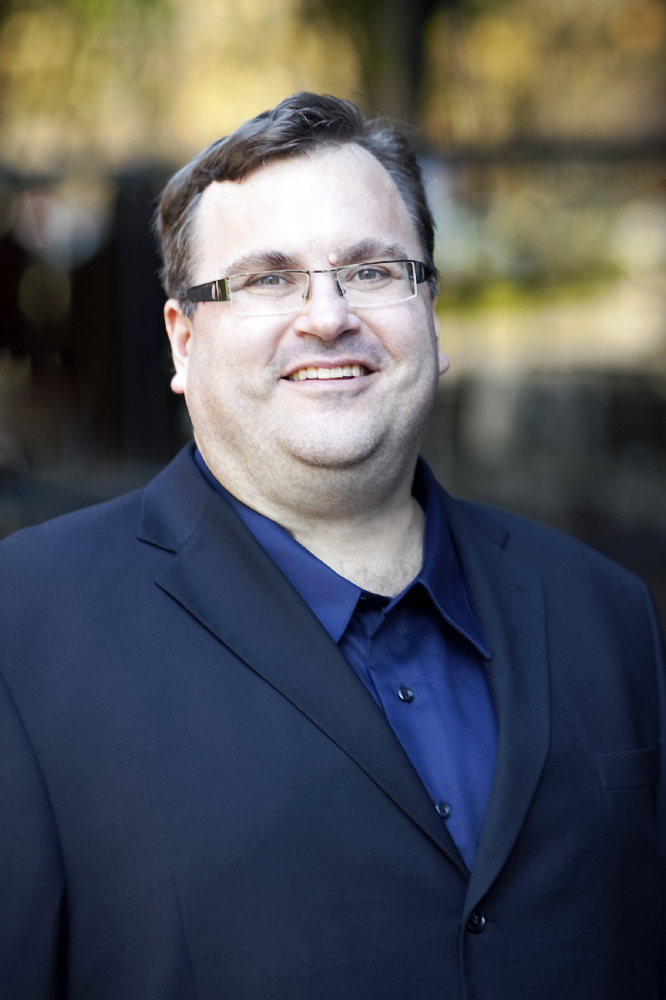

# ChatGPT历史简介

本段历史截止至2023年5月

[AGI](https://en.wikipedia.org/wiki/Artificial_general_intelligence)(Artificial general intelligence)指通用人工智能, 以下是 wiki 第一段:

> An artificial general intelligence (AGI) is a type of hypothetical(假设的) intelligent agent. The AGI concept is that it can learn to accomplish any intellectual task that human beings or other animals can perform. Alternatively, AGI has been defined as an autonomous(自洽的) system that surpasses(超过) human capabilities in the majority of economically valuable tasks. Creating AGI is a primary goal of some artificial intelligence research and companies such as OpenAI, DeepMind, and Anthropic. AGI is a common topic in science fiction and futures studies.

## OpenAI的成立

2014年1月26日, 谷歌宣布以5亿美元收购 DeepMind. 2015年, DeepMind 的 AlphaGo横空出世(AlphaGo论文--Mastering the game of Go with deep neural networks and tree search, AlphaGo Zero论文--Mastering the game of Go without human knowledge). 此时外界看来 DeepMind 有可能最先完成 AGI, 而谷歌就会垄断这一技术. 硅谷的互联网公司决定投资成立一个对抗 DeepMind 的实验室.

2015年12月11日, OpenAI成立.

> Sam Altman, Greg Brockman, Reid Hoffman, Jessica Livingston, Peter Thiel, Elon Musk, Amazon Web Services (AWS), Infosys, and YC Research announced the formation of OpenAI and pledged over $1 billion to the venture.
> - [Sam Altman](https://en.wikipedia.org/wiki/Sam_Altman), 山姆·阿尔特曼1985年4月22日出生于美国伊利诺伊州的芝加哥, 后被斯坦福大学录取, 开始研究人工智能和计算机科学. 2005年从大学辍学, 同好友合作创办社交媒体公司. 被媒体称为ChatGPT之父, 现为Y Combinator 总裁、人工智能实验室OpenAI首席执行官.
> 
> - [Peter Thiel](https://en.wikipedia.org/wiki/Peter_Thiel), 彼得·蒂尔出生于1964年, 于1996年创办了Thiel资产管理公司（Thiel Capital Management）, 并在2002年更名为 Clarium Capital Management. 该公司管理总值超过50亿美元的资产. 蒂尔曾在1998联合创办了PayPal, 并在2002年以15亿美元出售给eBay. 蒂尔是国际象棋天才, 12岁时就在全美排名第七.
> 
> - [Reid Hoffman](https://en.wikipedia.org/wiki/Reid_Hoffman), 里德·霍夫曼, 1967年8月5日出生. LinkedIn联合创始人, 曾经担任过PayPal高级副总裁. 是硅谷最有名的天使投资者之一, 曾经投资过60多家创业公司, 包括Facebook和 Digg.
> 
> - [Elon Reeve Musk](https://en.wikipedia.org/wiki/Elon_Musk), 埃隆·里夫·马斯克, 1971年6月28日出生于南非的行政首都比勒陀利亚, 兼具美国、南非、加拿大三重国籍, 企业家、工程师、发明家、慈善家、特斯拉（TESLA）创始人和首席执行官、太空探索技术公司（SpaceX）首席执行官和首席技术官、太阳城公司（SolarCity）董事会主席、推特首席执行官、OpenAI联合创始人、美国国家工程院院士、英国皇家学会院士, 本科毕业于宾夕法尼亚大学经济学和物理学双专业. 1995年至2002年, 马斯克与合伙人先后办了三家公司, 分别是在线内容出版软件“Zip2”、电子支付“X.com”和“PayPal”.2002年6月, 马斯克投资1亿美元成立太空探索技术公司（Space X）, 出任首席执行官兼首席技术官. 2004年, 马斯克向马丁·艾伯哈德（Martin Eberhard）创立的特斯拉公司投资630万美元, 并担任该公司的董事长. 2006年, 马斯克投资1000万美元联合创办了光伏发电企业太阳城公司. 2018年9月29日, 卸任特斯拉董事长, 但继续担任特斯拉首席执行官.
> 
> - [Ilya Sutskever](https://en.wikipedia.org/wiki/Ilya_Sutskever), 伊尔亚·苏茨克维, 现担任OpenAI首席科学家, 多伦多大学计算机本硕博, AI大牛图灵奖获得者Geoffrey Hinton的学生, Andrew Ng的博后, 前Google研究科学家, AlphaGo的研发者之一
> 

## OpenAI截止到ChatGPT前的时间线

## Chatgpt历代版本

2017年6月, 谷歌大脑团队(Google Brain)在神经信息处理系统大会(NeurlPS)上发表了《[Attention is all you need](https://arxiv.org/abs/1706.03762)》, 提出了基于**注意力机制的 Transformer 模型**, 用于自然语言处理(NLP).

2018年6月, OpenAI推出**有1.7亿参数的GPT-1**, 论文为[Improving Language Understanding by Generative Pre-training](extension://nhppiemcomgngbgdeffdgkhnkjlgpcdi/data/pdf.js/web/viewer.html?file=https%3A%2F%2Fwww.cs.ubc.ca%2F~amuham01%2FLING530%2Fpapers%2Fradford2018improving.pdf).

GPT-1得出发点是解决之前模型的主要2个问题：

1. 有监督学习需要大量的标注数据, 但是高质量的标注数据很难获得
2. 根据一个任务训练的模型, 很难泛化和应用到其它任务中, 无法做到通用

GPT-1的思想是先通过在无标签的数据上学习一个生成式的语言模型, 然后再根据特定任务进行微调, 处理的有监督任务包括：

1. 自然语言推理：判断两个句子是关系（包含、矛盾、中立）；
2. 问答和常识推理：类似于多选题, 输入一个文章, 一个问题以及若干个候选答案, 输出为每个答案的预测概率；
3. 语义相似度：判断两个句子是否语义上市是相关的；
4. 分类：判断输入文本是指定的哪个类别

GPT-1采用的数据集来自于NLP领域里面有名的BooksCorpus dataset（大型书籍训练集）, 包括7000本不同体裁的未出版的书籍数据.

2019年2月, OpenAI发布**15亿参数的GPT-2**, 论文为[Language Models are Unsupervised Multitask Learners](extension://nhppiemcomgngbgdeffdgkhnkjlgpcdi/data/pdf.js/web/viewer.html?file=https%3A%2F%2Flife-extension.github.io%2F2020%2F05%2F27%2FGPT%25E6%258A%2580%25E6%259C%25AF%25E5%2588%259D%25E6%258E%25A2%2Flanguage-models.pdf). 相较于GPT-1, GPT-2只使用了更多的网络参数与更大的数据集：最大模型共计48层.

GPT-2的训练数据WebText, 爬取了来自著名的社交媒体平台Reddit约4500万个网络链接, 抽取对应的网络文字. 800万篇文章, 共40G.

GPT-2可以基于embedding应用不同的规模. GPT-2的最大贡献是验证了通过海量数据和大量参数训练出来的词向量模型可迁移到其它类别任务中, 而不需要额外的训练. GPT-2基于WebText数据训练, 测试迁移到其它8个语言任务中, 能有7个实现SOTA.

2020年5月, OpenAI发布**1750亿参数的GPT-3**, 论文为[Language Models are Few-Shot Learners](https://arxiv.org/abs/2005.14165)

GPT-3是在GPT-2上的延伸. 训练好的GPT-3无需进一步训练和调整可以迁移到其它任务，实现聊好的表现，比如翻译，问题回答互动等. GPT-3的模型架构和GPT-2一样. 为了控制变量，研究模型规模对模型表现的影响，OpenAI训练了8个不同规模的GPT-3，从1.25亿参数到1750亿参数.

2022年3月, OpenAI发布**13亿参数的 Instruct GPT**, 论文为[Training language models to follow instructions with human feedback](https://arxiv.org/abs/2203.02155), InstructGPT的目标是生成清晰、简洁且易于遵循的自然语言文本. 通过收集了一批带标签的语言标记数据，通过引入了强化学习（reinforcement learning）基于人们的反馈，来进行有监督的调优. InstructGPT在真实性，错误性等上面相比GPT-3有更好的表现.

CHATGPT前置论文:
- RLHF([Augmenting Reinforcement Learning with Human Feedback](extension://nhppiemcomgngbgdeffdgkhnkjlgpcdi/data/pdf.js/web/viewer.html?file=https%3A%2F%2Fwww.cs.utexas.edu%2F~ai-lab%2Fpubs%2FICML_IL11-knox.pdf)), 人类反馈强化学习
- TAMER([Training an Agent Manually via Evaluative Reinforcement](extension://nhppiemcomgngbgdeffdgkhnkjlgpcdi/data/pdf.js/web/viewer.html?file=https%3A%2F%2Fwww.cs.utexas.edu%2F~bradknox%2Fpapers%2Ficdl08-knox.pdf)), 评估式强化人工训练处理
- PPO([Proximal Policy Optimization Algorithms](https://arxiv.org/abs/1707.06347)), 近端策略优化

[GPT-4 Technical Report](https://arxiv.org/abs/2303.08774), [官网介绍](https://openai.com/research/gpt-4).

## AlphaGO论文:Mastering the game of Go with deep neural networks and tree search

## AlphaGO ZERO论文:Mastering the game of Go without human knowledge

## 注意力机制论文:[Attention is all you need](https://arxiv.org/abs/1706.03762)

## GPT-1论文:[Improving Language Understanding by Generative Pre-training](xtension://nhppiemcomgngbgdeffdgkhnkjlgpcdi/data/pdf.js/web/viewer.html?file=https%3A%2F%2Fwww.cs.ubc.ca%2F~amuham01%2FLING530%2Fpapers%2Fradford2018improving.pdf)

## GPT-2论文:[Language Models are Unsupervised Multitask Learners](extension://nhppiemcomgngbgdeffdgkhnkjlgpcdi/data/pdf.js/web/viewer.html?file=https%3A%2F%2Flife-extension.github.io%2F2020%2F05%2F27%2FGPT%25E6%258A%2580%25E6%259C%25AF%25E5%2588%259D%25E6%258E%25A2%2Flanguage-models.pdf)

## GPT-3论文:[Language Models are Few-Shot Learners](https://arxiv.org/abs/2005.14165)

## Instruct GPT论文:[Training language models to follow instructions with human feedback](https://arxiv.org/abs/2203.02155)

## PPO论文:[Proximal Policy Optimization Algorithms](https://arxiv.org/abs/1707.06347)