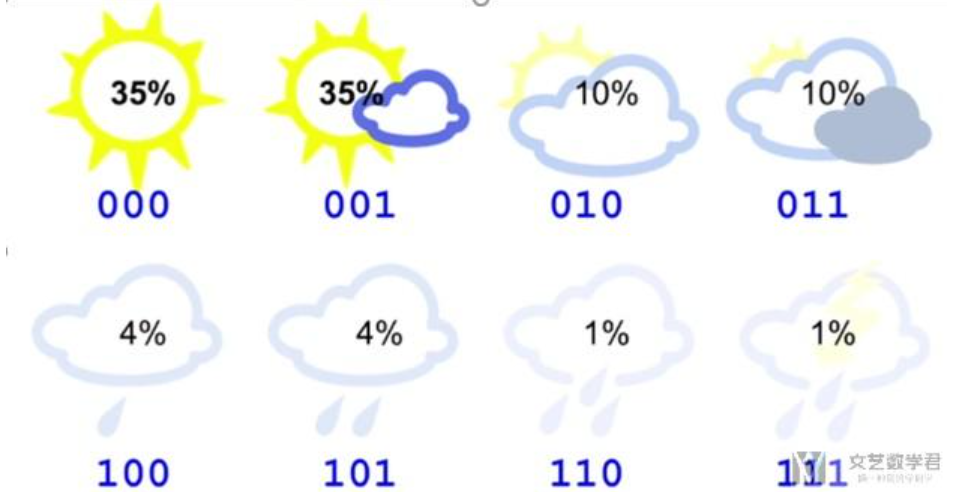
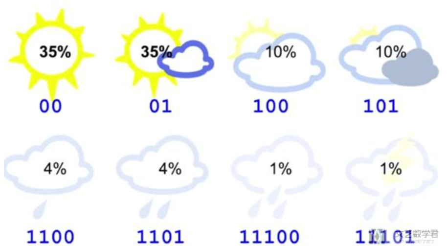

## **十六． 强化学习**

**强化学习**（Reinforcement Learning，简称**RL**）是机器学习的一个重要分支，前段时间人机大战的主角AlphaGo正是以强化学习为核心技术。在强化学习中，包含两种基本的元素：**状态**与**动作**，**在某个状态下执行某种动作，这便是一种策略**，学习器要做的就是通过不断地探索学习，从而获得一个好的策略。例如：在围棋中，一种落棋的局面就是一种状态，若能知道每种局面下的最优落子动作，那就攻无不克/百战不殆了~

若将状态看作为属性，动作看作为标记，易知：**监督学习和强化学习都是在试图寻找一个映射，从已知属性/状态推断出标记/动作**，这样强化学习中的策略相当于监督学习中的分类/回归器。但在实际问题中，**强化学习并没有监督学习那样的标记信息**，通常都是在**尝试动作后才能获得结果**，因此强化学习是通过反馈的结果信息不断调整之前的策略，从而算法能够学习到：在什么样的状态下选择什么样的动作可以获得最好的结果。

### **16.1 基本要素**

强化学习任务通常使用**马尔可夫决策过程**（Markov Decision Process，简称**MDP**）来描述，具体而言：机器处在一个环境中，每个状态为机器对当前环境的感知；机器只能通过动作来影响环境，当机器执行一个动作后，会使得环境按某种概率转移到另一个状态；同时，环境会根据潜在的奖赏函数反馈给机器一个奖赏。综合而言，强化学习主要包含四个要素：状态、动作、转移概率以及奖赏函数。

> **状态（X）**：机器对环境的感知，所有可能的状态称为状态空间；
> **动作（A）**：机器所采取的动作，所有能采取的动作构成动作空间；
> **转移概率（P）**：当执行某个动作后，当前状态会以某种概率转移到另一个状态；
> **奖赏函数（R）**：在状态转移的同时，环境给反馈给机器一个奖赏。

因此，**强化学习的主要任务就是通过在环境中不断地尝试，根据尝试获得的反馈信息调整策略，最终生成一个较好的策略π，机器根据这个策略便能知道在什么状态下应该执行什么动作**。常见的策略表示方法有以下两种：

> **确定性策略**：π（x）=a，即在状态x下执行a动作；
> **随机性策略**：P=π（x,a），即在状态x下执行a动作的概率。

**一个策略的优劣取决于长期执行这一策略后的累积奖赏**，换句话说：可以使用累积奖赏来评估策略的好坏，最优策略则表示在初始状态下一直执行该策略后，最后的累积奖赏值最高。长期累积奖赏通常使用下述两种计算方法：

### **16.2 K摇摆赌博机**

首先我们考虑强化学习最简单的情形：仅考虑一步操作，即在状态x下只需执行一次动作a便能观察到奖赏结果。易知：欲最大化单步奖赏，我们需要知道每个动作带来的期望奖赏值，这样便能选择奖赏值最大的动作来执行。若每个动作的奖赏值为确定值，则只需要将每个动作尝试一遍即可，但大多数情形下，一个动作的奖赏值来源于一个概率分布，因此需要进行多次的尝试。

单步强化学习实质上是**K-摇臂赌博机**（K-armed bandit）的原型，一般我们**尝试动作的次数是有限的**，那如何利用有限的次数进行有效地探索呢？这里有两种基本的想法：

> **仅探索法**：将尝试的机会平均分给每一个动作，即轮流执行，最终将每个动作的平均奖赏作为期望奖赏的近似值。
> **仅利用法**：将尝试的机会分给当前平均奖赏值最大的动作，隐含着让一部分人先富起来的思想。

可以看出：上述**两种方法是相互矛盾的**，仅探索法能较好地估算每个动作的期望奖赏，但是没能根据当前的反馈结果调整尝试策略；仅利用法在每次尝试之后都更新尝试策略，符合强化学习的思（tao）维（lu），但容易找不到最优动作。因此需要在这两者之间进行折中。

#### **16.2.1 ε-贪心**

**ε-贪心法基于一个概率来对探索和利用进行折中**，具体而言：在每次尝试时，以ε的概率进行探索，即以均匀概率随机选择一个动作；以1-ε的概率进行利用，即选择当前最优的动作。ε-贪心法只需记录每个动作的当前平均奖赏值与被选中的次数，便可以增量式更新。

#### **16.2.2 Softmax**

**Softmax算法则基于当前每个动作的平均奖赏值来对探索和利用进行折中，Softmax函数将一组值转化为一组概率**，值越大对应的概率也越高，因此当前平均奖赏值越高的动作被选中的几率也越大。Softmax函数如下所示：

### **16.3 有模型学习**

若学习任务中的四个要素都已知，即状态空间、动作空间、转移概率以及奖赏函数都已经给出，这样的情形称为“**有模型学习**”。假设状态空间和动作空间均为有限，即均为离散值，这样我们不用通过尝试便可以对某个策略进行评估。

#### **16.3.1 策略评估**

前面提到：**在模型已知的前提下，我们可以对任意策略的进行评估**（后续会给出演算过程）。一般常使用以下两种值函数来评估某个策略的优劣：

> **状态值函数（V）**：V（x），即从状态x出发，使用π策略所带来的累积奖赏；
> **状态-动作值函数（Q）**：Q（x,a），即从状态x出发，执行动作a后再使用π策略所带来的累积奖赏。

根据累积奖赏的定义，我们可以引入T步累积奖赏与r折扣累积奖赏：

由于MDP具有马尔可夫性，即现在决定未来，将来和过去无关，我们很容易找到值函数的递归关系：

类似地，对于r折扣累积奖赏可以得到：

易知：**当模型已知时，策略的评估问题转化为一种动态规划问题**，即以填表格的形式自底向上，先求解每个状态的单步累积奖赏，再求解每个状态的两步累积奖赏，一直迭代逐步求解出每个状态的T步累积奖赏。算法流程如下所示：

对于状态-动作值函数，只需通过简单的转化便可得到：

#### **16.3.2 策略改进**

理想的策略应能使得每个状态的累积奖赏之和最大，简单来理解就是：不管处于什么状态，只要通过该策略执行动作，总能得到较好的结果。因此对于给定的某个策略，我们需要对其进行改进，从而得到**最优的值函数**。

最优Bellman等式改进策略的方式为：**将策略选择的动作改为当前最优的动作**，而不是像之前那样对每种可能的动作进行求和。易知：选择当前最优动作相当于将所有的概率都赋给累积奖赏值最大的动作，因此每次改进都会使得值函数单调递增。

将策略评估与策略改进结合起来，我们便得到了生成最优策略的方法：先给定一个随机策略，现对该策略进行评估，然后再改进，接着再评估/改进一直到策略收敛、不再发生改变。这便是策略迭代算法，算法流程如下所示：

可以看出：策略迭代法在每次改进策略后都要对策略进行重新评估，因此比较耗时。若从最优化值函数的角度出发，即先迭代得到最优的值函数，再来计算如何改变策略，这便是值迭代算法，算法流程如下所示：

### **16.4 蒙特卡罗强化学习**

在现实的强化学习任务中，**环境的转移函数与奖赏函数往往很难得知**，因此我们需要考虑在不依赖于环境参数的条件下建立强化学习模型，这便是**免模型学习**。蒙特卡罗强化学习便是其中的一种经典方法。

由于模型参数未知，状态值函数不能像之前那样进行全概率展开，从而运用动态规划法求解。一种直接的方法便是通过采样来对策略进行评估/估算其值函数，**蒙特卡罗强化学习正是基于采样来估计状态-动作值函数**：对采样轨迹中的每一对状态-动作，记录其后的奖赏值之和，作为该状态-动作的一次累积奖赏，通过多次采样后，使用累积奖赏的平均作为状态-动作值的估计，并**引入ε-贪心策略保证采样的多样性**。

在上面的算法流程中，被评估和被改进的都是同一个策略，因此称为**同策略蒙特卡罗强化学习算法**。引入ε-贪心仅是为了便于采样评估，而在使用策略时并不需要ε-贪心，那能否仅在评估时使用ε-贪心策略，而在改进时使用原始策略呢？这便是**异策略蒙特卡罗强化学习算法**。

### **16.5 AlphaGo原理浅析**

本篇一开始便提到强化学习是AlphaGo的核心技术之一，刚好借着这个东风将AlphaGo的工作原理了解一番。正如人类下棋那般“**手下一步棋，心想三步棋**”，Alphago也正是这个思想，**当处于一个状态时，机器会暗地里进行多次的尝试/采样，并基于反馈回来的结果信息改进估值函数，从而最终通过增强版的估值函数来选择最优的落子动作。**

其中便涉及到了三个主要的问题：**（1）如何确定估值函数（2）如何进行采样（3）如何基于反馈信息改进估值函数**，这正对应着AlphaGo的三大核心模块：**深度学习**、**蒙特卡罗搜索树**、**强化学习**。

> **1.深度学习（拟合估值函数）**

由于围棋的状态空间巨大，像蒙特卡罗强化学习那样通过采样来确定值函数就行不通了。在围棋中，**状态值函数可以看作为一种局面函数，状态-动作值函数可以看作一种策略函数**，若我们能获得这两个估值函数，便可以根据这两个函数来完成：(1)衡量当前局面的价值；(2)选择当前最优的动作。那如何精确地估计这两个估值函数呢？**这就用到了深度学习，通过大量的对弈数据自动学习出特征，从而拟合出估值函数。**

> **2.蒙特卡罗搜索树（采样）**

蒙特卡罗树是一种经典的搜索框架，它通过反复地采样模拟对局来探索状态空间。具体表现在：从当前状态开始，利用策略函数尽可能选择当前最优的动作，同时也引入随机性来减小估值错误带来的负面影响，从而模拟棋局运行，使得棋盘达到终局或一定步数后停止。

> **3.强化学习（调整估值函数）**

在使用蒙特卡罗搜索树进行多次采样后，每次采样都会反馈后续的局面信息（利用局面函数进行评价），根据反馈回来的结果信息自动调整两个估值函数的参数，这便是强化学习的核心思想，最后基于改进后的策略函数选择出当前最优的落子动作。

## 熵、交叉熵和KL散度

**熵**(Entropy)的介绍
我们以天气预报为例子，进行熵的介绍．

- 假如只有 **2 种**天气，sunny 和 rainy ，那么明天对于每一种天气来说，各有 50% 的可能性．
- 此时气象部门告诉你明天是rainy，他其实减少了你的**不确定信息**．
- 所以，天气部门给了你 **1 bit**的**有效信息**(因为此时只有两种可能性)．
- 假如只有8种天气，每一种天气出现是**等可能的**．
- 此时气象部门告诉你明天是 Rainy ，他其实减少了你的不确定信息，也就是告诉了你有效信息．
- 所以，天气部门给了你 **3 bit**的有效信息(因为8种状态需要 2^3=8 ，需要 3 bit来表示．
- 所以，有效信息的计算可以使用 log 来进行计算，计算过程如下
$$
\begin{array}{l}
2^{3}=8 \\
\log _{2}(8)=3
\end{array}
$$

- 上面所有的情况都是等概率出现的，假设各种情况出现的**概率不是相等**的．
- 例如有75%的可能性是Sunny，25%的可能性是Rainy．
- 如果气象部门告诉你明天是Rainy
  - 我们会使用**概率的倒数**， $1 / 0.25=4$ (概率越小，有效信息越多)
  - 接着计算有效信息， $\log 2(1 / 0.25)=2=(-\log 2(0.25)$ ，log的等价计算)
  - 因为和本来的概率相差比较大，所以获得的有效信息比较多(本来是 Rainy 的可能性小)
- 如果气象部门告诉你明天是 Sunny
  - 同样计算此时的有效信息， $\log 2(1 / 0.75)=-\log 2(0.75)=0.41$
  - 因为和本来的概率相差比较小，所以获得的信息比较少(本来是 Sunny 的可能性大)
- 从气象部门获得的信息的平均值(这个就是**熵**
  - 简单解释: 有 75% 的可能性是Sunny ，得到晴天的有效信息是 0.41 ，所以是
$$
0.75* 0.41
$$
- 于是我们得到了**熵的计算公式**.
  - 熵是用来衡量获取的信息的平均值，没有获取什么信息量，则 Entropy 接近 0 ．
  - 下面是熵的计算公式
$$
\mathrm{H}(\mathbf{p})=-\Sigma_{i} p_{i} \log _{2}\left(p_{i}\right)
$$

**交叉熵**(Cross-Entropy)的介绍
对于交叉熵的介绍，我们还是以天气预报作为例子来进行讲解．

- 交叉熵(Cross-Entropy)可以理解为平均的 message length ，即**平均信息长度**．
- 现在有 8 种天气，于是每一种天气我们可以使用 3 bit 来进行表示（000，001，010，011...）
- 此时 average message length = 3 ，所以此时Cross-Entropy $=3$

现在假设你住在一个 sunny region ，出现晴天的可能性比较大(**即每一种天气不是等可能出现的**)，下图是每一种天气的概率．

我们来计算一下此时的熵(ntropy) ，计算的式子如下所示：
$$
\begin{array}{l}
Entropy\\
=-0.35 \log _{2}(0.35)-\ldots-0.01 \log_{2}(0.01) \\
=2.23 \mathrm{bits}
\end{array}
$$

- 此时有效的信息是 2.23 bit．
- 所以再使用上面的编码方式(都使用 3 $\mathrm{bit})$ 会有咒余．
- 也就是说我们每次发出 3 bit ，接收者有效信息为2.23 bit．
- 这时我们可以修改天气的 **encode 的方式**，可以给经常出现的天气比较小的 code 来进行表示，于是我们可以按照下图对每一种天气进行 encode ．

此时的平均长度的计算如下所示(每一种天气的概率该天气code的长度)：
$$
\begin{array}{l}
35 \% \times 2+35 \% \times 2+10 \% \times 3 \\
+10 \% \times 3+4 \% \times 4+4 \% \times 4 \\
+1 \% \times 5+1 \% \times 5\\
=2.42 \text { bits }
\end{array}
$$
此时的平均长度为 2.42 bit，可以看到比一开始的 3 bit有所减少．

如果我们使用相同的 code ，但是此时对应的天气的概率是不相同的，此时计算出的平均长度就会发生改变．此时每一种天气的概率如下图所示：

于是此时的信息的平均长度就是 4.58 bit ，比 Entropy 大很多 (如上图所示，我们给了概率很小的天 气的 code 也很小，概率很大的天气的 code 也很大，此时就会导致计算出的平均长度很大)，下面是平均长度的计算的式子．
$$
\begin{array}{l}
1 \% \times 2+1 \% \times 2+4 \% \times 3+ \\
4 \% \times 3+10 \% \times 4+10 \% \times 4 \\
+35 \% \times 5+35 \% \times 5\\
=4.58 \mathrm{bits}
\end{array}
$$
我们如何来理解我们给每一种天气的 code 呢，其实我们可以理解为这就是我们对每一种天气发生的可能性的预测，我们会给出现概率比较大的天气比较短的 code ，这里的概率是我们假设的，即**我们有一个估计的概率**，我们估计这个天气的概率比较大，所以给这个天气比较短的 code．

下图中可以表示出我们**预测的q**(predicted distribution)和**真实分布p**(true distribution)．可以看到此时我们的预测概率 $q$ 与真实分布 $p$ 之间相差很大(此时计算出的交叉熵就会比较大)

关于上面 code 长度与概率的转换，我们可以这么来进行理解，对于概率为 $p$ 的信息，他的有效信息为 $-log2(p)$ ．若此时 code 长度为 $n$ ，我们问概率为多少的信息的有效信息为 n ，即求解 $-log2(p)=n$ ，则 $\mathrm{p}=1 / 2^{\wedge} \mathrm{n}$ ，所以我们就可以求出 $\mathrm{code}$ 长度与概率的转换．此时，我们就可以定义**交叉熵**(Cross-Entropy)，这里会有两个变量，分别是p(真实的分布)和
q(预测的概率):
$$
\mathrm{H}(\mathrm{p}, \mathrm{q})=-\Sigma_{\mathrm{i}} p_{i} \log _{2}\left(q_{i}\right)
$$
这个交叉熵公式的意思就是在计算消息的平均长度，我们可以这样来进行理解．

- $-\log 2(\mathrm{q})$ 是将预测概率转换为 code 的长度(这里看上面 code 长度与概率的转换)
- 接着我们再将 code 的长度 $(-log2(q))$ 乘上出现的概率 $\mathrm{p}($ 真实的概率 $)$

我们简单说明一下熵(Entropy),和交叉熵(Cross-Entropy)的性质：

- 如果预测结果是好的,，那么 p 和 q 的分布是相似的，此时 Cross-Entropy 与 Entropy 是相似
的．
- 如果 p 和 q 有很大的不同，那么 Cross-Entropy 会比 Entropy 大．
- 其中 Cross-Entropy 比 Entropy 大的部分，我们称为 relative entropy ，或是Kullback-
Leibler Divergence(KL Divergence)，这个就是**KL-散度**，我们会在后面进行详细的介
绍．
- 也就是说，三者的关系为：**Cross-Entropy=Entropy+ KL Divergence**

在进行**分类**问题的时候，我们通常会将 loss 函数设置为交叉熵(Cross-Entropy)，其实现在来看这个也是很好理解，我们会有我们预测的概率 q 和实际的概率 p ，若 p 和 q 相似，则交叉熵小，若 p 和 q 不相似，则交叉熵大．

有一个要注意的是，我们通常在使用的时候会使用 10 为底的 log ，但是这个不影响 ，因为 $log2(x)=log10(x)/log(2)$ ，我们可以通过公式进行转换．

在 PyTorch 中，CrossEntropyLoss 不是直接按照上面进行计算的，他是包含了 Softmax 的步骤的．关于在 PyTorch 中 CrossEntropyLoss 的实际计算：
[详细介绍:PyTorch中交叉熵的计算CrossEntropyLoss](https://mathpretty.com/12068.html)

### 交叉熵损失函数

交叉熵损失函数（Cross-Entropy Loss Function）一般用于分类问题．假设样本的标签 𝑦 ∈ {1,⋯,𝐶} 为离散的类别，模型 $f(x;\theta) \in[0,1]^𝐶$的输出为类别标签的条件概率分布，即
$$p(y = c|x;\theta) = f_c(x;\theta),$$
并满足
$$f_c(x;\theta) \in [0,1],\qquad \sum_{c=1}^C f_c(x;\theta) = 1.$$
我们可以用一个 $C$ 维的one-hot向量 $y$ 来表示样本标签．假设样本的标签为 $k$ ，那么标签向量只有第 $k$ 维的值为 1 ，其余元素的值都为 0 ．标签向量 $y$ 可以看作样本标签的真实条件概率分布 $p_r(𝒚|𝒙)$ ，即第 $c$ 维（记为 $y_c, 1\leq c\leq C$） 是类别为 $c$ 的真实条件概率．假设样本的类别为 $k$ ，那么它属于第 $k$ 类的概率为 1 ，属于其他类的概率为 0 .
对于两个概率分布，一般可以用交叉熵来衡量它们的差异．标签的真实分布 $y$ 和模型预测分布 $f(x;\theta)$ 之间的交叉熵为
$$
\begin{aligned}
L(y,f(x;\theta)) &= -y^T \log f(x;\theta)\\
&=-\sum_{c=1}^C y_c \log f_c(x;\theta)
\end{aligned}
$$
比如对于三分类问题，一个样本的标签向量为$y = [0,0,1]^T$，模型预测的标签分布为$f(x;\theta) = [0.3,0.3,0.4]^T$，则它们的交叉熵为$-(0 \times \log (0.3)+0\times \log(0.3) + 1\times \log(0.4)) = -\log(0.4)$.
因为 $y$ 为one-hot向量，上式也可以写为
$$
L(y,f(x;\theta)) = -\log f_y(x;\theta),
$$
其中 $f_y(x;\theta)$ 可以看作真实类别 $y$ 的似然函数．因此，交叉熵损失函数也就是**负对数似然函数**（Negative Log-Likelihood）．

#### 交叉熵最小值证明

$H(p, q)=-\sum_{i} p_{i} \ln q_{i}$ 为什么当 $p$ 与 $q$ 的分布一致时, $H(p, q)$ 有最小值:

证明如下:
$$
H(p, p)-H(p, q)=\sum_{i} p_{i} \ln q_{i}-\sum_{i} p_{i} \ln p_{i}=\sum_{i} p_{i} \ln \frac{q_{i}}{p_{i}}
$$
因为 $\ln (x)$ 为定义域上的凸函数
根据琴生不等式有
$$
a_{1} \ln \left(x_{1}\right)+a_{2} \ln \left(x_{2}\right)+a_{3} \ln \left(x_{3}\right)+\ldots+a_{n} \ln \left(x_{n}\right)<=\ln \left(a_{1} x_{1}+a_{2} x_{2}+\ldots+a_{n} x_{n}\right)
$$
其中$\left(\sum_{i} a_{i}=1\right)$

将 $\sum_{i} p_{i} \ln \frac{q_{i}}{p_{i}}$ 代入则有:
$$
\begin{aligned}
p_{1} l n\left(\frac{p_{1}}{q_{1}}\right)+p_{2} \ln \left(\frac{p_{2}}{q_{2}}\right)+\ldots+p_{n} \ln \left(\frac{p_{n}}{q_{n}}\right)&\leq\ln \left(p_{1} \frac{q_{1}}{p_{1}}+p_{2} \frac{q_{2}}{p_{2}}+\ldots+p_{n} \frac{q_{n}}{p_{n}}\right)\\
\sum_{i} p_{i} \ln \frac{q_{i}}{p_{i}}&\leq \ln \left(q_{1}+q_{2}+\ldots+q_{n}\right)\\
&=0
\end{aligned}
$$
所以
$$
H(p, p)-H(p, q)<=0
$$
当 $p=q$ 时, 等号成立.
