# 最简单情形的自动对冲

选用近月或次月（可选）离合成期货最近的行权价对应的合成期货对作为对冲合约；
手动填入本次的目标\$delta以及可以接受的一个上下范围区间，对冲必须要达到目标\$delta一次后才会考虑上下范围；
例子：当前实际\$delta为5%，目标\$delta为20%，给定的上下容忍范围为10%，那么刚开始对冲的情形下，\$delta**必须到达一次20%才停止**进入等待状态，后续才会判断\$delta出了目标\$delta20%上下10%去做对冲，也就是低于10%或高于30%.

\$vega方面，不同于\$delta我们给定的是目标\$delta，\$vega我们会给一个**本次\$vega**，\$vega我们会实时计算从本次对冲开始下的单对应的\$vega，该\$vega未到设定的**本次要做的\$vega**前我们只用call或者put去做对冲，在该\$vega达到**本次要做的\$vega**后我们只会用合成期货去进行对冲；下的单对应的\$vega到过一次**本次要做的\$vega**后就再也不考虑\$vega这一希腊值了

流程图如下

