## 二．波动率价差

### 2.1 各种形式

#### 2.1.1 跨式期权

**跨式期权**（straddle）由一个看涨期权和一个看跌期权组成，这两个期权具有相同的行权价格和到期日．在跨式期权中，这两个期权要么同时买入（**跨式期权多头**），要么同时卖出（**跨式期权空头**）．

#### 2.1.2 宽跨式期权

与跨式期权一样，**宽跨式期权**（straggle）由一个看涨期权和一个看跌期权组成，且两个期权的到期时间相同．但在宽跨式期权中，两个期权的行权价格不同．

为了避免混淆，通常假设宽跨式期权由虚值期权组成．如果当前标的市场价格为 100，而交易者想买入 3 月行权价格为 90/110 的宽跨式期权，这意味着他想买入 1 份 3 月行权价格为 90 的看跌期权和 1 份 3 月行权价格为 110 的看涨期权．

#### 2.1.3 蝶式期权

**蝶式期权**（butterfly）通常就是一个由相同类型（要么都是看涨，要么都看跌）并具有相同到期时间，且合约间行权价格间距相等的 3 份期货合约组成的三腿价差．蝶式期权多头中，买入外部行权价格的期权合约，卖出内部行权价格的期权合约．构成比例固定不变：都为 1x2x1 ．

为何买外卖内算作蝶式的多头？ 根据损益图，如果不考虑期权费，买外卖内的损益总不小于零，故必须付出一定金额，所以称为多头．

**跨式期权潜在收益或风险都是无限的，而蝶式都是有限的**．

#### 2.1.4 鹰式期权

**鹰式期权**（condor）由 4 份期权组成，2 个内部行权价格和两个外部行权价格．构成比例总是 1x1x1x1 ，尽管两个内部行权价格的差额可以变化，*但是 2 个最低行权价格的差额一定要与 2 个最高行权价格的差额相等*(why?)．与蝶式期权一样，鹰式期权中所有期权的到期时间和类型都相同．买入两个外部行权价格的期权，卖出两个内部行权价格的期权就构成了鹰式期权多头．

上述四个策略对标的市场的变动方向没有偏好，损益图为对称的．

#### 2.1.5 比例价差

在波动率价差中，交易者不能完全不关心标的市场的变动方向．交易者可能认为向一个方向变动的可能性要大于向另一个方向变动的可能性．鉴于这个原因，交易者可能希望构建一个当标的向一个方向而不是另一个方向变动时能最大化收益或最小化损失的价差策略．为了实现这个目标，交易者可以构建一个**比例价差**（ratio spread）——买入并卖出不同数量的期权，所有期权都是同一类型的，且具有相同的到期时间．和其他波动率头寸一样，比例价差也是典型的 Delta 中性策略．

## 三．希腊值的含义

### 序:各种希腊值特性

#### delta

call 的价值变化：标的相对于行权价的变化
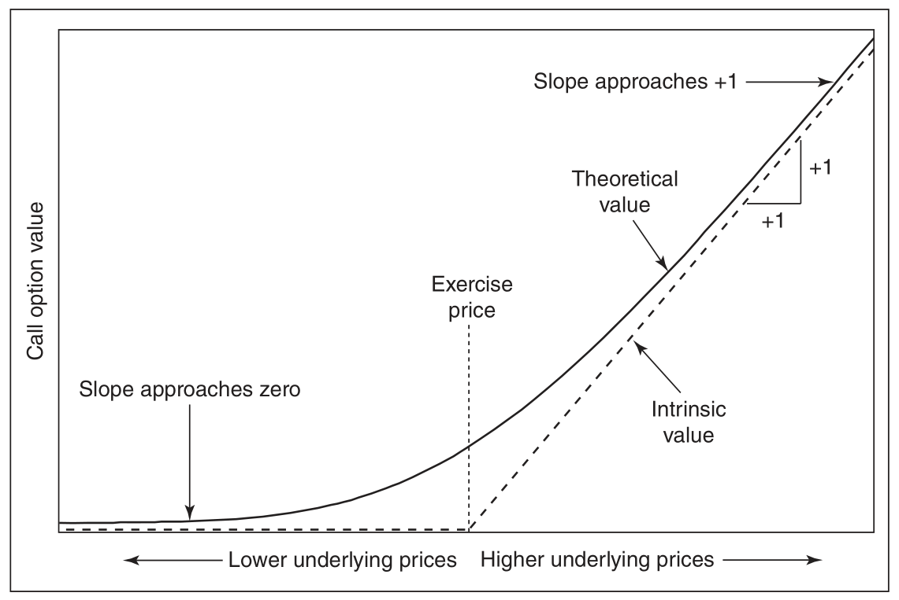

put 的价值变化：标的相对于行权价的变化
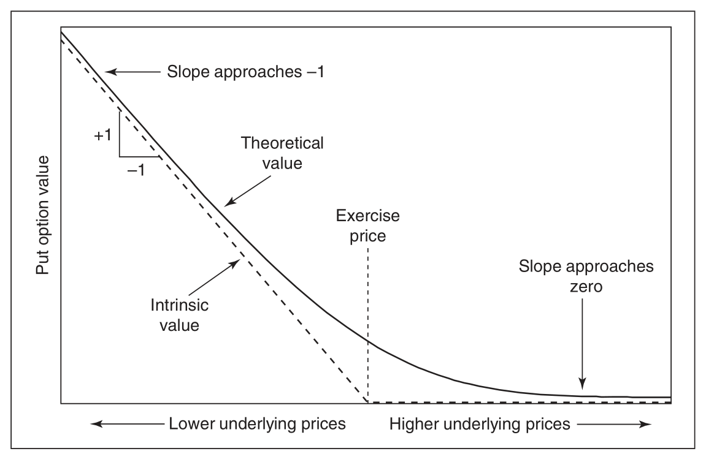

delta 随标的的变化
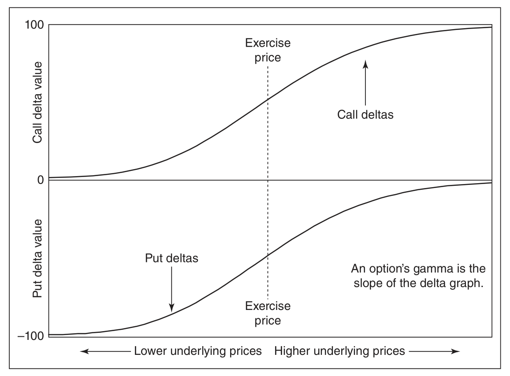

call_delta 随 volatility 的变化
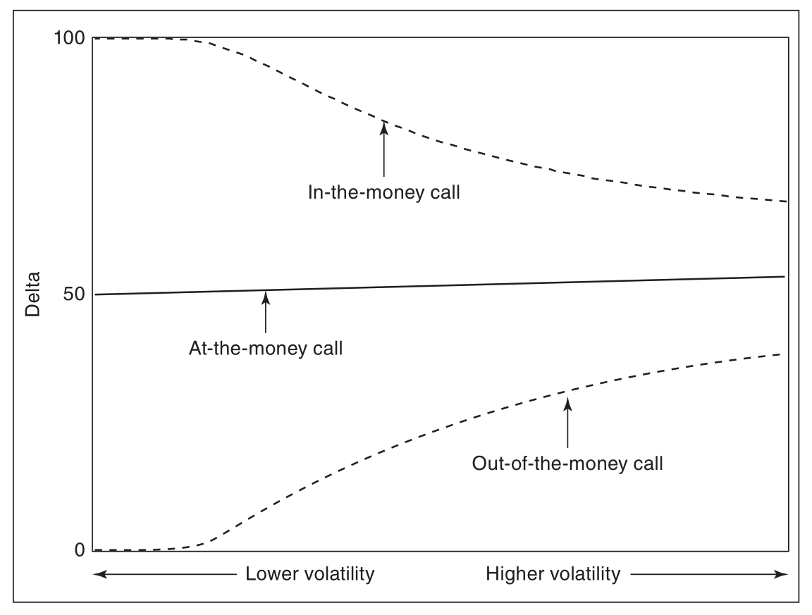

put_delta 随 volatility 的变化
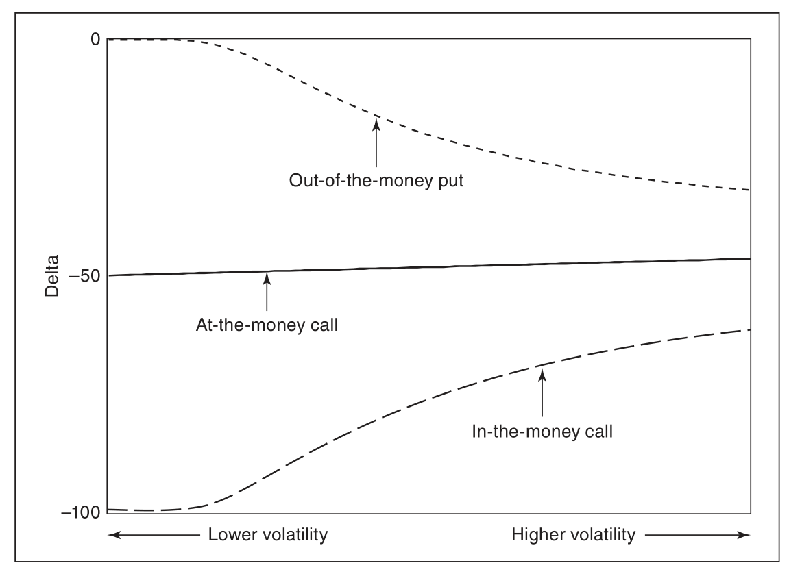

call_delta 随到期时间变化
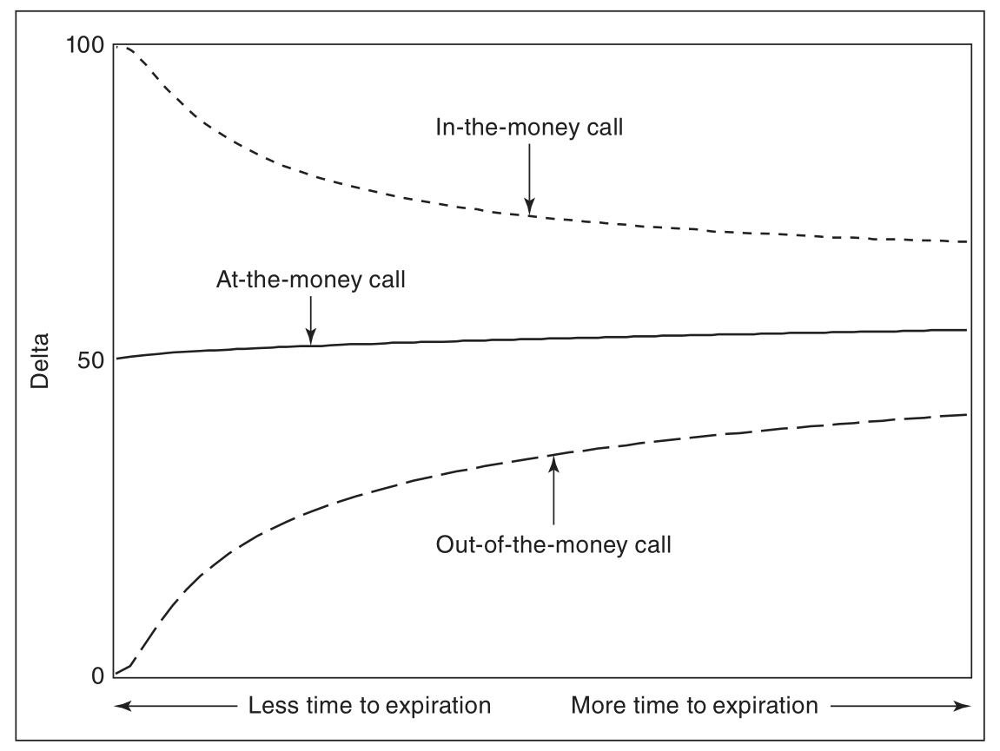

put_delta 随到期时间变化
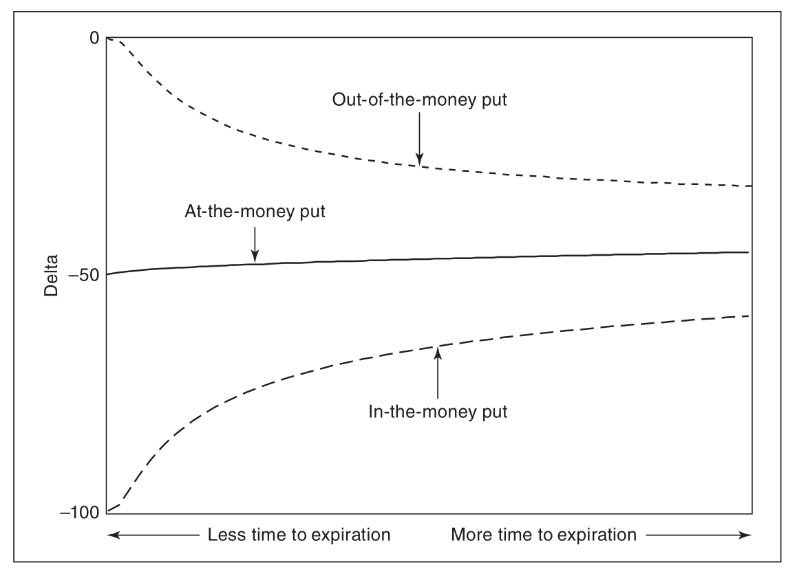

call_delta 随着时间推移或者波动率下降的变化
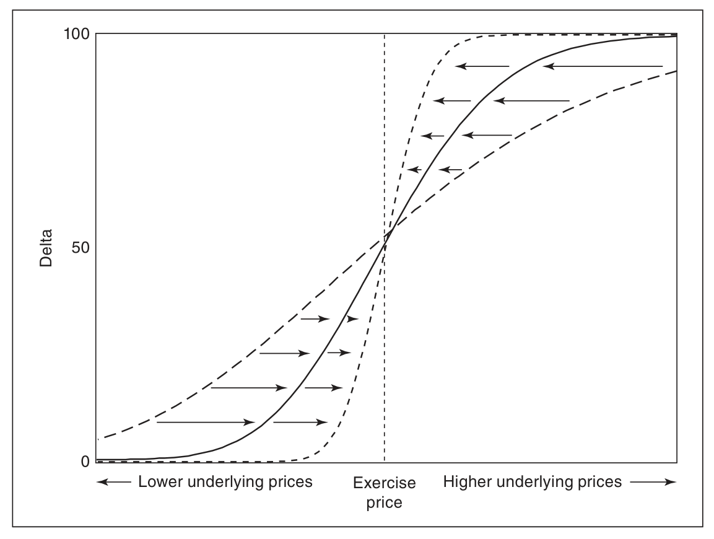

### Vanna

Vanna：作为 Delta 对波动率的偏导，或者 Vega 对标的价格的偏导．
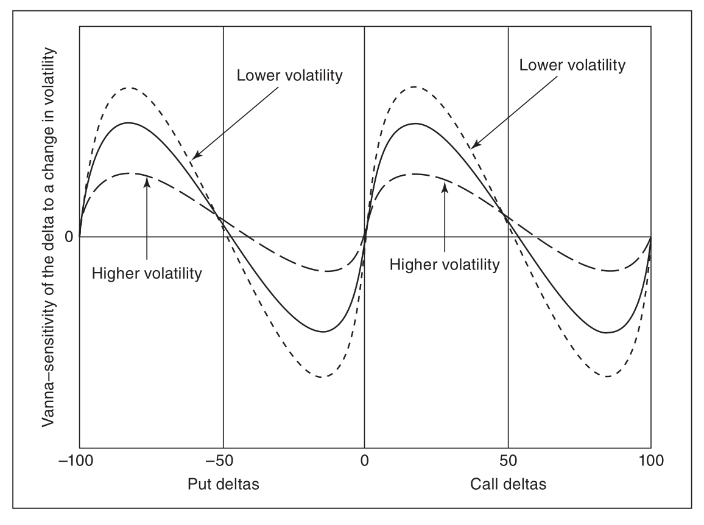

### theta

theta：期权价格随着标的价格变化，此处取了绝对值(**call 与 put 一样，都是负的！跟恒正 GAMMA 比较**)
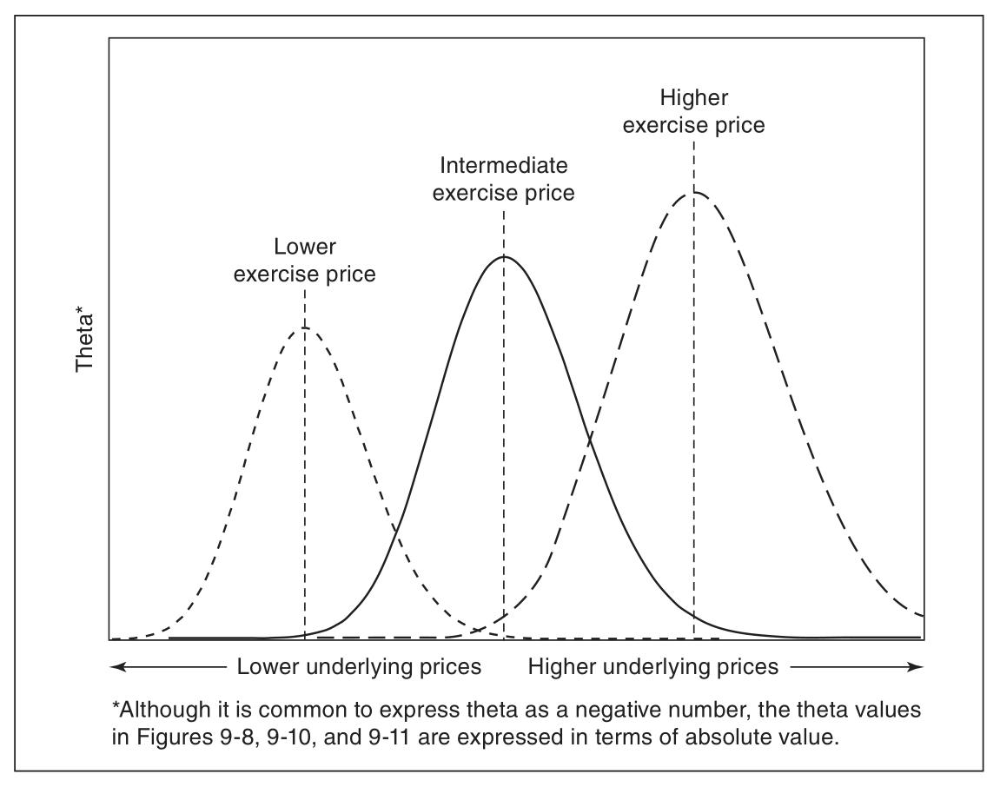

### vega

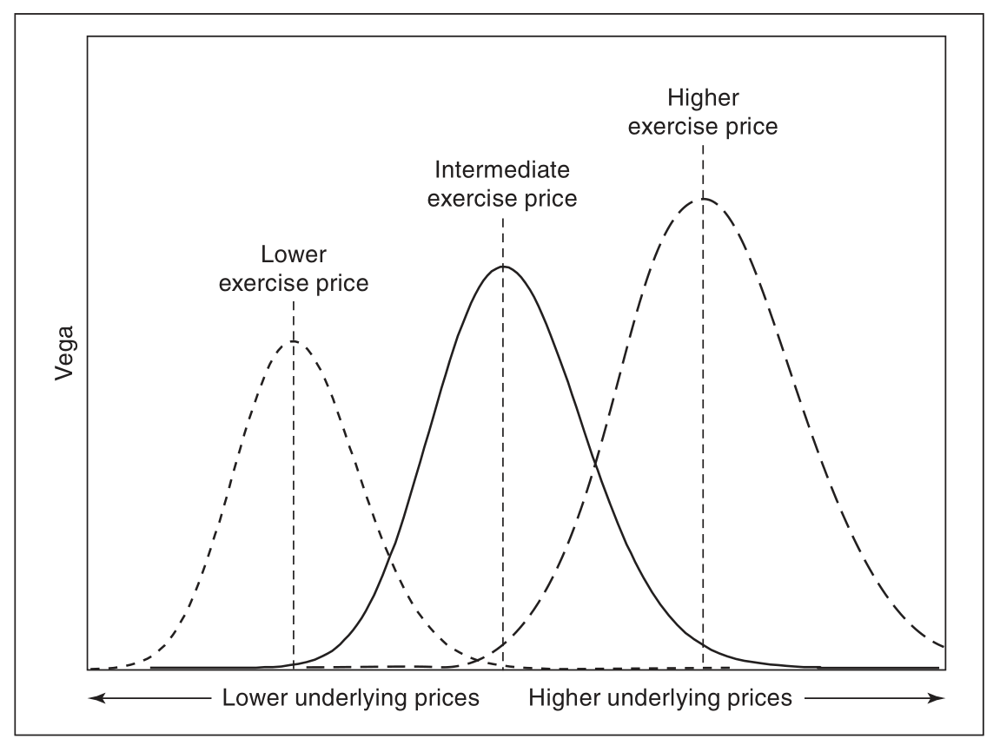

### gamma

恒正的 GAMMA：
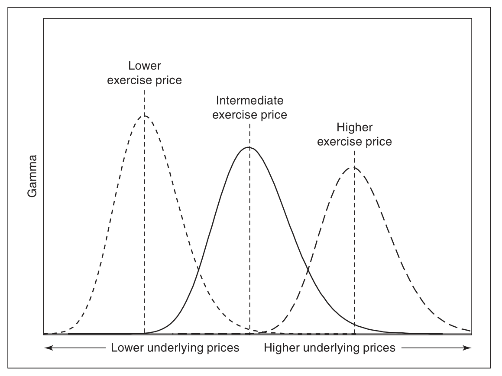

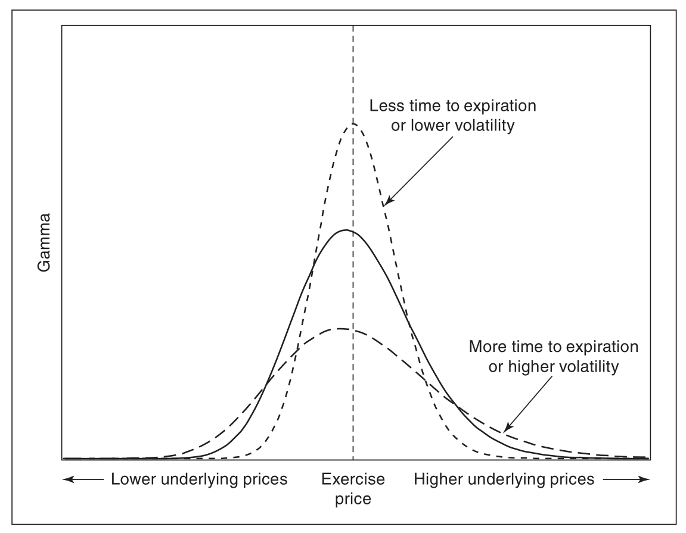

$$
V_{t} =S_{t} N\left(d_{1}\right)-K e^{-r(T-t)} N\left(d_{2}\right)
$$
其中
$$
\begin{array}{l}
d_{1}=\frac{\ln \left(\frac{S_{t}}{K}\right)+\left(r+\frac{1}{2} \sigma^{2}\right)(T-t)}{\sigma \sqrt{T-t}} \\
d_{2}=d_{1}-\sigma \sqrt{T-t}
\end{array}
$$