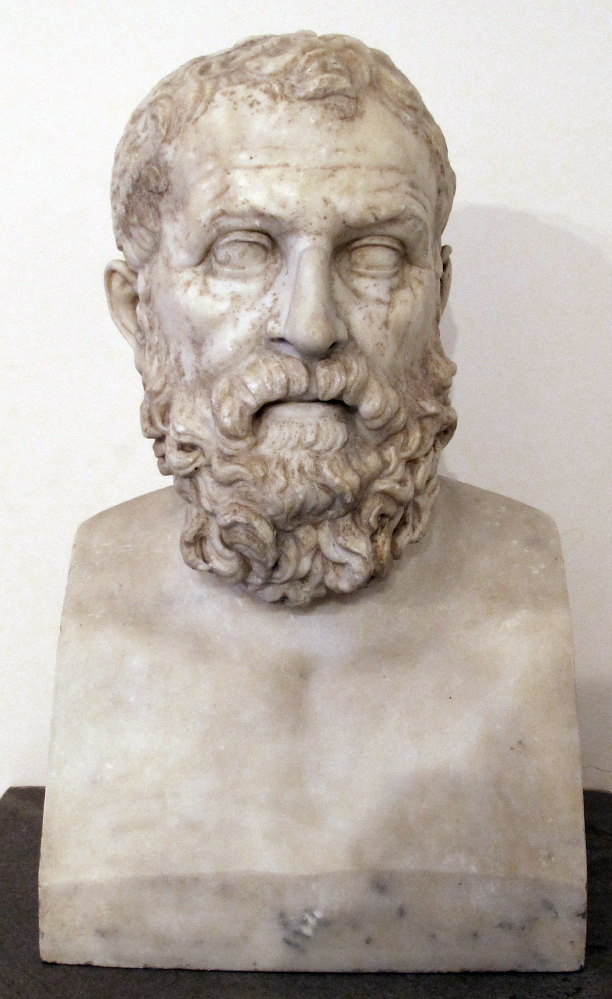
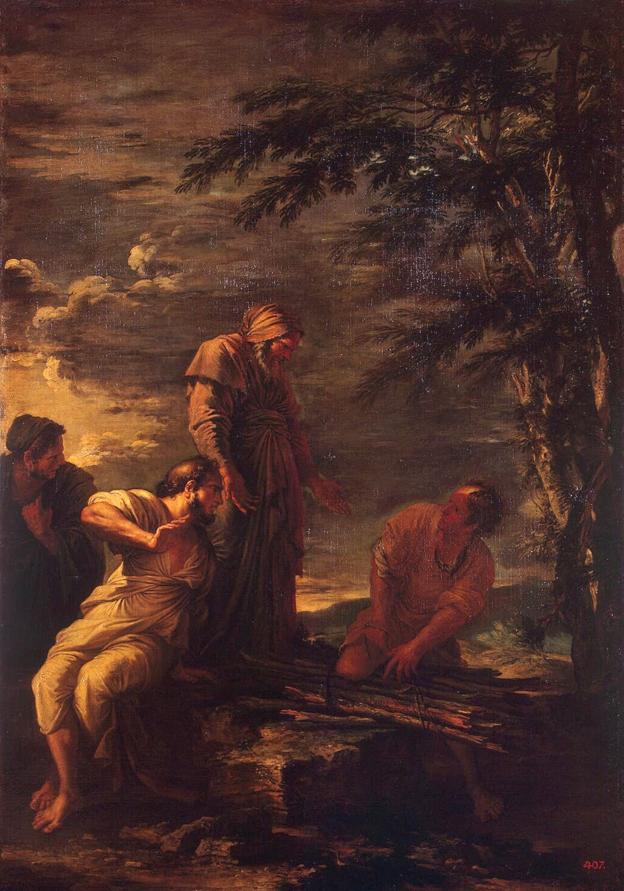
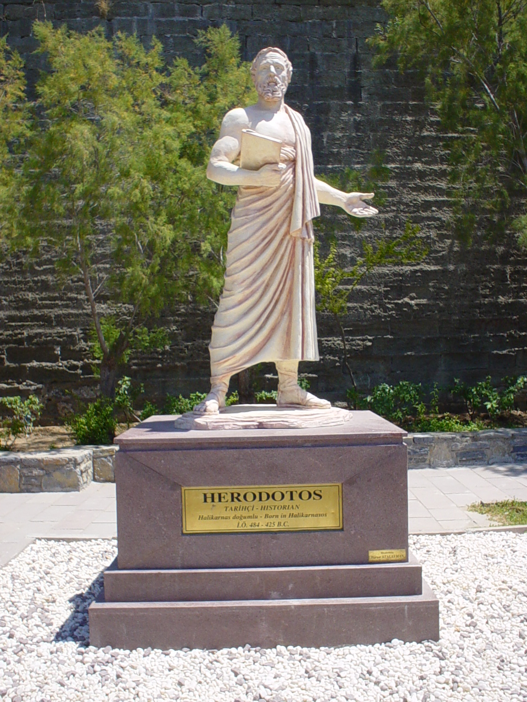

# 第一部分 古希腊哲学/Ancient Greek Philisophy

## 第零章 古希腊年表

- 公元前776年，第一届奥林匹克运动会举办，成为后来希腊世界很多历史事件确定时间的基础。
- 约公元前740—公元前720年，第一次美塞尼亚战争。斯巴达取胜，占领美赛尼亚人大部分国土。
- 公元前735年，科林斯人建立希腊人在西西里的第一个城邦纳克索斯；公元前734年，科林斯人在西西里建立叙拉古城邦。
- 公元前8—公元前7世纪，诗人希西阿德在世，希腊此时称为“希西阿德时期”。
- 公元前725年，斯巴达人建成希腊第一座石制神庙阿尔忒弥斯神庙。
- 公元前683年，雅典执政官改为一年一任，日后雅典国家文件常用名年执政官纪年。
- 公元前664年，普萨美提克一世开始招募希腊雇佣兵，希腊人开始渗入埃及。
- 约公元前7世纪中期，重步兵战术开始在希腊传播，深刻影响希腊世界的作战方式。
- 公元前660—公元前645年，第二次美塞尼亚战争，斯巴达占领美塞尼亚人的全部领土，奴役全部美塞尼亚人。
- 公元前650年，希腊人开始向黑海地区殖民。
- 公元前638年，梭伦出生于雅典。
<!--  -->

- 公元前630年，希腊人在利比亚建立昔兰尼城邦。
- 公元前630年，女诗人萨福出生列斯波斯岛。萨福是有史可查的古希腊第一位女诗人。

- 公元前624年，**米利都学派创始人泰勒斯**出生于米利都。
<!--  -->

- 公元前621年，雅典执政官德拉古颁布古希腊第一部成文法典。
- 公元前610年，**米利都学派哲学家阿那克西曼德**出生于米利都。他首次在哲学史上提出“本原”的概念。
<!--  -->

- 公元前595—公元前586年，为争夺德尔菲的控制权而爆发第一次神圣战争。
- 公元前594年，梭伦改革。雅典开始民主化进程。
- 公元前590—公元前560年，斯巴达-提吉亚战争。斯巴达取胜，提吉亚被迫成为斯巴达的“盟邦”。
- 公元前580年，雅典建立第一座雅典娜神庙。
- 约公元前580年，**毕达哥拉斯**出生于萨摩斯岛。他最早提出地球是球形的思想。
<!--  -->

- 公元前560年—公元前527年，庇西特拉图在雅典反复建立僭主政治，促进了雅典民主的建立。
- 公元前544年，**爱菲斯学派创始人、哲学家赫拉克利特**出生于爱菲斯。列宁称其为“辩证法的奠基人”。
<!--  -->

- 公元前540年，阿拉里亚海战，希腊人向地中海西部的扩张被迦太基人和爱特鲁里亚人阻止。
- 公元前534年，雅典第一部悲剧在酒神节中上演。
- 公元前525年，“悲剧之父”埃斯库罗斯出生于阿提卡的埃琉西斯。
<!--  -->

- 公元前525—公元前523年，斯巴达人扩张到萨摩斯。伯罗奔尼撒同盟逐渐形成。
- 公元前510年，雅典僭主希庇阿斯被驱逐，雅典僭主制结束。
- 公元前508年，克里斯提尼改革，雅典民主政治基本建立，雅典国家正式形成。
- 约公元前500年，雅典十将军制度确立。
- 公元前499年，波斯统治下的伊奥尼亚人暴动。
- 公元前496年，悲剧作家索福克勒斯出生于雅典。
- 公元前494年，波斯军攻陷并洗劫米利都。
- 公元前490年，5月，雅典在海战中败于埃及那；波斯军出征希腊本土；9月，马拉松战役，希腊联军大胜。
- 约公元前490—公元前480年，**智者学派代表人物普罗塔哥拉**出生于阿布德拉。
<!--  -->

- 公元前487年，雅典首次实施“陶片放逐法”。同年第一部喜剧上演。
- 公元前486年，雅典执政官开始实行抽签选举。
- 约公元前484年，历史学家希罗多德出生于哈利卡纳苏。
<!--  -->

- 公元前482年，雅典人在劳里昂发现银矿，并利用银矿的收入发展海军。
- 公元前481年，波斯军攻陷雅典，雅典人全部登上舰船；10月，在斯巴达组建希腊同盟。
- 公元前480年，9月，温泉关战役；同月，萨拉米海战，希腊联军大胜，波斯军大部撤军。
<!--  -->

- 公元前480年，悲剧作家欧里庇得斯出生于阿提卡的佛利亚乡。
- 普拉提亚战役，希腊联军大胜，波斯驻希腊陆军统帅玛尔多纽斯阵亡；米卡列战役。
<!--  -->

- 公元前478年，提洛同盟成立。
- 公元前469年，苏格拉底出生于雅典。
<!--  -->

- 约公元前468年，攸里梅敦河战役，客蒙率领提洛同盟军大胜波斯军。
- 约公元前464—公元前453年，第三次美塞尼亚战争，美塞尼亚人获得了解放。
- 公元前462年，雅典厄菲阿尔特改革，民主程度加强。
- 公元前460—公元前446年，以雅典为首的城邦集团与以斯巴达为首的城邦集团交战（又称“第一次伯罗奔尼撒战争”）。
- 公元前460年，历史学家修昔底德出生于雅典；医学家希波克拉底出生于科斯岛；**哲学家德谟克利特**出生于色雷斯，他提出了“原子论”。
<!--  -->

<!--  -->

- 公元前459—公元前454年，雅典人远征埃及，最终全军覆没。
- 公元前454年，提洛同盟金库转移至雅典，雅典帝国初步形成；罗马派遣考察团前往希腊考察法律。
- 公元前449—公元前448年，第二次神圣战争。
- 公元前447年，帕特农神庙开始修建。
- 公元前446年，喜剧作家阿里斯托芬出生于阿提卡；优卑亚暴动。
- 公元前445年，雅典人与伯罗奔尼撒人签订三十年和约。
- 公元前443年，雅典人在南意大利建立图里伊城邦。
- 公元前442—公元前429年，伯利克里连续当选将军，雅典民主政治进入黄金时代。
<!--  -->

- 约公元前440年，历史学家色诺芬出生于雅典。
- 公元前438年，帕特农神庙竣工。
- 公元前437年，雅典人在色雷斯建立安菲波利斯城邦。
- 公元前433年，雅典与科基拉结盟，援助科基拉与科林斯作战。此事是伯罗奔尼撒战争的导火索之一。
- 公元前431年，伯罗奔尼撒战争爆发，斯巴达国王阿奇达慕斯率军入侵阿提卡。
<!--  -->

- 公元前430—公元前427年，雅典大瘟疫。
- 公元前427年，**柏拉图出生于雅典**；西西里的高尔基亚出使雅典，修辞学开始在希腊本土传播。
<!--  -->

- 公元前424年，伯罗奔尼撒同盟军攻克安菲波利斯，史学家修昔底德因救援不利而被放逐。
- 公元前422年，克里昂、伯拉西达战死，伯罗奔尼撒战争双方主和派占上风。
- 公元前421年，雅典与斯巴达签订“尼基阿斯和约”。
- 公元前418年，斯巴达在曼丁尼亚战役中大败阿尔戈斯同盟军。
- 公元前416年，雅典在西西里的盟友爱吉斯泰与赛林努斯发生冲突。
- 公元前415年，雅典公民大会通过远征西西里的决议，任命亚西比德、尼基阿斯、拉马库斯为远征军指挥；赫尔墨斯神像案，远征进行时公民大会决议逮捕亚西比德回国，亚西比德潜逃至斯巴达。
- 公元前413年，雅典军在西西里惨败，损失战舰200艘以上。从此雅典不再有赢得伯罗奔尼撒战争的可能。
- 公元前411年，6月，雅典四百人政府执政；9月，雅典五千人政府执政；年底，亚西比德指挥雅典军在库诺赛马和阿卑多斯取胜。
- 公元前410年，雅典五千人政府被推翻，恢复了民主制。
- 公元前407年，亚西比德会到雅典，成为全权将军；吕山德成为斯巴达海军统帅。
- 公元前406年，3月，斯巴达于诺提昂海战击败雅典；8月，雅典在阿吉努塞海战大胜斯巴达，但8名将军中有6名被判处死刑。
- 公元前405年，羊河海战，雅典战败，失去几乎全部海上力量。
- 公元前404年，雅典投降，拆毁比雷埃夫斯长城，建立三十寡头政府，其暴政引起雅典人普遍不满。伯罗奔尼撒战争结束。
- 公元前403年，雅典三十寡头政府被推翻，民主制恢复。
- 公元前401—公元前400年，希腊万人雇佣军参与小居鲁士与其兄阿尔塔薛西斯二世争夺王位的战争。色诺芬《长征记》记载了此内容。
- 公元前399年，**苏格拉底**被判处死刑。
- 公元前396—公元前394年，斯巴达进军小亚。
- 公元前395年，科林斯战争爆发；雅典开始重修长城。
- 公元前394年，克多尼斯海战，科浓作为雇佣军将领率波斯海军大败斯巴达舰队，斯巴达失去海上霸权。
- 公元前393年，雅典重修长城竣工。
<!--  -->

- 公元前390年，雅典名将伊菲克拉特首次率轻盾兵击败斯巴达重步兵。
- 公元前387年，**柏拉图创建阿卡德米学园**。
- 公元前386年，《大王和约》签订，波斯从此能合法介入希腊事务。
- 公元前384年，**亚里士多德出生于色雷斯的希腊殖民地斯塔基拉**。
<!--  -->

<!--  -->

- 公元前382年，斯巴达军攻占底比斯卫城。
- 公元前378年，雅典与底比斯结盟；第二雅典海上同盟成立。
- 公元前376年，纳克索斯海战，雅典重新掌握爱琴海制海权。
- 公元前371年，留克特拉战役，底比斯军大败斯巴达军，底比斯开始称霸希腊。
- 公元前369年，雅典与斯巴达结盟，抵抗正在崛起的底比斯。
- 公元前362年，曼丁尼亚战役，底比斯惨胜反底比斯联军，底比斯名将伊巴密浓达战死。
- 公元前359年，马其顿的腓力摄政，雅典与马其顿结盟。
- 公元前356—公元前346年，第三次神圣战争。
- 公元前340年，德摩斯梯尼组织反马其顿同盟。
- 公元前338年，喀罗尼亚战役，希腊诸邦联军惨败于马其顿；第一次科林斯会议。
- 公元前337年，第二次科林斯会议，组建以马其顿为首的希腊同盟，并向波斯宣战。
- 公元前336年，马其顿的亚历山大二世继位。
- 公元前335年，**亚里士多德在吕凯昂建立学园**。
- 公元前334年，亚历山大征服小亚。
- 公元前333年，伊苏斯战役，波斯军大败。
- 公元前331年，亚历山大里亚建城；高加米拉战役。
- 公元前327年，亚历山大进入印度。
- 公元前323年，亚历山大去世。
- 公元前323—公元前322年，拉米亚战争，希腊反马其顿联盟惨败。

## 第一章 苏格拉底的前辈

希腊哲学诞生在与雅典隔爱琴海相望的港口城市米利都，它坐落于小亚细亚伊奥尼亚地区的西海岸。由于他们所处的地理位置，第一批希腊哲学家就被称作**米利都学派**或**伊奥尼亚学派**。

由于他们所处的地理位置，第一批希腊哲学家就被称作**米利都学派**或**伊奥尼亚学派**。大约公元前 585 年，当米利都学派的哲学家们开始他们系统的哲学工作时，米利都巴经成为一个海洋贸易和各地思想的汇聚之地。早先伊奥尼亚就诞生过创作了《伊利亚特 》和《奥德塞》Odyssey)的荷马(约公元前700年)。

### 1.1 什么东西是**持存**的

#### 泰勒斯

对于米利都的泰勒斯我们知道的并不多，而我们所知道的那些还不如说是一些逸闻。泰勒斯没有留下任何作品。他是希腊国王克洛素斯和执政官梭伦的同代人，他生活的年代大概是在公元前624年到公元前546年之间。 他开启了一个全新的思想领域, 由此，也赢得了西方文明“第一个哲学家”的称号。

泰勒斯全新的问题是关子事物的本质的。事物是由什么构成的呢?或者，哪种”物质”构成了万事万物?泰勒斯提出这些问题，试图解释这样一个事实，即存在着各种不同的事物, 例如士壤、云和海洋，有时这些事物中的一些转变成另一些事物，不过它们在某些方面依然类似。泰勒斯对思想的独特贡献在于他的如下思想，即不论事物之间有多大的差异，它们之间依然存在着根本的相似。**多通过一而相互关联**。他假定某种单一的元素，某种“物质”包含了自身活动和变化的原则，它是所有物理实在的基础。**对泰勒斯来说，这个一，这种物质，就是水**。

他的问题为一种新的研究创造了条件，这种研究就其本性而言是允许争论的，在进一步的分析中它可能得到证实，也可能被驳倒。

#### 阿那克西曼德

阿那克西曼德是比泰勒斯年轻一些的同代人，也是泰勒斯的学生。他同意老师的看法.认为存在着某种单一的基本物质，事物就是由它构成的。但是, 阿那克西曼德不同于泰勒斯，他说，这种基本的物质既不是水，也不是其他任何特殊的元素。他认为，所有这些物质都来自最原始的本质，它就是一个**不定的或无限制的实在**。

他另外还提出了人是由鱼演化而来的演化论，绘制了第一幅全球地图，认识到天体环绕北极星运转提出天空是一个完整的球体等等。

#### 阿那克西米尼

阿那克西米尼(约公元前585年——公元前528年)，他是阿那克西曼德的年轻同伴。
阿那克西米尼试图沟通他的两个前辈的不同观点，他提出**气是万物由之而产生的原初物质**。就像泰勒斯提出的水的思想，气也是一种确定的物质，我们可以很有理由的把它看作是所有事物的基础。例如，虽然气是不可见的，但是我们只有在可以呼吸时才能存活，“就像我们的灵魂——它是气——把我们凝聚为一体，气息和气也包围了整个世界。”就像阿那克西曼德 提出的无限制者处于持续的运动中这种看法一样，气弥漫于所有的地方——虽然不像无限制者，它是一种特殊的、可以被实实在在把握到而加以识别的物质实体。此外，气的运动也是一个比阿那克西曼德的“分离”更加特殊的过程。为了解释气是如何作为万物本原的，阿那克西米尼指出，事物之成为它们所是的那个样子，取决于组成这些东西的气在多大程度上凝聚和扩张。在这样说的时候，他已经提出了一种重要的新思想:**质上的差异，原因在于量上的差异**。

米利都学派真正的意义在于他们第一次提出了事物的最终本性的问题，并且第一次迟疑不决地但却是直接地探究了自然实际上是由什么构成的。

### 1.2 万物的数学基础

#### 毕达哥拉斯

爱琴海中有一座与米利都一水之隔的小岛——萨摩斯岛。它就是智薏非凡的毕达哥拉斯(约公元前570年——公元前497年)的出生地。亚里士多德告诉我们，毕达哥拉斯派"致力于数学研究，他们是最先推动这项研究的，由于长期浸淫其中，他们进而认为数的原则就是所有事物的原则。“与米利都学派形成对照的是, 毕达哥拉斯学派认为，**事物是由数构成的**。
像毕达哥拉斯学派那样说所有事物都是数，就意味着在他们看来所有具有形状和大小的事物都有一个数的基础。他们以这种方式从算术转到了几何，然后再转到实在的结构。
对数的这种理解使毕达哥拉斯学派形成了他们最重要的哲学观念，即**形式的概念**。米利都学派已经形成了原初物质或质料的观念，所有的事物都是由它构成的，但是特殊事物是如何从这个单一的原初物质中分化出来的?他们对此却没有一个连贯的概念。他们都谈到了一种无限定的物质，不论它是水、气，还是不确定的无限制者，都以之来意指某种原初的物质。毕达哥拉斯学派现在提出了形式的概念。在他们看来，形式意味着**限定(limit)**，而限定尤其要通过数来加以理解。
毕达哥拉斯及其追随者的辉煌在某种程度上体现在他们对后来的哲学家尤其是柏拉图的影响上。柏拉图哲学的许多内容在毕达哥拉斯的教导中已经得到了表述，包括灵魂的重要性和它的三重区分，还有数学的重要性，因为它关系到形式或“理念”的概念。

### 1.3 解释变化的尝试

#### 赫拉克利特

早先的哲学家们试图描述我们周围世界的**构成要素**。来自爱菲索的贵族赫拉克利特(约公元前540年-公元前480年)把注意力转向一个新的问题，即**变化的问题**。他的主要思想是“**一切都处于流变之中**”，他用如下的话表达了永恒变化的思想：“我们不能两次踏进同一条河流“。这种流变的思想不仅适用于河流，而且适用于一切事物，包括人类的灵魂。赫拉克利特指出，在这许多形式和那单一的持存元素之间，在多和一之间，必定存在着某种基本的统一性。他的说理方式富有想象力，因此他的许多说法在后来柏拉图和斯多噶派的哲学中有着重要的位置；在近几个世纪里，他则深为黑格尔与尼采所激赏。
流变与火为了把变化描述为多样性中的统一，赫拉克利特认定必定存在着某种在
变化的东西，他说这个东西就是火。但是他并不只是简单地用火这个元素取代素勒斯的水或者阿那克西米尼的气。赫拉克利特之所以认定火是万物的基本元素，是因为火的活动方式提示出了变化过程是如何进行的。火在同一时刻既是一种不足，又是一种过剩：它必须不停地加人（燃料），它也不停地释放出某些东西一热、烟或者灰烬。火是一个转化的过程，于是在这一过程中，添加进火里去的东西转化成其他的东西。

除了火的概念外，赫拉克利特还提出了另外一个很有意义的思想，这就是**作为普遍规律的理性的思想**。

**作为普遍规律的理性**  变化的过程不是杂乱无章的运动，而是神的普遍理性（逻各斯，logos)的产物。理性的观念来源于赫拉克利特的宗教信仰，他相信最实在的东西是灵魂，而灵魂最独特最重要的属性是智慧或思想。但是当他谈到神和灵魂时，却并未想到独立的人格实体。对他而言，只存在一种基本的实在，这就是火，赫拉克利特将火这个物质实体称作一或神。因此，赫拉克利特是一个泛神论者，即认为神就是宇宙中万物的总体。在赫拉克利特看来，一切事物都是火/神。既然火/神存在于一切事物之中，所以甚至人的灵魂也是火/神的一部分。

#### 巴门尼德

巴门尼德是比赫拉克利特年轻一些的同代人。他大约出生在公元前510年，他的一生大部分时间是在埃利亚度过的。这座城市位于意大利的西南部，是由希腊的流亡者们建造的。居于此城时，巴门尼德在多个领域卓有建树，他为埃利亚的人们制定了法律，建立了一个新的哲学学派即**埃利亚学派**。巴门尼德对他的前辈们的哲学观点深感不满，他提出了一种非常引人注目的理论：**整个的宇宙只有一个东西，它从不变化，没有任何部分，永远不可毁灭**。他把这个单一的东西称作**一(One)**。在巴门尼德看来，所有这些变化和多样性都只是一个幻觉。不管现象是怎样的，存在的只能是一个单一的、不变的、永恒的东西。为什么巴门尼德要提出一个与现象截然相反的理论呢？原因就在于他更加信服于逻辑推理而不是眼睛看到的东西。
巴门尼德的理路从如下一个简单的陈述开始，**要么存在者存在，要么存在者不存在**。
例如，母牛存在，但是独角兽不存在。经过进一步的考虑，巴门尼德认识到我们只能断言上面这个陈述的前半部分，即存在者存在。因为我们只能对存在的东西形成概念并言说之，而对不存在的东西则不能。因此，在巴门尼德看来，我们必须拒斥任何暗含着存在者不存在的观点。巴门尼德随后揭示了这个观点的几个隐含的意思。首先，他指出不存在变化。赫拉克利特认为一切都处在持续不断的变化之中；而巴门尼德侧持完全相反的观点。我们通常观察到事物通过产生和消失而变化着。虽然事物如此这般地呈现在我们眼前，但是巴门尼德指出，这个所谓的变化过程在逻辑上是有缺陷的。我们先是说树不存在，然后又说它存在，接着我们再一次说它不存在。这里我们在开始和最后都说到了存在者不存在这个不可能成立的观点。于是从逻辑上来说，我们不得不拒斥这个所谓的变化过程，把它看作一个巨大的幻象。因此，没有什么东西是变化的。

与此类似，巴门尼德指出，世界是由一个不可分的东西构成的。不过我们通常也观察到世界包含许多不同的东西。例如，假设我看到一只猫坐在地毯上。对此，我通常所知觉到的是，猫和地毯是不同的东西，而不仅仅是一团没有分别的物质。但是这种通常的物理差别的观点在逻辑上也是有缺陷的。我其实是在说在猫爪子的下面不存在猫，而从它的爪子到头才存在猫，在猫的头顶之上又不存在猫。因而当我划分猫的物理界限时，我在开始和最后都说到了存在者不存在这个不可能的观点。因此我必须拒斥所谓的物理差异的事实，把它也看作一个幻象。简而言之，只有一个不可分的东西存在。
巴门尼德运用类似的逻辑指出**一必定是不动的**：如果它运动的话，它在它原来的地方将不存在，这包含了存在者不存在这样一个不合逻辑的断言。巴门尼德还指出一必定是一个完满的球体。如果它在任何一个方向上是不规则的一就像保龄球上钻有三个洞，这将在保龄球里边产生一个不存在的区域。这也会错误地断言某物不存在。
即使我们承认巴门尼德论证的逻辑力量，我们也很难抛弃我们的常识观点，即世界呈现出变化和多样性。但是巴门尼德拒斥这些通常的思想，坚持在现象与实在之间作出区分。他说，变化和多样性混淆了现象和实在。在现象与实在的区分之后的是巴门尼德另外一个同样重要的区分，即意见与真理之间的区分。现象只能产生意见，而实在是真理的基础。常识告诉我们，事物似乎处在流变之中，因此处在个持续的变化过程之中。然而巴门尼德说，这个建基于感性的意见必须被理性的活动所取代。理性能够辨别出关于事物的真理，它告诉我们如果存在着一个单一的实体，而且所有东西都是由它构成的，那么就不可能存在运动或变化。当泰勒斯说一切都来源于水的时候，他在某种程度上也提出了这个观点。泰勒斯暗示说，事物的现象并没有向我们展示实在的构成物质。但是巴门尼德明确地强调这些区分，它们在柏拉图的哲学中产生了决定性的作用。*柏拉图*接受了巴门尼德关于存在的不变性的根本思想，*由此进一步提出他的真理的理智世界和意见的可见世界之间的区分*。
巴门尼德在65岁时由他主要的学生芝诺陪同前往雅典。传说他与年轻的苏格拉底进行了对话。巴门尼德关于变化和多样性的极端观点不可避免地招致了人们的质疑和嘲笑。捍卫这些观点、反击其论敌的任务落在了巴门尼德的学生芝诺的上。

#### 芝诺

芝诺大约在公元前489年出生在埃利亚。当他陪同巴门尼德访问雅典时已经40岁了。芝诺为巴门尼德进行辩护的主要策略是揭示关于世界的所谓常识会导致比巴门尼德的观点更荒唐的结论。例如，毕达哥拉斯学派拒斥巴门尼德所接受的一个基本的假设，这就是**实在是一**。相反他们相信事物的复多性——存在着大量分离的互相区别的事物——因而运动和变化是实在的。他们的观点似乎更能得到常识和感官的验证。但是芝诺所追随的埃利亚学派要求在现象与实在之间作出区。
芝诺强烈地感到我们的感官没有为我们提供关于实在的任何线索，它只是为我们提供了关于现象的线索。所以我们的感官没有给我们提供可靠的知识，而只是提供了意见。他举了一个黍米种子的例子来说明这一点。如果我们把一粒黍米的种子扔到地上，是不会发出声响的。但是如果我们把半蒲式尔的种子倒到地上，就会有声音了。芝诺由此下结论说，我们的感官欺骗了我们。因为要么哪怕只有一粒种子落下时也有声音，要么即使许多种子落下时也没有声音，二者必居其一。所以要想达到事物的真理，思想之路要比感觉之路更为可靠。

**芝诺的四个悖论**  为了回击对巴门尼德的批评，芝诺把他的论证构造成悖论的形式。关于世界的常识观点采用了两个主要的假设：(1)**变化在时间中发生**，以及(2)**各种不同的事物延伸在空间之中**。芝诺追随巴门尼德，他当然也拒斥这两个假设。为了反驳常识观点，芝诺暂时先接受上面的两个假设，然后揭示出从中产生的悖论。这样得到的结果实际上如此荒唐，以至于常识的观点再也不是表面上看来那么符合常理了。两相对比之下，巴门尼德关于一的观点似乎倒是对世界更合理的解释了。芝诺提出了四个主要的悖论。

**1.运动场恃论**  根据运动的这个悖论，一个奔跑者从跑道的起点到终点要穿越一系列的距离单位。根据毕达哥拉斯学派的假设，跑步者要跑完全程必须在有限数量的时间内穿越无限数量的点。但关键问题是，一个人如何能够在有限的时间里穿过无限数重的点呢？跑步者要达到跑道的终点，就必须首先达到跑道的中点：但是从起点到中点又可以分成两半，要想达到中间点，跑步者必须首先达到那个四分之一点。同样从起点到四分之一点之间的距离也是可分的，这个分割的过程必定可以无限进行下去，因为分割后总是有剩余，而剩余的部分还是可分的。所以，如果跑步者不首先到达某个点之前的一个中间点，他就不能到达那个点，而如果有无数的点，那么他就不可能在有限的时间里穿越无限数量的点。因此芝诺下结论说，运动并不存在。
**2.阿基里斯追🐢的恃论**  这个悖论与运动场悖论很类似。让我们想象在迅捷的阿基里斯和缓慢的乌龟之间举行一场赛跑。由于阿基里斯是位运动健将，假设之下，阿基里斯永远也追不上乌龟。
**3.飞失恃论**  当射手瞄准一个靶子射出箭时，那支箭运动吗？毕达哥拉斯学派承认空间的实在性与可分性，他们会说，运动的箭在每一刻都占据了空间中的一个特定位置。但是如果一支箭在空间中占据了和它的长度相等的一个位置，那么这正是我们说一支箭不动时所表达的意思。由于飞矢必定总是在空间中占据这样一个等于它的长度的位置，它必定总是处于静止状态。此外，正如我们在运动场的例子中看到的，任何量都是无限可分的。因此，飞矢占据的空间是无限的，这样它就必须与所有其他的事物相重合，在此情况下，所有事物都必定是一而不是多。因此运动只是一个幻象。
**4.运动的相对性恃论**  想象三辆相同长度的大客车，它们在相互平行的道路上行驶，每辆车的一边都有8个窗户。一辆车静止不动，其他两辆车以相同的速度朝相反的方向运动。芝诺主要的观点就是运动没有清晰的定义，它是一个相对的概念。

在所有这些论证中，芝诺仅仅是在对巴门尼德的反对者的观点进行驳难，他严格遵循他们对复多性世界——例如其中一条线或者时间是可分的世界——的假设。通过把这些假设推导到它们的逻辑结论，芝诺试图证明复多性世界的思想将使人陷人不可解决的荒谬和悖论之中。因此，他重申了巴门尼德的论题：变化和运动乃是幻象，只有一个存在者，它是连续的、物质的、不动的。芝诺的努力尽管勇气非凡，但是关于世界的常识观点依然存在，它促使后来的哲学家们采取一种不同的方式来解决变化与恒常的关系问题。

#### 恩培多克勒

恩培多克勒在他的家乡西西里岛的阿格里琴托是个引人注目的人物，他在那里大概从公元前490年活到了公元前430年。他的兴趣和活动覆盖了从政治学和医学到宗教和哲学的泛领域。传说为了让人们永远对他奉若神明，恩培多克勒跳进埃特纳火山口结束了自已的生命，这样他的身体就不留下任何痕迹，人们便会以为他升天了。恩培多克勒认为**承认与否认运动变化的论证都有各自的价值**。由此他发现了一种协调的方式，使得我们既可以说存在着变化，同时也可以断言实在从根本上来讲是不变的。
恩培多克勒在如下的观点上是同意巴门尼德的，即存在是永生的、不可毁灭的，它仅仅只存在着。他写道：“从绝对没有实存的东西不可能产生任何存在；而存在的毁灭也是完全不能实现也不可想象的：因为它将一直存在下去，不论什么人把它放在什么条件下，都是如此。”但是，恩培多克勒不像巴门尼德，他不同意说实存之物仅仅由“一”构成。我们要接受那个“一”的概念就必须否认运动的实在性，可是对于恩培多克勒来说，运动的现象如此显而易见、引人注目因而是不容否认的。因此他拒斥了“一”的观念。恩培多克勒同意巴
门尼德的存在是永生的且不可毁灭的观点，**但是他认为，存在不是一而是多。不变的、永恒的东西是多**。
在恩培多克勒看来，我们看到和经验到的物体事实上是有成也有毁的。但是这样的变化和运动之所以可能，是因为物体是由许多物质微粒组成的。因此，虽然物体能够变化，就像赫拉克利特说的那样，但是它们由之构成的微粒是不变的，就像巴门尼德谈论的一那样。但是这些微粒包括什么呢？恩培多克勒认为这些微粒包括四种永恒的物质元素，即土、气、火、水。他相信这四种元素是不变的、永恒的，永远也不能转化为其他的东西。用来解释我们看到的物体中的变化的，是四种元素的混合，而不是它们的转化。他写道，“只存在混合以及混合之物的相互交换。”土、气、火、水是不变的微粒，它们混合在一起形成物体，这就使得我们在日常经验中看到的变化成为可能。
恩培多克勒对土、气、火、水的解释只是他的理论的第一个部分。第二个部分是**对推动变化过程的特殊的力的解释**。伊奥尼亚学派假定自然物质自身就转化为各种各样的物体。只有阿那克西米尼试图用气的稠密和膨胀的理论来具体地分析变化的过程。恩培多克勒则与之形成鲜明对照，他假定在自然中存在着两种力，他称之为爱和恨（也可以说和谐与争执)。它们就是导致四种元素互相混合后来又互相分离的力。爱的力导致元素相互吸引，形成某种特殊的形式或者某个特殊的人。恨的力导致事物的解体。

#### 阿那克萨戈拉

阿那克萨戈拉（公元前500年-公元前428年）出生在一个叫克拉左美奈的海滨小城，它现在土耳其境内。后来他来到雅典伴随执政官伯里克利左右。他主要的哲学贡献是**提出了心灵（奴斯，nous)概念**，他把它和物质区分开来。阿那克萨戈拉同意恩培多克勒的观点，所有存在的产生和消灭都仅仅在于已经存在的物质的混合与分离。但是他不接受恩培多克勒认为各种事物都是由爱与恨形成的那种含糊不清甚至带有神话色彩的思想。在阿那克萨戈拉看来，这个世界和世上的一切事物都是井然有序而且具有复杂精妙的结构的；所
以，必定存在着某个有知识有力量的存在者把物质世界组织成这个样子。
根据阿那克萨戈拉的看法，实在的本质最好被理解为是由心灵和物质构成的。在心灵影响物质的形状和行为之前，物质就已经存在了，它是各种各样物质实体的混合，而这些物质实体都是不生不灭的。即使当这种物质原料被分成实际的物体时，分出的每个部分也还是包含着其他所有元素“种子”的微粒。例如雪就既包含了黑又包含了白，而它之所以被称作白的只不过是因为白在其中居于主导地位。所以在某种意义上，实在的每个部分都和实在的全体有同样的成分，因为，每个部分之中都含有每种元素的“一份”。
根据阿那克萨戈拉的看法，原始物质形成各种事物是通过分离的过程，这个分离是由心灵的力量促其发生的。具体说来，心灵首先产生了一个旋转运动，形成了一个漩涡，它扩展开来，使得越来越多的原初物质卷入进来。这迫使各种物质“分离”开来。这个漩祸运动最初将物质分成两大部分，其中的一部分包含热、光明、稀薄和干燥的物质，另一部分则包含冷、黑暗、稠密和潮湿的物质。这个分离的过程是连续的，是永不间断地进行下去的。特定的事物总是由诸物质结合而成的，在其中某种特定的物质占了统治地位。例如，水中是潮湿的元素占主导地位，但也存在所有其他的元素。
虽然阿那克萨戈拉把心灵作为宇宙中和人的身体中的推动力或控制力，但是他对心灵实际作用的解释是有其局限的。一方面，心灵不是物质的创造者，因为他认为物质是永恒的。此外，他在心灵中没有看到自然世界的任何目的。那种主要用“分离”过程来说明心灵在特殊事物起源中的作用的办法，看来是一个机械论的解释。事物是物质原因的产物，而心灵除了予以最初的推动外，似乎就没有任何别的特殊作用了。
亚里士多德后来区分了不同种类的原因，他对阿那克萨戈拉的观点的评价有褒有贬。他把阿那克萨戈拉和他的前辈作了比较，那些前辈把事物的起源归结为自发性和随机。根据亚里士多德的观点，阿那克萨戈拉说，“理性在动物中，也在全部的自然中作为秩序和一切安排的原因而出现时，他看起来头脑冷静，截然不同于他的前辈。”但是，亚里士多德又说，阿那克萨戈拉对心灵概念的运用是“远不充分的”。他的批评是，“阿那克萨戈拉让理性作为一具神奇的机器来制造世界。当他说不清楚某事物必然存在的原因何在时，他就会把理性拉进来，但在其他一切情况下他都把事物的原因归于理性之外的东西。”阿那克萨戈拉似乎只是解释了物质如何能发生漩涡运动，自然秩序的其余内容测不过是这个运动的产物而已。
然而，阿那克萨戈拉关于理性的说法在哲学史上**产生了深远的影响，因为他由此把一种抽象的原则引入了事物的本质之中。他区分了心灵和物质。**他或许还没有将心灵描述为完全非物质的，但是他将心灵和它要与之打交道的物质区分了开来。他宜称，心灵不像物质，“它不与其他任何东西相混合，是单独的、自在的”。心灵不同于物质的地方在于它是“所有事物中最精细的、最纯的，它拥有对每件事物的一切知识，具有最大的力量”。因而，物质是复合的，而心灵则是单一的。但是阿那克萨戈拉并没有区分两个不同的世界一心灵的世界和物质的世界一而是将它们看作总是相互关联的。所以他写道，心灵存在于“每一个事物存在的地方”。虽然阿那克萨戈拉没有展开他的心灵概念的所有可能性，但是这个概念注定会对此后的希腊哲学产生巨大的影响。

### 1.4 原子论者

留基波和德谟克利特建立了一种关于事物的本质的理论，它与某些当代的科学观点有着惊人的相似。然而今天我们很难把留基波和德谟克利特各自对这个理论的贡献区分开。他们的作品绝大部分都佚失了，但是我们至少知道**留基波是原子论学派的创立者，对此理论的详尽阐述则来自德谟克利特**。留基波与恩培多克勒（公元前490年-公元前430年）是同时代的人，但是除此之外我们对他的生平几乎一无所知。德谟克利特出生在色雷斯的阿布德拉，据说他活了100岁，生于公元前460年，卒于公元前360年。他学识广博，力求对他
那抽象的原子理论进行清晰的表述，这些自然都让留基波相形见绌。不过我们还是得肯定，是留基波提出了原子论的主要观点，即所有事物都是由运动在虚空中的原子构成的。

#### 原子和虚空

根据亚里士多德的描述，原子论的产生是想要克服埃利亚学派拒斥空间的逻辑结果。巴门尼德否认存在任何独立的事物，因为到处都是存在，在这种情况下整个的存在是一。尤其是他否认非存在或虚空（空的空间）的存在，因为说存在着虚空就是说虚空是某种存在。他认为，我们不可能说存在着无。留基波建立他的新理论，正是为了反对埃利亚学派对空间或虚空的处理方式。

留基波肯定了空间的实在性，从而为一种关于运动和变化的连贯理论的提出准备了条件。使巴门尼德的空间概念陷入困境的是，他认为任何存在的东西都必须是物质的，因此如果空间存在，那么它也必定是物质的。而留基波则认为，我们可以肯定空间的存在，同时无须说空间是物质的。所以他把空间描述为一个容器，它可以在某个地方是空的，而在另一个地方被充满。空间或虚空作为一个容器可以是物体移动的场所，留基波认为，很显然我们没有任何理由否认空间的这一特性。要是没有这样一种空间概念，留基波和德谟克利特就不可能提出他们的万物都是由原子构成的观点。
在留基波和德谟克利特看来，事物的本质在于无限数量的微粒或单元，称为“原子”。留基波和德谟克利特赋予这些原子两个主要的特性——这也是巴门尼德认为“一”所具有的——即**不可毁灭性和永恒性**。巴门尼德说过，实在是个单一的“一”，而原子论者现在说，存在着无限多的原子，每一个原子自身是绝对致密的。这些原子不包含任何的虚空，因此是不可入、不可分的。它们存在于空间之中，并且在形状和大小上相互区别。由于它们太过微小，所以是不可见的。因为这些原子是永恒的，所以它们不是被创造的。因此，自然只包含两种东西：空间（它是真空）和原子。原子在空间中运动，它们的运动使它们形成了我们所经验到的物体。
原子论者认为无须解释原子最初是如何在空间中运动起来的。他们认为这些原子最初的运动类似于灰尘在光线中向各个方向的飞速运动，即使没有风推动它们，灰尘也会这样。最初原子在空间中运动着，它们是单个的单元。它们不可避免地相互碰撞。在有些情况下，它们的形状使它们能够结合在一起，形成团。在这点上，原子论者和认为事物都是数的毕达哥拉斯学派
有近似之处。事物就像数一样是由可以相互结合的单元构成的；对于原子论者来说，事物仅仅是各种不同原子的结合。数学的形体和物理的形体是类似的。原子一开始就存在于空间中。每个原子就像巴门尼德的一，但是，虽然它们是不可毁灭的，却永远处于运动之中。原子论者把土、气、火、水描述为本身不变的原子所形成的各种不同的聚集一这些聚集产生于最初单一的原子的运动。这四种元素并不像早先的哲学家所认为的那样是所有其他事物的最初根源，它们本身也是绝对原初的物质——原子——的产物。
原子论者对事物的本质提出了一个**机械论**的概念。对他们来说，所有事物都是在空间中运动的原子相互碰撞的结果。他们认为没有必要解释原子的来源，也没有必要解释推动原子的最初运动。因为这些起源的问题总是可以问下去，甚至对于上帝我们也可以这么问：赋予物质的原子以永恒的存在似乎并不比其他任何解释更令人感到不满。
留基波和德谟克利特设想的原子理论在历史上造成了长久而深远的影响。这一理论的生命力十分顽强，虽然在中世纪曾一度式微，但到了文艺复兴时期又东山再起，并且为接下来几个世纪里的科学工作提供了模式。伊萨克·牛顿(1642-1727)在写作著名的《数学原理》(Principia Mathematica)时依然用原子论的术语进行思考。在这部著作里他推导出了行星、彗星、月球和海洋的运动；他在1686年写道：
>我希望我们能够用从机械原理得出的相同的推理揭示出自然的其他现象，因为有许多原因促使我猜测它们或许都依赖于某些力，凭借这些力，由于某种目前还不清楚的原因，这些物体的微粒互相吸引，形成规则的形状，或者互相排斥而彼此远离。
虽然牛顿假设是上帝椎动了事物运动起来，他对自然的物理分析却仅限于在空间中运动的物质的机械原则。在牛顿之后原子论一直占据支配地位，直到量子理论和爱因斯坦为当代科学提供了一种新的物质概念，它否认了原子有不可毁灭性。

#### 知识理论和伦理学

除了描述自然的结构，德谟克利特还关注其他两个哲学问题：**知识问题和人类行为问题**。德谟克利特是个彻底的唯物主义者，他认为思想也可以用解释其他现象的方式来解释，即它也是原子的运动。他区分了两种不同的知觉，一种是感性知觉，一种是理性知觉，它们都是物理过程。当我们的眼晴看到某个东西时，它其实是由物体造成的“影响”，是物体的原子的流射，从而形成了一个“影像”。这些事物的原子影像进人眼晴和其他感觉器官，对灵魂产生了影响，而灵魂自身也是由原子构成的。
德谟克利特进一步区分了两种认识事物的方式：“**存在着两种形式的知识，真实的知识和暗昧的知识**。属于后者的是视觉、听觉、嗅觉、味觉和触觉。但是真实的知识与这完全不同。”区别这两种思想的东西是，“真实的”知识仅仅依赖于对象，而“暗昧的”知识则受到那个人特定身体条件的影响。例如两个人都会同意他们品尝的是苹果（真实的知识）。但是他们可能对苹果的味道意见不一（暗昧的知识）。所以根据德谟克利特的看法，“我们通过感官不能知道任何确切的真理，我们所知道的只是那些按照我们身体的倾向以及进入身体或者抵抗身体的东西的倾向而变化的东西。”不过德谟克利特还是承认，感觉和思想是相同类型的机械式的过程。
关于伦理学，德谟克利特为人类行为提出了一套雄心勃勃的规则。总的来说，他认为生活最令人向往的目标是快乐，我们最好是通过在一切事务上的节制有度和文化上的教养来获得它。随着伦理学成为哲学最关注的问题，哲学也走到了它的一个主要分水岭前，**哲学的第一个时期结束了，这一时期的主要问题是自然的秩序**。现在人们提出了许多更富有挑战性的问题来探讨他们应该如何行动。

## 第二章 智者派与苏格拉底

第一批哲学家关注的是自然;而智者派和苏格拉底则将哲学的关注点转到了对人类的研究。他们不去问“事物的终极原则是什么”等一些关于宇宙的大问題，而是提出一些与道德行为有着更直接关系的问題。哲学由主要关注科学问题转而关注基本的伦理问题，这一转向能在下述事实中得到部分解释:前苏格拉底哲学家们彼此之间并没有能达成任何一种统一的宇宙概念。他们对自然提出了各不相同的解释，这些解释彼此似乎无法调和。例如，赫拉克利特说自然由多种实体构成，所有事物都处于持续的变化过程中。巴门尼德则持完全相反的观点，他论证实在是单一的、静止的实体，是“一〞，运动和变化只是由事物的現象投射于我们的感官而引起的幻觉。如果这些相互矛盾的宇宙论在破解自然之迷时所遇到的巨大困难产生的仅仅是人们的一种理智的疲倦，那么哲学也许就会在这里止步不前了。确实，关于事物终极原則的爭论导致了一种怀疑主义的傾向:人类理性是否有能力发现自然的真理?但是这种怀疑主义为哲学转向一个新方向提供了推动力，**因为怀疑主义自身成了被加以认真考虑的主題**。哲学家们现在不再就各种自然理论争论不休，他们现在想解决有关人类知识的问題，问道:**我们有没有可能发现普遍的真理**?各个种族和社群的文化差异使这个问题越发显得突出。结果，关于真的问题与关于善的问题深深地纠缠在了一起。如果人们没有能力认识到任何普遍的真理，那么还能够存在一个普通的善的概念吗?这场新爭论的主要参与方是**智者派**和**苏格拉底**。

### 2.1 智者派

在公元前5世纪前后，雅典出现三个最为杰出的智者，他们是普罗泰戈拉、高尔吉亚和塞拉西马柯。他们这群人或者是作为游历教师来到雅典的，或者是像埃利斯的希庇亚的情况那样，作为使节来到雅典的。他们给自己加上“智者”或者“有知识的人”的特别称号。他们的文化背景各异：普罗泰戈拉来自色雷斯的阿布德拉，高尔吉亚来自南西西里岛的林地尼，塞拉西马柯侧来自卡尔亚冬。他们对雅典人的思想和习俗进行了一番新的审视，提出了一些追根究底的问题。特别是，他们使雅典人不得不考虑自己的观念和习俗是基于真理还是仅仅基于惯常的行为方式。雅典人在希腊人与野蛮人之间，以及在主人与奴隶之间作出的区分是有充足的根据还是仅仅基于偏见？智者们对不同文化的广博知识使他们怀疑获得任何让社会能借以对人们生活进行规范的绝对真理的可能性。他们迫使富有思想的雅典人考虑希腊文化是建基于人为的规侧(nomos)还是建基于自然(physis)。他们令雅典人追问自己的宗教和道德规范是约定俗成的从而也是可变的，还是自然的从而也是永恒的。毫无疑问，智者们为更加深人细致地思考人类本性开辟了道路——尤其是**我们如何获得知识以及我们如何规范自己的行为**。
智者派主要是一些有实际经验的人，他们尤其善于语法、写作和公开辩说。这些技能使他们成了惟一有能力满足雅典社会中一种特殊社会需要的人。在执政官伯里克利（公元前490年-公元前429年)的领导下，雅典旧有的贵族政体被民主制取代了。由于自由民可以参与政治讨论并担任领导职务，人们的政治生活得到了强化。但是旧有的贵族教育体系主要建基于家庭传统，无法使人们适应民主社会生活中的新情况。在宗教、语法领域以及对诗歌的细致解释方面，还没有严格的理论训练。智者们进入这一文化真空，他们在教育上的实践兴趣满足了这个迫切的需要。他们成为广受欢迎的讲师，是新式教育的主要提供者。使他们特别受人追捧的首先是他们自称能教授修辞术——即令人信服地演说。在民主的雅典，说服力对任何一个想要爬到领导层的人都是政治上所必需的。
智者派的声誉最初是很好的。他们为训练人们清晰有力地表述自己的思想而做了大量工作。但是修辞术有些像一把刀，既可为善，也可作恶。修辞术的运用从令人赞许变为令人遗憾，这其中智者派所固有的怀疑主义起了极大的推动作用。没有多久，智者派的怀疑主义和相对主义使他们受到了怀疑。他们的形象已经不同于早期哲学家那种不带任何经济考虑而从事哲学的公正无偏的思想家形象。智者派为他们的教学索取费用，而且刻意找那些付得起费的有钱人来教。苏格拉底曾在智者门下学习，可是因为穷，他只上得起他们提供的“短期课程”。这种收费教学的行为使得柏拉图将他们讥为“销售灵魂食品的商人”。

#### 普罗泰戈拉

在来到雅典的诸多智者当中，阿布德拉的普罗泰戈拉（约公元前490年-公元前420年)是年纪最长的，在许多方面他也是最有影响的。他因下面的这一陈述而广为人知，**“人是万物的尺度，是存在者存在的尺度，也是不存在者不存在的尺度。”**就是说，每个个人是他或她作出的所有判断的最终标准。这意味着任何我可能达到的关于事物的知识都受到我作为人的能力的限制。普罗泰戈拉不考虑任何神学的探讨，他说，“关于神，我既不能认识到他们是否存在，也不能认识到他们是什么样子的；因为阻碍我的认识的因素有很多：问题的晦涩，人生的短暂。”普罗泰戈拉说，知识受到我们各种知觉的限制，这些知觉是因人而异的。如果两个人观察同一个对象，他们的感觉会各不相同，因为每个人相对于这个对象的位置不一样。与此相似，同一阵风吹向两个人，一个人会觉得凉，一个人则会觉得暖。因而，说一个人是所有事物的尺度就是说我们的知识被自己的知觉所限制。如果在我们内部的某个东西使我们以与别人不同的方式知觉事物，那么就不存在什么标准来检验是不是某个人的知觉是对的而另一个人的是错的。普罗泰戈拉认为，我们通过自己各种各样的感官知觉到的对象必定具有不同的人各自知觉到的属于它们的所有属性。由于这一原因，我们不可能发现一个事物的“真正”本质是什么；一个事物有多少感知它的人就有多少特性。这样，我们就没有办法区分一个事物的现象和它的实在。基于这一知识理论，我们不可能获得任何绝对的科学知识，因为不同的观察者之间存在着固有的差异，这使我们每个人对事物的观察各不相同。普罗泰戈拉总结道，**知识对每个人而言都是相对的**。

当普罗泰戈拉谈到伦理学时，他认为道德判断也是相对的。他乐意承认法律观念反映了存在于每一种文化中的想在所有人中建立道德秩序的普遍愿望。但是，他拒绝承认存在着任何适合于所有人类行为的统一的、所有人在任何地方都可以发现的自然法律。他区分了自然和习俗，他说法律和道德规范不是基于自然，而是基于习俗。每个社会都有它自己的法律和道德规则，没有什么方法来断定这个社会的法律和道德规范的对错。但是普罗泰戈拉没有将这一道德相对主义推到极端，他并不认为每个个人都能够仅凭自已就断定对他或她而言什么是道德。相反，他持一种保守的观点，认为城邦制定法律，而每个人应该接受它们，因为这些法律是能够制定出的最好的法律。其他的社群或许有不同的法律，这个城邦里的个人或许想到不同的法律，但是在这两种情况下，并不是说它们就是更好的法律：它们只不过是不同的法律而已。因而，为了社会和平有序，人们应该尊重和支持自己的传统精心发展出的习俗、法律和道德规范。在宗教问题上，普罗泰戈拉持类似的观点：我们不能确定地知道诸神的存在及其本质，不过这并不妨碍我们对神的崇拜。普罗泰戈拉相对主义有趣的结果是他保守的结论，年轻人应该被教育接受和支持自己的社会的传统，这不是因为此传统是正确的，而是因为它使一个稳定的社会成为可能。尽管如此，毫无疑问，普罗泰戈拉的相对主义严重地打击了人们对有可能发现真知的信心。他的怀疑主义招致了苏格拉底和柏拉图的严厉批评。

#### 高尔吉亚

高尔吉亚（公元前5世纪后期）于公元前427年作为使节从他的母邦利昂提尼来到雅典。他对真理所持的观点如此极端，以至最终他放弃了哲学，而转向了修辞术的实践与教学。他的极端观点不同于普罗泰戈拉的观点，因为普罗泰戈拉说，相对于不同的观众，一切都是真的；而高尔吉亚侧拒绝承认任何真理的存在。高尔吉亚极其繁琐地运用埃利亚哲学家巴门尼德和芝诺所使用的推理类型，提出了一系列非同寻常的观点：(1)无物存在，（2)如果有某物存在，它也无法被认识，(3)即使它可以被认识，也不能被传达。以第三个观点为例，他论证说，我们用语言进行交流，但是语言只是符号或标记，符号与它所代表的事物是绝不相同的。因此，知识就不能被传达。通过这种推理，高尔吉亚认为他能够证明上述全部的观点，至少他的推理与和他意见相左者的推理一样严密。他确信不存在任何可靠的知识，当然也不存在任何真理。
高尔吉亚放弃哲学之后转向了修辞学，他试图将之作为说服的技术加以完善。在修辞学和说服术的这种结合中，传统认为他运用心理学和暗示的力量发展了欺骗术。

#### 塞拉西马柯

在柏拉图的《理想国》(Republic)中，塞拉西马柯被刻画为智者，他断言不正义比正义的生活更可取。他并不把不正义看成性格的缺陷。相反，塞拉西马柯将不正义的人看作在性格和智力上更优越的人。他说，事实上，不正义不只是在小偷这种可怜的水平上令人“获利”（虽然在这里也会有利可图），而且尤其对那些将不正义推行到登峰造极之境的人有利，并使他们成为城邦或国家的首领。只有傻子才追求正义，正义只能导致软弱。塞拉西马柯主张，人们应该以一种事实上是毫无顾忌地自作主张的方式去肆意追求他们自己的利益。他将正义看作较强者的利益，他相信“有力即有理”。他说，法律是由统治集团为了自己的利益而制定的，这些法律规定了什么是正确的。所有的国家都一样，“正当”的观念意味着同一个东西，因为“正当”仅仅是以权力建立起来的，反映了把持权力的集团的利益。所以，塞拉西马柯说，“合理的结论就是‘正当'的东西在任何地方都是一样的：都是更强大的集团的利益。”
这里有一个从道德到权力的还原。这是智者派的怀疑主义不可避免的结果，这种怀疑主义使得他们对真理和伦理抱有相对主义的态度。而揭示智者派的逻辑矛盾，重建某种真理概念，为道德判断建立某种牢固的基础，这些就是苏格拉底主要考虑的问题了。

### 2.2 苏格拉底

许多雅典人误把苏格拉底看作智者，事实上苏格拉底是智者派最尖锐的批判者之一。苏格拉底之所以被人们混同于智者，部分地是因为他对任何主题的不带感情的分析——智者们也运用了这一技术。然而在苏格拉底与智者派之间存在着一个根本的差异。智者派挖空心思钻牛角尖，以表明对于一个问题的任何一面都可以作出同样好的论证。他们是怀疑主义者，不相信有任何确定的或可靠的知识。此外，他们还得出结论说，既然所有知识都是相对的，那么道德标准也是相对的。相反，苏格拉底坚持不懈地进行论辩却是怀着不同的动机。他坚定地追求真理，认为自己的任务就是为确定的知识寻找基础。他也试图发现善的生活的基础。苏格拉底在履行自己的使命时，发明了一种达到真理的方法：他将知和行联系起来，所以认识善就是行善，在这个意义上，“知识就是美德”。所以，与智者派不同，苏格拉底致力于进行讨论是为了获得对真理和善的实质性概念。

#### 苏格拉底的生平

苏格拉底于公元前470年出生在雅典。历史上很少有某时某地像此时的雅典这样出现了如此众多的天才人物。这个时候，刷作家埃斯库罗斯已经完成了他的几部戏剧杰作。欧里庇得斯和索福克勒斯这两位剧作家此时还是小孩子，他们以后将要创作的伟大悲剧苏格拉底很有可能是到剧场看过的。这时伯里克利还是个年轻小伙，他将会开创一个政治民主、艺术繁荣的伟大时代。苏格拉底有可能看过帕特农神庙和菲狄亚斯的雕塑，它们就是完成于他生活的那个年代的。这个时候，波斯已经被打败，雅典已经成为海上期主，基本上控制了爱琴海。雅典达到了前所未有的强大和辉煌。虽然苏格拉底成长于一个黄金时代，但在垂暮之年，他目睹了雅典在战争中的失败，而他自己的生命也在狱中结束。公元前399年，也就是苏格拉底71岁时，他遵从法庭对他的判决喝下了毒药。
苏格拉底没有写下文字作品。我们所知道的关于他的绝大部分事情都是由他的三个著名的年轻的同代人记载下来的，他们是阿里斯托芬、色诺芬以及三人中最重要的一位——柏拉图。从这些资料里看，苏格拉底天资过人，不仅思维严谨超乎群伦，为人也热情友善，秉性幽默。他体格健壮，颇能吃苦耐劳。阿里斯托芬在他的喜剧《云》里把苏格拉底描绘得像一只自负的水鸟，取笑他转跟珠的习惯，俏皮地提到他的“学徒们”及“思想的作坊”。而色诺芬所描绘的则是一位忠诚的战士，他充满激情地探讨着道德的要求，对那些想在他这里得到指点的年轻人有着难以抗拒的吸引力。柏拉图肯定了对苏格拉底的这个总的写照，并进一步把苏格拉底描绘为一个有着深沉的使命感和绝对的道德纯洁性的人。在《会饮篇》中，柏拉图讲述了一位美少年阿尔西比亚德斯是如何希望赢得苏格拉底的爱情的，他想方设法要和苏格拉底单独相处。但是，阿尔西比亚德斯说，“从来就没有出现过这种情况：他只愿意用他通常的方式和我交谈，和我呆了一整个白天后，他就会离开我，自顾自走了。”苏格拉底在从军征战时比其他任何人都更能忍饥挨饿。其他人都“小心翼翼地”把自己包得严严实实，用“毡子加羊毛”裹在鞋子外面，以抵御冬日的严寒。而苏格拉底，阿尔西比亚德斯说，“就穿着他平常穿的一件外套在那样的天气里出门，他光着脚在冰面上行走比我们穿着鞋走还要轻快。”
苏格拉底的注意力能长时间地高度集中。在一次战役中，他曾经站着沉思了一天一夜，“直到黎明来临，太阳升起；在向着太阳做了一次铸告之后，他才走开”。他经常从一个神秘的“声音”那里获得信息或警告，他称这个声音为自己的灵异(daimon)。虽然这种“超自然的”征兆从小就侵扰着他的思想，但对此最合理的解释应该是苏格拉底具有“宗教梦幻式”的气质，尤其是具有对人类行为的道德品质的敏感，正是这些道德品质赋予生活以价值。他对早期希腊街学家们的自然科学必定是非常熟悉的，虽然在柏拉图的《申辩篇》中，他说过，“事情的真相就是如此，雅典人、我与对自然的思索没有任何关系。”对他而言，这样的思索已经让位于那些更紧迫的问题，即人的本性、真理和善。一个决定性的事件确认了苏格拉底的使命是做一个道德哲学家，这就是**德尔斐神庙的神谕**。故事是这样的，一个名叫凯勒丰的虔信宗教的青年到德尔斐附近的阿波罗神庙去问，这世上是否还有人比苏格拉底更聪明；女祭司回答说没有。苏格拉底认为这个回答的意思是，他之所以是最聪明的，是因为他意识到并且承认自己的无知。苏格拉底就是以这样的态度开始了他对不可动摇的真理和智慧的探求。

#### 作为哲学家的苏格拉底

由于苏格拉底自己没有留下文字作品，究竟哪些哲学思想可以确认是他的，现在还是有争议的。关于他的思想，我们所拥有的最全面丰富的资料来源是柏拉图的《对话集》，他是这些对话中的主角。但是长期以来一直存在的一个问题是，这里柏拉图所描绘的是苏格拉底确实教导过的东西，还是在假托苏格拉底的形象来表达他自己的思想。有些人认为柏拉图《对话集》中的苏格拉底就是历史上的那个苏格拉底。这将意味着这些对话中包含的创造性的哲学工作全都要归功于苏格拉底。要是这样看的话，柏拉图就不过是发明了一种文学体裁，使苏格拉底的思想能够保存下来并得到详尽阐述、准确表达和文字上的润色。可是，亚里士多德对苏格拉底和柏拉图的哲学贡献作出了区分。亚里士多德将“归纳论证和普遍定义”归功于苏格拉底，而将理念论——普遍的原型独立于特殊事物而存在，特殊事物只是它们的具体化——的提出归功于柏拉图。其实，争论就在于是苏格拉底还是柏拉图提出了理念论。因为亚里士多德自己对这个问题特别感兴趣，在学园里已经和柏拉图对之进行过详尽的讨论，因此似乎有理由认为他对苏格拉底和柏拉图的思想的区分是准确的。同时，柏拉图的一些早期对话似乎体现了苏格拉底自己的思想，比如《申辩篇》、《欧绪弗洛篇》。因此，对此问题最合理的解决方法就是把两种观点各采纳一部分。这样我们就可以认为，柏拉图早期的很多对话都是对苏格拉底哲学活动的描述，而柏拉图后期的对话则主要代表了他自己的哲学发展，包括系统地提出具有形而上意义的理念论。在这个基础上，我们就应当把苏格拉底看作是一个原创性的哲学家，他提出了一种新方法来进行理智的探究。
要想成功地克服智者派的相对主义和怀疑主义，苏格拉底就必须为知识的大厦找到一个稳固的基础。苏格拉底在人之中，而不是在外部世界的种种事实中，发现了这个稳固的基础。苏格拉底说，内在生活是一种独特活动即认知活动发生的场所，这一活动导致实践活动，也就是行为。为了描述这一活动，苏格拉底提出了灵魂或心灵(psyche)的概念。对他而言，灵魂不是任何特殊的官能，也不是任何一种特别的实体。相反，它是理智和性格的能力；它是一个人有意识的人格。苏格拉底进一步表述了他的灵魂概念的意义，灵魂是在“我们之中的，我们由于它而被断定是聪明的还是愚意的，是好的还是坏的”。通过这样的描述，苏格拉底是把灵魂等同于理智和性格的正常能力，而不是什么幽灵般的实体。灵魂是人格的结构。虽然苏格拉底很难确切地描述灵魂究竟是什么，但他还是确信灵魂的活动乃是去认识和影响甚至指引和支配一个人的日常行为。虽然对苏格拉底而言灵魂不是一个事物(thing),他还是可以说，我们最应该关心的就是去照料我们的灵魏，“使灵魂尽可能地善”。当我们理解了事实与幻想的区别从而将我们的思想建基于对人类生活的真实状况的知识上时，我们就最好地照料了我们的灵魂。由于获得了这样的知识，那些在思想中照料好了自己灵魂的人也将根据他们对真实的道德价值的知识而采取相应的行动。简而言之，苏格拉底主要关注的是善的生活，而不是纯粹的沉思。
对苏格拉底而言，这种灵魂概念的要点涉及到我们对一些词语的意义的清醒意识。认识到一些事物与另一些事物相矛盾——比如，正义不能意味着伤害别人——就是一个典型的例子，灵魂仅仅通过运用自己的认知能力就可以发现它。因而当我们在行动中违抗这种知识的时——例如当我们伤害一个人而同时又十分清楚这一行为违背了我们关于正义的知识的时候——就会破坏我们自己作为人的本性。苏格拉底确信人可以获得可靠的知识，而且只有这样的知识小能成为道德的正当基础。因而他的**首要任务就是为他自己和他的追随者澄清一个人是如何得到可靠的知识的**。

#### 苏格拉底的知识理论：思想的助产术

苏格拉底确信，得到可靠知识的最可靠的方法就是通过受到规训的对话，这种对话所起的作用就像一名思想的助产士。他称这个方法为辩证法(dialectic)。不管面对什么问题，这方法总是先讨论它的最显而易见的方面。在对话的过程中，交谈的各方将不得不澄清他们的观点，最终的结论将是一个意义清晰的陈述。虽然这套方法表面上看很简单，但当苏格拉底将之运用到别人身上时，不管是谁，不久都会感受到它那极其严密的力量，也会因苏格拉底的讽刺而感到难堪。柏拉图的早期对话就展示了这种方法，苏格拉底假装对某个主题一无所知，然后设法从其他人的言谈中抽引出他们关于这一主题所能有的最完满的知识。他认为通过对不全面或不确切的思想进行一步步的修正，就可以诱导任何人得出真理。他常常揭示出潜藏在对方观，点之下的矛盾——这种技术被称作“问答法”(elenchus)——从而迫使那人放弃自己误人歧途的观点。如果有些东西是人类的心灵所认识不了的，苏格拉底也要把这点论证出来。因此他相信，没有经过仔细审视的观念是不值得拥有的，正如没有经过仔细审视的生活是不值得过的一样。有些对话的结尾没有结论，因为苏格拉底关心的不是提出一套教条式的思想强加给他的听众，而是引导他们去经历一个有条不紊的思想过程。
我们在柏拉图写的对话《欧绪弗洛篇》中发现了苏格拉底方法的一个很好的例子。对话发生在阿卡翁国王的宫邸前，苏格拉底等在那里想看看是谁指控他不虔敬，这可是一项死罪。年轻的欧绪弗洛赶到那里向他解释说，他想指控自己的父亲不虔敬。苏格拉底表示对不虔敬的含义一无所知，他要欧绪弗洛解释它的意思，因为欧绪弗洛就是以这个罪名指控他的父亲的。欧绪弗洛作出了回答，他将虔敬定义为“起诉犯罪的人”，而不虔敬就是不起诉他。苏格拉底对此回答说，“我没有要你从无数虔敬的行为中举出一两样来；我是要你告诉我虔敬的概念是什么，正是它使得一切虔敬的行为成为虔敬的。”由于他的第一个定义并不令人满意，欧绪弗洛再次尝试说，“凡是令诸神喜悦的就是虔敬的”。但是苏格拉底指出，诸神也相互争吵，这表明诸神之间对于什么是更好的和什么是更糟的意见不一。因而，同一个行动可能令一些神感到喜悦却并不令另一些神喜悦。所以欧绪弗洛的第二个定义也不充分。饮绪弗洛试图修正，他提出了一个新的定义，“虔敬就是诸神全都喜爱的，而不虔敬就是诸神全都痛恨的”。但是苏格拉底问，“诸神是因为一个行动是虔敬的而喜爱它，还是因为诸神喜欢这个行动它才是虔敬的？”简而言之，虔敬的本质是什么？欧绪弗洛再次尝试说，虔敬乃是“正义的一部分，它与对诸神给予其应得的侍奉有关”。苏格拉底再次问，诸神应得的侍奉是怎样的，以迫使欧绪弗洛作出一个更加清晰的定义。这个时候，欧绪弗洛已经陷入了无法摆脱的犹疑不定之中，苏格拉底告诉他，“你不能起诉你年迈的父亲,除非你确切地知道什么是虔敬和不虔敬。”当苏格拉底迫使他再一次作出一个更清晰的定义时，欧绪弗洛回答说，“下次吧…苏格拉底。我现在很忙，我得走了。”
这篇对话对于有关虔敬的话题没有得出结论。但它是苏格拉底辩证方法的一个生动例子，是他关于哲学生活的概念的一个写照。特别是它表现出了苏格拉底对定义的独特关注，定义乃是清晰思想的工具。

**定义的重要性** 苏格拉底求知方法的再清楚不过的体现是在他寻求定义的过程中。也正是通过对定义的强调，他对智者派进行了最有决定意义的反驳：名词术语都有确定的意义，这就从根本上动摇了相对主义。对他来说，一个定义是一个清晰而确定的概念。苏格拉底深刻地意识到这样一个事实：虽然特殊的事件或事物在某些方面变化或消逝着，它们里面却有某种东西是同一的，从不变化，从不消逝。这就是它们的定义、它们的本性。当苏格拉底追问“那使得一切虔敬的行为成为虔敬的虔敬概念”时，他想要欧绪弗洛给出的就是这个永恒的意义。苏格拉底以一种相似的方法寻求正义的概念，由于它，一个行为才成为正义的；寻求美的概念，由于它，特殊的事物才可以被称作美的；寻求善的概念，由于它，我们才认为一个人的行动是善的。例如，没有什么特殊的事物是完全地美的：它之所以美只是因为它分有了更大的美的概念。此外，当一个美的事物消逝了，美的概念却依然存在。苏格拉底所看重的是我们对一般观念而不仅仅是特殊事物的思考能力。他认为无论我们思考什么东西，某种意义上我们都是在思考着两种不同的对象。一朵美的花首先是这一朵特殊的花，同时它又是美的一般或普遍意义的一个例子或分有者。对苏格拉底而言，定义包含一个过程，通过这一过程我们的心灵能够区分思想的这两种对象，即特殊（这一个特殊的花朵）和一般或普遍（美的概念，这朵花由于分有了它才是美的)。如果苏格拉底问，“什么是一朵美的花？”或者“什么是一个虔诚的行动？”他一定不会满足于你向他指出这朵花或这个行动。因为虽然美以某种方式与一个特定的事物相关联，但这个事物既不等于也没有穷尽美的概念。此外，虽然各种美的事物互不相同，但不论它们是花还是人，都被称作美的，这是因为它们不管彼此有何差别，都一样分有使它们被称为美的那种要素。只有通过严格的定义过程，我们才能最终把握一个特殊的事物（这一朵美的花)和一个普遍的观念（美或美的）之间的区别。定义的过程，正如苏格拉底所展示的，是一个达到清晰确定的概念的过程。
运用这种定义的方法，苏格拉底表明了真知识不仅仅是简单地考察事实，知识相关于我们在事实中发现那些永恒要素的能力，这些要素在这些事实消逝之后也依然存在。玫瑰花凋谢了，美依然存在。对心灵来说，一个不完美的三角形暗示了那个三角形（的概念），不完美的圆则被看作近似于那个完美的圆（的概念），完美的圆的定义产生了清晰确定的圆的概念。事实可以产生许多不同的观念，因为没有两朵花是相同的。同样也没有两个人或两种文化是相同的。如果我们将我们的知识仅仅限于罗列未经解释的事实，我们的结论将是所有的事物都各不相同，不存在普遍的相似之处。智者派就是这么做的，他们搜集其他文化的一些事实，然后论证说，有关正义和善的所有观念都是相对的。但是苏格拉底不愿接受这个结论。在他看来，人们之间事实上的差异——例如他们的身高、体力和智力的差异——并没有抹杀他们都是人这个同样确定的事实。他通过定义的过程，透过具体的人显而易见的实际差异，发现了是什么东西使每个人尽管有这些差异，却仍然是一个人。他的清晰的人的概念为他对人的思考提供了一个牢靠的基础。与此相似，虽然存在着文化上的差异，存在着实际的法律和道德规则上的差异，苏格拉底认为，法律、正义和善的概念依然可以像人的概念一样被严格地定义。面对我们周围变异的事实，苏格拉底并不认为我们周围的多样性的事实一定会导向怀疑主义和相对主义，相反地，他相信，只要我们运用分析和定义的方法，这些事实就能够产生出清晰而确定的概念。
于是苏格拉底相信，在事实世界的后面，在事物之中，存在着一个我们可以发现的秩序。这使得他在哲学中引入了一种考察宇宙万物的方法，即对事物的一种目的论的概念——它认为每个事物都有一个功能或目标，都朝向善。例如，说一个人有一个可定义的本质，也就是说有某种行为是适合于他或她的本质的。如果人是理性的存在者，那么理性地行动就是适合于他的本质的行为。这差不多也就等于说人们应该理性地行动。通过发现每个事物的本性，苏格拉底相信他也可以在事物中发现可理解的秩序。从这个观点看，事物不仪有它自己特殊的本质和功能，而且这些功能在所有事物的整体安排中还有某种另外的目的。宇宙中存在着许多种事物，这不是由于偶然的混合，而是每个事物都各尽其职，所有的事物共同构成了有序的宇宙。很明显，苏格拉底可以区分出两个层次的知识，一个层次是基于**对事实的观察**(inspection),另一个层次则是基于**对事实的解释**(interpretation)。换言之，**一个是基于特殊的事物，一个是基于一般的或普遍的概念**。
在话语中总是使用诸如美、直线、三角形、人等普遍概念，这个事实表明它们的使用实际上存在着某种实在的基础。重要的是，这些普遍的概念是否是指某种像特殊的世界那样存在着的实在？如果约翰这个词是指存在于一个特定地方的一个人，那么人这个概念是否也指存在于某处的实在？苏格拉底是否处理了这个普遍意义上的形而上学问题，这得看我们认为是柏拉图还是苏格拉底是理念论的创立者。柏拉图确确实实教导说，这些概念化的理念是最实在的存在者，它们独立于我们看到的特殊事物而存在，特殊事物只是分有了这些理念。亚里士多德则拒斥主张理念单独存在的理论，他论证说，某种意义上普遍的形式只存在于我们经验到的实际事物之中。他也表明，苏格拉底并没有把这些理念和事物“分离开来”。即使苏格拉底不是见于柏拉图对话中的理念论的创立者，隐藏于可见世界背后的可理解秩序观念，却依然是由他创建的。

#### 苏格拉底的道德思想

对苏格拉底而言，知识和德性是同一个东西。如果德性与“使灵魂尽可能地善”有关，那么我们首先就有必要知道什么使灵魂善。因此善和知识密切相关。但是苏格拉底对于道德所说的不只于此。他实际上将善与知识等同起来，他说，**认识善就是行善，知识就是德性**。通过将知识和德性等同起来，苏格拉底也就认为恶行或恶乃是缺乏知识。正如知识就是德性，恶行也就是无知。这个推理的结论使苏格拉底确信没有人会作恶无度或者明知故犯地行恶。他说，做错事总是不自觉的，是无知的结果。
把德性与知识、恶行与无知分别划上等号，这似乎有悖于我们关于人的最基本的经验。常识告诉我们，经常有这样的情况：即使我们知道一个行为错了，我们还是会拼命去做，因此我们是故意而自愿地做错事的。苏格拉底承认我们会做坏事。但是他不认为人们是明知故犯。苏格拉底说，当人们做坏事时，他们总是以为这些事在某种意义上是好事。
当苏格拉底把德性和知识等同起来时，他头脑中考虑的德性概念有着特殊的含义。对他而言，德性意味着履行一个人的功能。作为一个理性的存在者，一个人的功能就是理性地行事。同时，每个人都不可避免地为其灵魂追求幸福或好的生活。这一内在的好的生活，“使灵魂尽可能地善”，只有通过某种合适的行为方式才能达到。因为我们有着对幸福的渴求，我们就会对我们的行动有所选择，希望它们能带来幸福。哪种行动或者什么行为可以带来幸福？苏格拉底认识到，有些行动表面上带来了幸福，但实际上并非如此。因此我们常常选择那些本身很成问题的行动，却以为它们可以带来幸福。小偷或许知道偷窃本身是错误的，但是他们依然行窃，希望以此获得幸福。与之类似，我们追求权力、肉体愉悦和财富，以为它们是成功和幸福的标志，却混滑了幸福的真正基础。
不管怎么说，把恶行和无知等同其实并不是那么违背常识的，因为苏格拉底所说的无知是对一个行动产生幸福的能力的无知，而不是对行动自身的无知。这是对一个人的灵魂的无知，即不知道怎么办才可以“使灵魂尽可能地善”。因此过错就是对某些行为不确切的估计造成的后果。这种不确切的预期以为某些事物或愉悦能带来幸福。因而，过错之所以是无知的产物，就是因为人们在做错事的时候指望它会产生其产生不了的结果。无知即在于看不到某些行为并不能产生幸福。要有对人类本性的真知识，才能知道什么才是幸福所必需的。还要有对事物和行为类型的真知识，才能知道它们是否能实现人们对幸福的要求。这就要求我们的知识能够区分：什么东西表面看上去能带来幸福，什么东西确实能带来幸福。
所以，说恶行是无知，是不自愿的，就是说没有人会故意选择损害、破坏或者毁灭自己的人性。甚至当我们选择痛苦时，我们也是希望这种痛苦能够带来德性，实现我们人的本性——这个本性追求着它自己的好的生活。我们总是认为我们的所作所为是正当的。但是我们的行为是否正当则依赖于它们是否与真的人性相和谐，而这是一个真知的问题。此外，因为苏格拉底相信人性的基本结构是恒常的，所以他相信有德性的行为也是恒常的。这就是他得以克服智者派的怀疑主义和相对主义的基础。苏格拉底为道德哲学所设定的方向，是道德哲学在整个西方文明史中一直遵循的。他的思想得到了柏拉图、亚里士多德
和基督教神学家们的修正，但它依然是理智和道德方面万变不离其宗的主导性传统。

#### 苏格拉底的审判与死亡

苏格拉底确信我们最该关心的就是照料我们的灵魂，所以他把一生大部分的时间都用在审视他自己的生活和其他雅典人的生活和思想上。当雅典在伯里克利统治下是一个稳定而强大的民主社会时，苏格拉底可以履行他作为一只“牛虻”的使命而没有招致严重的反对。他不留情面地在人们无序的行为之下追寻稳定恒常的道德秩序。这一追寻要么令人愤怒，要么令人愉快，这也为他带来从事于悖论的智者这个名声。更增糕的是，人们认为他的思想太没有拘束，对于那些雅典人认为不容置疑的敏感问题也进行追问。然而，在雅典经济和军事上还强大的时候，苏格拉底还是可以随其所好去进行追问而不受惩罚。但
是，随着雅典的社会大势走向危机和挫折，苏格拉底就再也不能免于受到追究了。他在上层社会的年轻人中发展辩证技能的努力一尤其是对道德习俗、宗教和政治行为的刨根问底的技巧一已经引起了人们的疑虑。但是直到雅典与斯巴达交战期间，他的行为才终于被认为是具有明显的、迫在眉睫的危险性的。
与这场战争有关的一系列的事件最终导致了对苏格拉底的审判和处死。其中之一是阿尔西比亚德斯的叛国行为，他是苏格拉底的学生。阿尔西比亚德斯的确去了斯巴达并在对雅典的作战中为斯巴达人提出了颇有价值的建议。这就难免让许多雅典人认为苏格拉底在某种程度上应该为阿尔西比亚德斯的行为负责。此外，苏格拉底发现自己与五百人会议分歧严重，他是其中的一个成员。他们面临的问题是有8位军事指挥官被指控在亚吉努撤群岛附近的一次海战中玩忽职守。雅典军队虽然最终赢得了这场战争，但是他们也付出了高昂的代价，损失了25艘战舰和4000名士兵。8位卷人这场损失惨重的战役的将领被要求受审判。但是，五百人会议不是一个一个地确定每一位将军的罪责，而是被命令-次性投票表决这8个人全体是否有罪。起先会议抵制这一动议，认为它违反了正常的法律程序。但是当检举人威胁说除了将军们还要起诉会议成员时，就只有苏格拉底还坚持原来的意见，其他会议成员都屈服了。将军们后来被认定有罪，其中已经被监禁起来的6人被立即执行了死刑。这些事件发生在公元前406年。在公元前404年，随着雅典的衰落，苏格拉底再一次发现他面临着强大的反对势力。在斯巴达胜利者的压力下，雅典成立了一个30人团为雅典的新政府起草法律。但是这个30人团很快蜕变成-一个横暴的寡头统治集忧.他们专断地迫害以前拥护伯里克利民主秩序的人，为自己聚敛财富。仪仅过了一年，这个寡头集团就被暴力推翻了，雅典重新建立起了民主秩序。但是很不幸，被推翻的寡头集团里有一些人是苏格拉底的好友，尤其是克里提亚斯和查米德斯。这是他又一次因株连而获罪，如同在先前阿尔西比亚德斯的案件中他因为是叛徒的老师而被判入狱一样。到这个时候，人们对苏格拉底的愤怒已经发展到对他的不信任。大概在公元前399年，苏格拉底被控受审，据第欧根尼·拉尔修记载，他被指控的罪名是：“(1)对于城邦所崇拜的神不虔敬，而是引人新的陌生的宗教惯例；(2)更有甚者，腐蚀青年。指控者要求判处苏格拉底死刑。”
苏格拉底听到对他的指控后本来可以选择自愿流放。但是他依然留在雅典，在法庭上为自己辩护。法庭的陪审团由大约500人组成。柏拉图的《申辩篇》记载了苏格拉底为自己的辩护，这是对他理智能力的光辉证明。它有力地揭露了原告们的动机和他们指控根据的不充分。他强调自己对雅典的毕生忠诚，他提到了他的军旅生涯和在审判将领们的事件中对法律程序的维护。他的辩护是强有力论证的典范，完全建立在引用事实和要求讲理的基础上。当他被判有罪时，他还有机会提议给自己定什么刑。苏格拉底不但坚信自己无罪，而且坚信他这样的生活和教导对雅典是有价值的，他提议雅典人应该让他得到应得的奖赏。苏格拉底把他自己和“在奥林匹克比赛中赛马、赛车夺冠的人”作了比较，他说，“这样的人只是让你们表面上快乐，而我是令你们真正地快乐。”因此他说，他的奖赏应该是“由城邦出钱在名人院里奉养他”，这个礼遇是只有声名显赫的雅典人、将军、奥林匹克冠军和其他杰人士才能荣享的。陪审团在他的傲慢面前颜面扫地，最后判处他死刑。
最后，他的朋友们试图提供机会让他越狱逃跑，但是苏格拉底坚决不从。正如他拒绝在陪审团面前提及他的妻子和年幼的孩子们来打动他们一样，现在他也没有为他的学生克里托的恳求所动，克里托曾说，他不想自己也得想想他的孩子们。他如何能够收回他曾经教导别人的东西，抛弃自己对真理永远忠贞不渝的信念？苏格拉底相信，逃跑就是违抗并损害雅典和雅典的法制，那将是在追求一个错误的目标。法律对他的审判和死刑并无责任；有责任的是那些误入歧途的原告们，是阿尼图斯和美勒托，是他们犯了错误。因此，他服从法庭对他的判决，以此证明他对法制的尊重。
柏拉图在他的《斐多篇》中描绘了苏格拉底喝下毒药后的最后时刻，“苏格拉底摸了一下自己，说等药力抵达心脏，他就完了。他已经开始变冷…说出了最后的话，‘克里托，我还欠阿斯克勒比俄斯一只公鸡；千万别忘了替我还上’…这就是我们这位朋友的结局，我认为他是他的时代所有人中最优秀、最睿智、最公正的人。”

## 第三章 柏拉图

### 3.1 柏拉图的生平

### 3.2 知识理论

#### 洞穴

#### 线段

#### 理念论

### 3.3 道德哲学

#### 灵魂概念

#### 恶的原因：无知或遗忘

#### 恢复失去的道德

#### 作为功能之实现的德性

### 3.4 政治哲学

#### 巨人般的国家

#### 哲学王

#### 国家中的德性

#### 理想国的衰败

### 3.5 宇宙观

## 第四章 亚里士多德

### 4.1 亚里士多德的生平

### 4.2 逻辑学

#### 范畴和推理的起点

#### 三段论

### 4.3 形而上学

#### 界定形而上学的问题

#### 作为事物的首要本质的实体

#### 质料和形式

#### 变化的过程：四因

#### 潜能和现实

#### 不被推动的推动者

### 4.4 人的地位：物理学、生物学和心理学

#### 物理学

#### 生物学

#### 心理学

### 4.5 伦理学

#### “目的”的类型

#### 人的功能

#### 作为目的的幸福

#### 作为中道的德性

#### 审慎和选择

#### 沉思

### 4.6 政治学

#### 国家类型

#### 差异与不平等

#### 好的政体和革命

### 4.7 艺术哲学