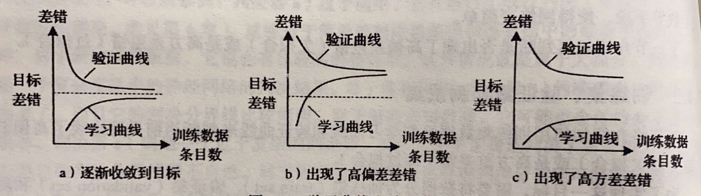
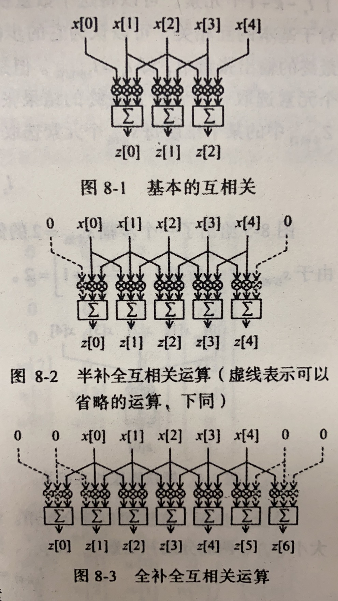
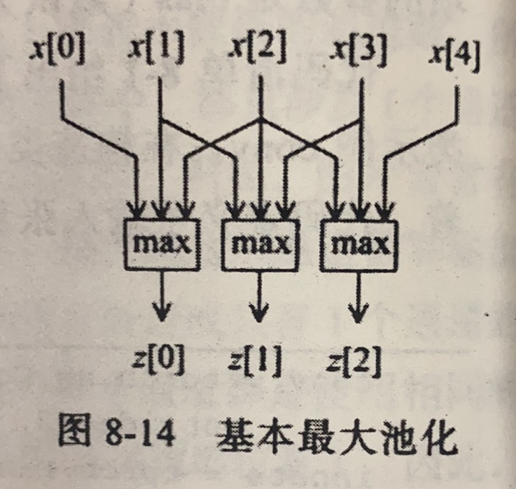
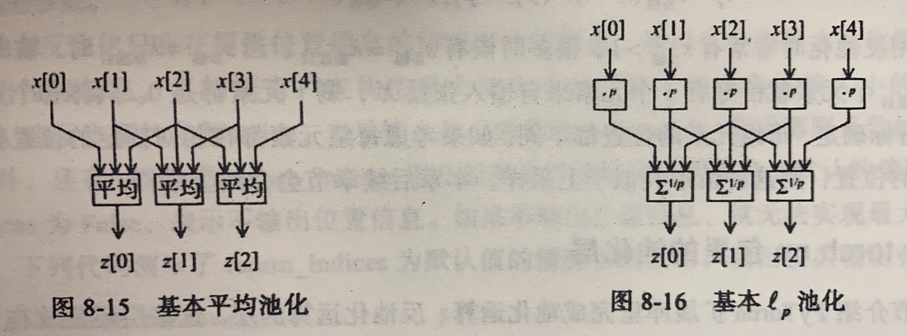
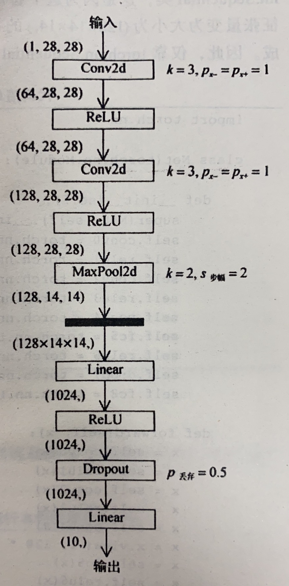

## pytorch

创建网络的一种快捷方法：Sequential

```python
net = torch.nn.Sequential(
        torch.nn.Linear(STATE_SIZE, HIDDEN_SIZE),
        torch.nn.ReLU(),
        torch.nn.Linear(HIDDEN_SIZE, ACTION_SIZE),
        )
```

### 2.1 构造张量的函数

torch.tensor()
torch.zeros(), torch.zeros_like()
torch.ones(), torch.ones_like()
torch.full(), torch.full_like() 全填充为指定值
torch.empty(), torch.empty_like()
torch.eye()
torch.arange(), torch.range(), torch.linspace()
torch.logspace() 等比
torch.rand(), torch.rand_like() 标准均匀
torch.randn(), torch.randn_like(), torch.normal() 标准正态
torch.randint(), torch.randint_like()
torch.bernoulli() 两点分布
torch.multinomial()
torch.randperm() {0,1,2,3...,n-1}的随机排列

### 2.2 重排张量元素

以下三种不会改变张量的实际位置（浅拷贝）

- reshape()
- squeeze()：消除张量中大小为 $1$ 的维度，`t.squeeze()`
- unsqueeze()：添加一个大小为 $0$ 的维度，`t.unsqueeze(dim=2)`

### 2.3 张量扩展和拼接

- repeat()
- cat()：两个参数，第一个是要拼接的张量的列表，第二个是延哪一个维度
- stack()：同上，不同在于 stack 要求拼接的张量大小完全一样，延一个新的维度拼接

### 2.4 求解优化问题

- 在构造用做自变量的 torch.Tensor 类实例时，应将参数 requires_grad 设置为 True
- 调用张量类实例的成员方法 backward() 可以求偏导，调用完后，**自变量**的属性 grad 就储存了偏导的数值

```python
from math import pi
import torch
x = torch.tensor([ pi/3 , pi/6 ], requires_grad=True)
f = -((x.cos()**2).sum)**2
print(f'value = {f}')
f.backward()
print(f'grad = {x.grad}')
```

#### 优化算法与torch.optim包

在梯度下降时，先调用优化器实例的方法 zero_grad() 清空优化器在上次迭代中储存的数据，然后调用 torch.tensor 类实例的方法 backward() 求梯度，最后使用优化器的方法 step() 更新自变量的值

```python
optimizer.zero_grad()
f.backward()
optimizer.step()
```

使用 torch.optim.SGD 梯度下降的一个实例

```python
from math import pi
import torch
import torch.optim
x = torch.tensor([ pi/3 , pi/6 ], requires_grad=True)
optimizer = torch.optim.SGD([x,], lr=0.1 ,momentum=0)
for step in range(11):
    if step:
        optimizer.zero_grad()
        f.backward()
        optimizer.step()
    f = -((x.cos()**2).sum)**2
    print(f'step {step}: x = {x.tolist()}, f(x) = {f}')
```

#### torch.nn子包与损失类

torch.nn.Module 类及其子类可有以下用途

- 表示一个神经网络．如：torch.nn.Sequential 类可以表示一个前馈神经网络
- 表示神经网络的一个层：如 torch.nn.Linear 线性层，torch.nn.ReLU 激活层
- 表示损失：torch.nn.MSELoss，torh.nn.CrossEntropyLoss 等

**激活层**中逐元素激活分为以下三类

- S 型激活：Sigmoid，Softsign，Tanh，Hardtanh，ReLU6
- 单侧激活：ReLU，LeakyReLU，PReLU，RReLU，Threshold，ELU，SELU，Softplus，LogSigmoid
- 褶皱激活：Hardshrinkage，Softshrinkage，Tanhshrinkage

非逐元素激活

- Softmax，Softmax2d，LogSoftmax

torch.nn 里的损失类都是 torch.nn.Module 类的子类

```python
criterion = torch.nn.MSELoss()
pred = torch.arange(5, requires_grad=True)
y = torch.ones(5)
loss = criterion(pred, y)
loss.backward()
```

#### 训练集、验证集与训练集

训练集用来计算参数，验证集来判定欠拟合或过拟合，测试机来评价最终结果



|                        | 欠拟合               | 过拟合                     |
| ---------------------- | -------------------- | -------------------------- |
| 泛化差错主要来源       | 偏差差错 (bias)      | 方差差错 (variance)        |
| 模型复杂度             | 过低                 | 过高                       |
| 学习曲线和验证曲线特征 | 收敛到比较大的差错值 | 两条曲线之间差别大         |
| 解决方案               | 增加模型复杂度       | 减小模型复杂度或增大训练集 |

### 2.5 标准化

- 批标准化( batch normalization )：对同一通道使用相同的均值和方差进行归一化，更适用于特征提取这样的应用
- 实例标准化( instance normalization )：对同一通道使用不同的均值和方差进行归一化，更适用于生成数据这样的应用

| 标准化操作类型 | 维度 | 标准化类                | 输入输出张量维度       | 适用网络     |
| -------------- | ---- | ----------------------- | ---------------------- | ------------ |
| 批标准化       | 1    | torch.nn.BatchNorm1d    | $(n,c,l[0])$           | 前馈神经网络 |
| 批标准化       | 2    | torch.nn.BatchNorm2d    | $(n,c,l[0],l[1])$      | 前馈神经网络 |
| 批标准化       | 3    | torch.nn.BatchNorm3d    | $(n,c,l[0],l[1],l[2])$ | 前馈神经网络 |
| 实例标准化     | 1    | torch.nn.InstanceNorm1d | $(n,c,l[0])$           | 前馈神经网络 |
| 实例标准化     | 2    | torch.nn.InstanceNorm2d | $(n,c,l[0],l[1])$      | 前馈神经网络 |
| 实例标准化     | 3    | torch.nn.InstanceNorm3d | $(n,c,l[0]),l[1],l[2]$ | 前馈神经网络 |
| 层标准化       | 不限 | torch.nn.LayerNorm      | $(n,L$                 | 前馈神经网络 |

### 2.6 网络权重初始化

pytorch 中完成权重初始化需要 torch.nn.init 子包和 torch.nn.Module 类成员方法 apply()．

| 函数名                          | 元素分布 | 分布参数确定方法                                                      |
| ------------------------------- | -------- | --------------------------------------------------------------------- |
| torch.nn.init.uniform_()        | 均匀分布 | 传入表示最小值的参数 a (默认为 0 )和表示最大值的参数 b (默认为 1 )    |
| torch.nn.init.normal_()         | 正态分布 | 传入表示均值的参数 mean (默认为 0 )和表示方差的参数 std (默认为 1 )   |
| torch.nn.init.constant_()       | 常量     | 传入常量 vaL                                                          |
| torch.nn.init.xavier_uniform_() | 均匀分布 | 均值为 0 ，标准差 $\sigma$ 根据输入的张量大小和增益函数 gain 计算得到 |
| torch.nn.init.xavier_uniform_() | 均匀分布 | 均值为 0 ，标准差 $\sigma$ 根据输入的张量大小和增益函数 gain 计算得到 |

apply() 方法有一个参数，参数是一个 python 函数，这个函数的参数必须是 torch.nn.Module 类．

```python
import torch.nn.init as init
def weights_init(m):
    init.xavier_normal_(m.weight)
    init.constant_(m.bias, 0)
```

### 2.7 卷积神经网络

对一维卷积，设 $X$ 为输入张量，大小为 $(l_x,)$，$W$ 为卷积核，大小为 $(k,)$ ，输出张量为 $Z$ ，大小为 $(l_z,)$，则有
$$
l_z=l_x-k+1
$$

**补全** (pad) 运算



在补零后 (前后各补 $p_{x-}$ ，$p_{x+}$) ，相应的张量维度为
$$
l_{补后}=p_{x-}+l_x+p_{x+}
$$

核的**膨胀**(dilate)，基本互相关中，每个权重连续对应着输入张量中的元素，此时可认为膨胀系数为 $k_{膨胀}=1$ ，膨胀前后核大小关系为
$$
k_{膨胀后}=d_{膨胀}(k-1)+1
$$
图 8-4 给出了膨胀系数 $d_{膨胀}=2$ 的例子．膨胀前，核的大小为 $k=3$ ，膨胀后，$k_{膨胀后}=5$


**步幅**(stride)，基本互相关中，卷积核每次相对输入张量 $X$ 向右移动一个元素的位置并得到一个输出张量，一共 $l_z=l_x-k+1$ 个输出．将此输出大小记为 $l_{z步幅前}$ 视为可以认为基本互相关操作的步幅 $s_{步幅}=1$ ，如果考虑更大步幅，则有
$$
l_z = \left[ \frac{l_{z步幅前}-1}{s_{步幅}}+1 \right]
$$

补全、步幅、膨胀可以综合使用．综合前文，输入大小 $\left( l_{x},\right)$ ，输出大小 $\left(l_{z},\right)$ ，核张量大小 $(k,)$，两侧分别补全数 $p_{x-}$ 和 $p_{x+}$ ，步幅 $s_{步幅}$，膨胀系数 $d_{膨胀}$ 之间的关系满足
$$
\begin{aligned}
l_{x补后}&=p_{x-}+l_x+p_{x+}\\
k_{膨胀后}&=d_{膨胀}(k-1)+1\\
l_{z步幅前}&=l_{x补后}-k_{膨胀后}+1\\
l_z &= \left[ \frac{l_{z步幅前}-1}{s_{步幅}}+1 \right]
\end{aligned}
$$
将以上几式综合起来，可以得到
$$
l_z=\left[ \frac{ (p_{x-}+l_x+p_{x+})-(d_{膨胀}(k-1)+1) }{s_{步幅}} +1 \right]
$$

#### torch.nn 里的卷积层

| 运算类型 | 运算维度 | torch.nn.Module子类 | 类实例输入张量的大小           | 类实例输出张量的大小           |
| -------- | -------- | ------------------- | ------------------------------ | ------------------------------ |
| 互相关   | 1        | torch.nn.Conv1d     | $(n,c_x,l_x[0])$               | $(n,c_x,l_z[0])$               |
| 互相关   | 2        | torch.nn.Conv2d     | $(n,c_x,l_x[0],l_x[1])$        | $(n,c_x,l_z[0],l_z[1])$        |
| 互相关   | 3        | torch.nn.Conv3d     | $(n,c_x,l_x[0],l_x[1],l_x[2])$ | $(n,c_x,l_z[0],l_z[1],l_z[2])$ |

$n$ 为样本的计数， $c$ 表示数据的通道数，即一条数据有几个 $d$ 维张量．卷积层的输出通道数表示最多支持的特征个数．因为每个通道使用相同的卷积核计算，每个卷积核只能提取一种特征．

```python
conv = torch.nn.Conv2d(16, 33, kernel_size={3, 5}, stride={2, 1}, padding={4, 2}, dilation={3, 1})
inputs = torch.rand(20, 16, 50, 100) #20条样本，16个通道，每个通道大小为 50*100
outputs = conv(inputs)
outputs.size()
```

#### 张量的池化

**池化** (pooling)，核不需要权重

- 最大池化(max pool)：输出张量的每个元素都是若干个输入张量的最大值
- 平均池化(average pool)：输出元素由若干个输入元素求平均得到
- $l_p$池化($l_p$ pool)：计算输入元素组合的 $l_p$ 范数





以下为不带“自适应”(adaptive)的版本，带自适应只需在 MaxPool1d 前加上 Adaptive，此时不能设置补全数等，他会自动帮你计算

| 运算类型   | 运算维度 | torch.nn.Module子类  | 类实例输入张量的大小           | 类实例输出张量的大小           |
| ---------- | -------- | -------------------- | ------------------------------ | ------------------------------ |
| 最大池化   | 1        | torch.nn.MaxPool1d   | $(n,c_x,l_x[0])$               | $(n,c_x,l_z[0])$               |
| 最大池化   | 2        | torch.nn.MaxPool2d   | $(n,c_x,l_x[0],l_x[1])$        | $(n,c_x,l_z[0],l_z[1])$        |
| 最大池化   | 3        | torch.nn.MaxPool3d   | $(n,c_x,l_x[0],l_x[1],l_x[2])$ | $(n,c_x,l_z[0],l_z[1],l_z[2])$ |
| 平均池化   | 1        | torch.nn.AvgPool1d   | $(n,c_x,l_x[0])$               | $(n,c_x,l_z[0])$               |
| 平均池化   | 2        | torch.nn.AvgPool2d   | $(n,c_x,l_x[0],l_x[1])$        | $(n,c_x,l_z[0],l_z[1])$        |
| 平均池化   | 3        | torch.nn.AvgPool3d   | $(n,c_x,l_x[0],l_x[1],l_x[2])$ | $(n,c_x,l_z[0],l_z[1],l_z[2])$ |
| $l_p$池化  | 1        | torch.nn.LPPool1d    | $(n,c_x,l_x[0])$               | $(n,c_x,l_z[0])$               |
| $l_p$池化  | 2        | torch.nn.LPPool2d    | $(n,c_x,l_x[0],l_x[1])$        | $(n,c_x,l_z[0],l_z[1])$        |
| 最大反池化 | 1        | torch.nn.MaxUnpool1d | $(n,c_x,l_x[0]$                | $(n,c_x,l_z[0])$               |
| 最大反池化 | 2        | torch.nn.MaxUnpool2d | $(n,c_x,l_x[0],l_x[1])$        | $(n,c_x,l_z[0],l_z[1])$        |
| 最大反池化 | 3        | torch.nn.MaxUnpool3d | $(n,c_x,l_x[0],l_x[1],l_x[2])$ | $(n,c_x,l_z[0],l_z[1],l_z[2])$ |

#### 张量的上采样

张量的**上采样**(up-sample)，将输入张量的每个维度大小扩展若干倍．

- 最邻近上采样( nearest up-sample )：按照一个比例因子( scale factor )将每个元素重复若干次
- 线性插值上采样( linearup-sample )

pytorch 中上采样用的是 torch.nn 的子包 torch.nn.Unsample 类．

| 运算类型     | 运算维度 | torch.nn.Unsample类实例构造参数 | 类实例输入张量的大小           | 类实例输出张量的大小           |
| ------------ | -------- | ------------------------------- | ------------------------------ | ------------------------------ |
| 最邻近上采样 | 1        | mode='nearest'(默认值)          | $(n,c_x,l_x[0])$               | $(n,c_x,l_z[0])$               |
| 最邻近上采样 | 2        | mode='nearest'(默认值)          | $(n,c_x,l_x[0],l_x[1])$        | $(n,c_x,l_z[0],l_z[1])$        |
| 最邻近上采样 | 3        | mode='nearest'(默认值)          | $(n,c_x,l_x[0],l_x[1],l_x[2])$ | $(n,c_x,l_z[0],l_z[1],l_z[2])$ |
| 线性上采样   | 1        | mode='linear'                   | $(n,c_x,l_x[0])$               | $(n,c_x,l_z[0])$               |
| 线性上采样   | 2        | mode='bilinear'                 | $(n,c_x,l_x[0],l_x[1])$        | $(n,c_x,l_z[0],l_z[1])$        |
| 线性上采样   | 3        | mode='trilinear'                | $(n,c_x,l_x[0],l_x[1],l_x[2])$ | $(n,c_x,l_z[0],l_z[1],l_z[2])$ |

#### 张量的补全运算

- 常数补全( constant pad )：输入张量前后补上常数
- 重复补全( replication pad )：用最边上的值补全
- 反射补全( reflection pad )：以边界为对称轴补全

| 运算类型 | 运算维度 | torch.nn.Module子类       | 类实例输入张量的大小           | 类实例输出张量的大小                             |
| -------- | -------- | ------------------------- | ------------------------------ | ------------------------------------------------ |
| 常数补全 | 2        | torch.nn.ConstantPad2d    | $(n,c_x,l_x[0],l_x[1])$        | $(n,c_x,l_{x补后}[0],l_{x补后}[1])$              |
| 重复补全 | 2        | torch.nn.ReplicationPad2d | $(n,c_x,l_x[0],l_x[1])$        | $(n,c_x,l_{x补后},l_{x补后}[1])$                 |
| 反射补全 | 2        | torch.nn.ReflectionPad2d  | $(n,c_x,l_x[0],l_x[1])$        | $(n,c_x,l_{x补后}[0],l_{x补后}[1])$              |
| 反射补全 | 3        | torch.nn.Reflection3d     | $(n,c_x,l_x[0],l_x[1],l_x[2])$ | $(n,c_x,l_{x补后}[0],l_{x补后}[1],l_{x补后}[2])$ |

```python
inputs = torch.arange(12).view(1, 1, 3, 4)
pad = nn.ConstantPad2d(padding=[1, 1, 1, 1], value=-1)
pad = nn.Replication2d(padding=[1, 1, 1, 1])
pad = nn.Reflection2d(padding=[1, 1, 1, 1])
```

例如实现下图的卷积网络，可以参考的构建网络方法：



```python
import torch.nn

class Net(torch.nn.Module):

    def __init__(self):
        super(Net, self).__init__()
        self.conv0 = torch.nn.Conv2d(1, 64, kernel_size=3, padding=1)
        self.relu1 = torch.nn.ReLU()
        self.conv2 = torch.nn.Conv2d(64, 128, kernel_size=3, padding=1)
        self.relu3 = torch.nn.ReLU()
        self.pool4 = torch.nn.MaxPool2d(stride=2, kernel_size=2)
        self.fc5 = torch.nn.Linear(128*14*14, 1024)
        self.relu6 = torch.nn.ReLU()
        self.drop7 = torch.nn.Dropout(p=0.5)
        self.fc8 = torch.nn.Linear(1024, 10)

    def forward(self, x):
        x = self.conv0(x)
        x = self.relu1(x)
        x = self.conv2(x)
        x = self.relu3(x)
        x = self.pool4(x)
        x = x.view(-1, 128 * 14 * 14)
        x = self.fc5(x)
        x = self.relu6(x)
        x = self.drop7(x)
        x = self.fc8(x)
        return x

net = Net()
```

另外可用 sequential 方法

```python
import torch.nn

class Net(torch.nn.Module):

    def __init__(self):
        super(Net, self).__init__()
        self.conv = torch.nn.Sequential(
            torch.nn.Conv2d(1, 64, kernel_size=3, padding=1)
            torch.nn.ReLU()
            torch.nn.Conv2d(64, 128, kernel_size=3, padding=1)
            torch.nn.ReLU()
            torch.nn.MaxPool2d(stride=2, kernel_size=2))
        self.dense = torch.nn.Sequential(
            torch.nn.Linear(128*14*14, 1024)
            torch.nn.ReLU()
            torch.nn.Dropout(p=0.5)
            torch.nn.Linear(1024, 10))

    def forward(self, x):
        x = self.conv(x)
        x = x.view(-1, 128 * 14 * 14)
        x = self.dense(x)
        return x

net = Net()
```

### 2.8 循环神经网络

TODO:循环神经网络

以下是 LSTM 示例

```python
import torch.nn

class Net(torch.nn.Module):

    def __init__(self, input_size, hidden_size):
        super(Net, self).__init__()
        self.rnn = torch.nn.LSTM(input_size, hidden_size)
        self.fc = torch.nn.Linear(hidden_size, 1)

    def forward(self, x):
        x = x[:, :, None]
        x, _ = self.rnn(x)
        x = self.fc(x)
        x = x[:, :, 0]
        return x

net = Net(input_size=1, hidden_size=5)
```

### 2.9 生成对抗网络

- 生成网络( generative network )：一般一条随机输入是一个有多个元素的张量 $Z$，张量 $Z$ 的取值空间称为“潜在空间”( latent space )，张量 $Z$ 的元素个数称为“潜在大小”( latent size )．生成网络 $g$ 可以将这条潜在张量样本 $Z$ 映射为一条数据张量 $X=g(Z)$．
- 鉴别网络( discriminative network )：对生成网络生成的数据进行判定．

以 $l$ 记交叉熵损失函数

目的：训练鉴别网络 $d$ 使得
$$
\begin{aligned}
&min_d l(d(X),1),\qquad其中X是真实数据\\
&min_d l(d(g(X)),0)
\end{aligned}
$$
训练生成网络使得
$$
max_g min_d l(d(g(Z)),0)
$$

以下是CIFAR-10图像生成的实例

```python
'''读取数据'''
from torch.utils.data import DataLoader
from torchvision.datasets import CIFAR10
import torchvision.transforms as transforms
from torchvision.utils import save_image

dataset = CIFAR10(root='./data', download=True,
        transform=transforms.ToTensor())
dataloader = DataLoader(dataset, batch_size=64, shuffle=True)

for batch_idx, data in enumerate(dataloader):
    real_images, _ = data
    batch_size = real_images.size(0)
    print ('#{} has {} images.'.format(batch_idx, batch_size))
    if batch_idx % 100 == 0:
        path = './data/CIFAR10_shuffled_batch{:03d}.png'.format(batch_idx)
        save_image(real_images, path, normalize=True)

'''生成网络与鉴别网络的搭建'''
import torch.nn as nn

# 搭建生成网络
latent_size = 64 # 潜在大小
n_channel = 3 # 输出通道数
n_g_feature = 64 # 生成网络隐藏层大小
gnet = nn.Sequential(
        # 输入大小 = (64, 1, 1)
        nn.ConvTranspose2d(latent_size, 4 * n_g_feature, kernel_size=4,
                bias=False),
        nn.BatchNorm2d(4 * n_g_feature),
        nn.ReLU(),
        # 大小 = (256, 4, 4)
        nn.ConvTranspose2d(4 * n_g_feature, 2 * n_g_feature, kernel_size=4,
                stride=2, padding=1, bias=False),
        nn.BatchNorm2d(2 * n_g_feature),
        nn.ReLU(),
        # 大小 = (128, 8, 8)
        nn.ConvTranspose2d(2 * n_g_feature, n_g_feature, kernel_size=4,
                stride=2, padding=1, bias=False),
        nn.BatchNorm2d(n_g_feature),
        nn.ReLU(),
        # 大小 = (64, 16, 16)
        nn.ConvTranspose2d(n_g_feature, n_channel, kernel_size=4,
                stride=2, padding=1),
        nn.Sigmoid(),
        # 图片大小 = (3, 32, 32)
        )
print (gnet)

# 搭建鉴别网络
n_d_feature = 64 # 鉴别网络隐藏层大小
dnet = nn.Sequential(
        # 图片大小 = (3, 32, 32)
        nn.Conv2d(n_channel, n_d_feature, kernel_size=4,
                stride=2, padding=1),
        nn.LeakyReLU(0.2),
        # 大小 = (64, 16, 16)
        nn.Conv2d(n_d_feature, 2 * n_d_feature, kernel_size=4,
                stride=2, padding=1, bias=False),
        nn.BatchNorm2d(2 * n_d_feature),
        nn.LeakyReLU(0.2),
        # 大小 = (128, 8, 8)
        nn.Conv2d(2 * n_d_feature, 4 * n_d_feature, kernel_size=4,
                stride=2, padding=1, bias=False),
        nn.BatchNorm2d(4 * n_d_feature),
        nn.LeakyReLU(0.2),
        # 大小 = (256, 4, 4)
        nn.Conv2d(4 * n_d_feature, 1, kernel_size=4),
        # 对数赔率张量大小 = (1, 1, 1)
        )
print(dnet)

'''网络初始化'''
import torch.nn.init as init

def weights_init(m): # 用于初始化权重值的函数
    if type(m) in [nn.ConvTranspose2d, nn.Conv2d]:
        init.xavier_normal_(m.weight)
    elif type(m) == nn.BatchNorm2d:
        init.normal_(m.weight, 1.0, 0.02)
        init.constant_(m.bias, 0)

gnet.apply(weights_init)
dnet.apply(weights_init)

'''训练并输出图片'''
import torch
import torch.optim

# 损失
criterion = nn.BCEWithLogitsLoss()

# 优化器
goptimizer = torch.optim.Adam(gnet.parameters(),
        lr=0.0002, betas=(0.5, 0.999))
doptimizer = torch.optim.Adam(dnet.parameters(),
        lr=0.0002, betas=(0.5, 0.999))

# 用于测试的固定噪声,用来查看相同的潜在张量在训练过程中生成图片的变换
batch_size = 64
fixed_noises = torch.randn(batch_size, latent_size, 1, 1)

# 训练过程
epoch_num = 10
for epoch in range(epoch_num):
    for batch_idx, data in enumerate(dataloader):
        # 载入本批次数据
        real_images, _ = data
        batch_size = real_images.size(0)

        # 训练鉴别网络
        labels = torch.ones(batch_size) # 真实数据对应标签为1
        preds = dnet(real_images) # 对真实数据进行判别
        outputs = preds.reshape(-1)
        dloss_real = criterion(outputs, labels) # 真实数据的鉴别器损失
        dmean_real = outputs.sigmoid().mean()
                # 计算鉴别器将多少比例的真数据判定为真,仅用于输出显示

        noises = torch.randn(batch_size, latent_size, 1, 1) # 潜在噪声
        fake_images = gnet(noises) # 生成假数据
        labels = torch.zeros(batch_size) # 假数据对应标签为0
        fake = fake_images.detach()
                # 使得梯度的计算不回溯到生成网络,可用于加快训练速度.删去此步结果不变
        preds = dnet(fake) # 对假数据进行鉴别
        outputs = preds.view(-1)
        dloss_fake = criterion(outputs, labels) # 假数据的鉴别器损失
        dmean_fake = outputs.sigmoid().mean()
                # 计算鉴别器将多少比例的假数据判定为真,仅用于输出显示

        dloss = dloss_real + dloss_fake # 总的鉴别器损失
        dnet.zero_grad()
        dloss.backward()
        doptimizer.step()

        # 训练生成网络
        labels = torch.ones(batch_size)
                # 生成网络希望所有生成的数据都被认为是真数据
        preds = dnet(fake_images) # 把假数据通过鉴别网络
        outputs = preds.view(-1)
        gloss = criterion(outputs, labels) # 真数据看到的损失
        gmean_fake = outputs.sigmoid().mean()
                # 计算鉴别器将多少比例的假数据判定为真,仅用于输出显示
        gnet.zero_grad()
        gloss.backward()
        goptimizer.step()

        # 输出本步训练结果
        print('[{}/{}]'.format(epoch, epoch_num) +
                '[{}/{}]'.format(batch_idx, len(dataloader)) +
                '鉴别网络损失:{:g} 生成网络损失:{:g}'.format(dloss, gloss) +
                '真数据判真比例:{:g} 假数据判真比例:{:g}/{:g}'.format(
                dmean_real, dmean_fake, gmean_fake))
        if batch_idx % 100 == 0:
            fake = gnet(fixed_noises) # 由固定潜在张量生成假数据
            save_image(fake, # 保存假数据
                    './data/images_epoch{:02d}_batch{:03d}.png'.format(
                    epoch, batch_idx))
```